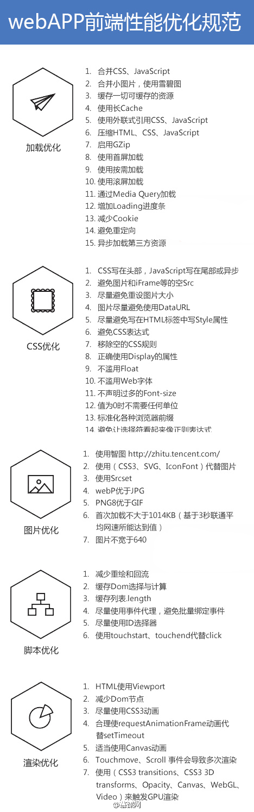

# 个人总结
> 不敢说是博客，只是记录学习的进程吧，结一番吧哈也是为写博客做准备吧！

## 总结

### 个人简历
[简历](https://github.com/iSAM2016/iSAM2016.github.io/issues/1)

### underscore 源码学习
[underscore源码阅读](https://github.com/iSAM2016/underscore)

### Vue UI组件
[Vue写的UI组件](https://github.com/iSAM2016/UI)

### 设计模式
[设计模式](https://github.com/iSAM2016/Design-pattern)

## 学习路径
>网络上找到，感觉特别适合自己吧，大体上是 现代化、工程化、性能优化、插件开发、主要框架使用
>[职业发展路径](https://github.com/f2e-journey/f2e-journey/blob/master/career-planning.md)

### 层级计划
1. 熟练使用框架 学习优秀的框架设计*（知识）
2. 解决实际业务（技能）
3.  源码学习（知识）

### 知识结构

###计算机学习

    算法数据结构
        阅读《算法图解》
        算法

##学习笔记

最好是三次理论并且要实现

1.  html、css和js较为扎实的基本功，尤其是js方面，能脱离jq/zepote干活，
    具有良好的面相对象的编程思想，能够书写较大规模的前端业务代码.
2.  熟练使用sass、less、stylus等css预处理器
3.  掌握至少一种前端模块化开发规范及其相关框架，比如AMD(require.js)或CMD(sea.js) Browserify
4.  掌握一种MVC\MVVM框架，并有一个、两个项目实战项目
5.  熟悉一门后端的开发语言，比如Java、PHP
6.  团队协作方面 git
7.  熟悉前端页面的优化规则，熟悉http协议的通信规则，对静态资源缓存机制较深的理解
8.  熟悉HTML5和css3，有H5网站开发的经验
9.  react 学习
10. RN学习

*  移动端: 了解它与PC端的不同，比如不在移动端使用jq,开始使用zepto 
    了解touch事件。尝试写移动端的组件，无,如无限滚动、左右滑动插件，
    并解决移动端的性能问题。可以找司徒正美、张代平、叶小钗总结的移动端解决方案

*  源码阅读
    1. underscore.js是第一个选择，是工具方法，实现api方法，要背诵一些api,之后可以看看《JavaScript函数式编程》
    2. zpote 源码阅读，把不懂的地方搞明白(你不知道的javascript 系列)
    3. backone.js此框架是以类jq和underscore为基础的mvc的框架，在这之前可以看《基于MVC的javascript Web富应用开发》
    4. 其他可以是一些插件的源码，比如bootstrap 可以敲。轮播、分页、下拉框。其中有两个插件是必须说的，**表格插件**  **webtreeview控件**
    5. CMD/AMD 模块化阅读 require.js, 了解common.js

## 文章列表

#####JS
1. [*剑指 offer -- JavaScript 版](https://zhuanlan.zhihu.com/p/31938189?utm_source=wechat_session&utm_medium=social)

#####ReatNative
1. [*React Native 基于画板简析封装安卓原生UI](https://zhuanlan.zhihu.com/p/32327408?utm_source=wechat_session&utm_medium=social)

#####移动端
1. [*移动端 Web 开发踩坑之旅](https://zhuanlan.zhihu.com/p/26141351?utm_source=wechat_session&utm_medium=social)
2. [*移动端图片上传旋转、压缩的解决方案](https://zhuanlan.zhihu.com/p/27627436?utm_source=wechat_session&utm_medium=social)
3. [*【移动端兼容问题研究】javascript事件机制详解（涉及移动兼容）](http://www.cnblogs.com/yexiaochai/p/3462657.html)
4. [*虚拟键盘与fixed带给移动端的痛！*](http://www.cnblogs.com/yexiaochai/p/3561939.html)
5. [*精通移动端布局 - 实践篇 *](http://www.cnblogs.com/HCJJ/p/6408363.html)
6. [*移动端图片预览*](https://jsfiddle.net/8q63yq5c/)
7. [*移动 web 1px 边框解决方案*](https://juejin.im/post/58db16385c497d00570fe931)
8. [*Mobile Web Favorites*](https://github.com/hoosin/mobile-web-favorites)
9. [*mobileTech*](https://github.com/jtyjty99999/mobileTech)

#####Vue

#####mvvm相关
1. [实现一个属于我们自己的简易MVVM库](https://my.oschina.net/qiangdada/blog/906220)
2. [如何监听一个数组的变化](https://juejin.im/entry/59361d22b123db00643536b1?utm_medium=hao.caibaojian.com&utm_source=hao.caibaojian.com)

#####源码
1. [【requireJS源码学习01】了解整个requireJS的结构](http://www.cnblogs.com/yexiaochai/p/3632580.html)

#####面试
1. [*中级前端工程师面试 我想问的几个问题](https://zhuanlan.zhihu.com/p/25701897?utm_source=wechat_session&utm_medium=social)
2. [*方正的前端面试知识点汇总（一）](https://zhuanlan.zhihu.com/p/29012060?utm_source=wechat_session&utm_medium=social)

##### 性能优化

1. [*[转载]JavaScript 的性能优化：加载和执行*](http://caibaojian.com/jsload.html)

2. [*毫秒必争，前端网页性能最佳实践*](http://www.cnblogs.com/developersupport/p/3248695.html)

3. [JavaScript 启动性能瓶颈分析与解决方案](https://zhuanlan.zhihu.com/p/25221314)

4. [如何评价页面的性能](http://taobaofed.org/blog/2015/11/09/web-performance/)

5. [H5性能优化方案](http://ddtalk.github.io/blog/2015/09/07/dingding-first/)

6. 页面生成的过程

##### http
1. [我知道的HTTP请求](https://fed.renren.com/2018/02/03/http-request/?from=timeline)

##缓存

##### 其他
1. [*《美团旅行前端技术体系的思考与实践》知乎 live 文字稿](https://zhuanlan.zhihu.com/p/29373613?utm_source=wechat_session&utm_medium=social)
2. [*一名合格的前端工程师的知识结构是怎样的？有插件推荐](https://www.zhihu.com/question/19588629/answer/152951340?utm_source=wechat_session&utm_medium=social)
3. [*帮你打包前端之巅一整年好文！](https://zhuanlan.zhihu.com/p/27283922?utm_source=wechat_session&utm_medium=social)
4. [*理解 javascript 观察者模式 (订阅者与发布者)*](https://juejin.im/entry/580b5553570c350068e6c2d6)
5. [*一张图彻底掌握 scrollTop, offsetTop, scrollLeft, offsetLeft......*](https://juejin.im/entry/57cba52079bc440063ff0ae9/)

新鲜度检查：原始服务器的内容可能会法伤变化，缓存要对其进行检测，看看他们保存的副本是否是服务器上最新的副本。

再验证命中或缓慢命中：缓存对缓存的副本进行再验证时候，会向服务器发送一个小的再请求验证，如果内容没有变化，服务器会以一个小的304（NOT Modified）进行响应。只要缓存知道副本任然有效，就会再次将副本标记为暂时新鲜的，并将副本提供给客户端

if-Modified-Since 首部:只有在缓存了对象的副本之后，又对其进行的修改情况下才发送对象

缓存的拓扑结构： 
    私有缓存：
    公有缓存：（代理缓存）

图片

文档过期： cache-control  Expires
表格： 过期响应首部

cache-control: max-age  max-age 值定义了文档的最大使用周期-从第一次生成文档到文档不再新鲜、无法使用为止，最大的合法生存时间（以秒为单位） 
Cache-Control: max-age=49489

Expires 指定一个绝对过期日期，如果四埃及那已经过期了，说明文档不再更新看

服务器在验证
仅仅是已缓存文档过期了并不是意味着它和原始服务器上目前处于活跃状态的文档有实际的区别，这只是意味到了进哪个行核对的事件，

如果在验证显示内容发生了变化，缓存会获取一份新的文档副本，并将其存在旧的文档为止上，热庵后将文档发给客户端

如果显示在验证内容没有发生变化，缓存只需要获取新的首部，包括一个新的过期日期

 

