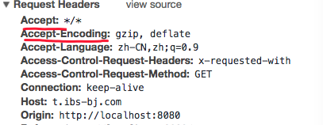
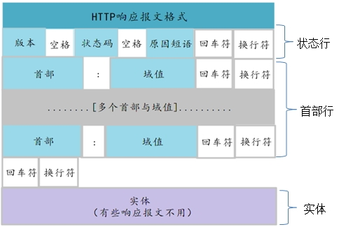
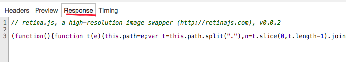
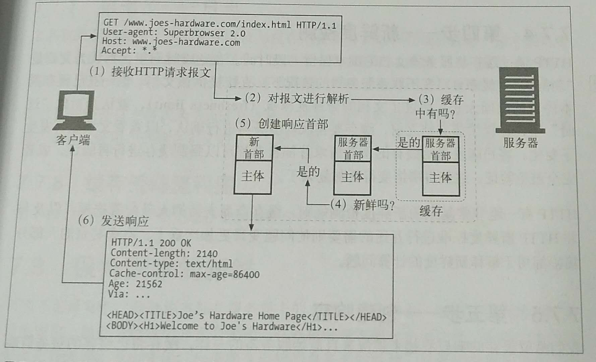
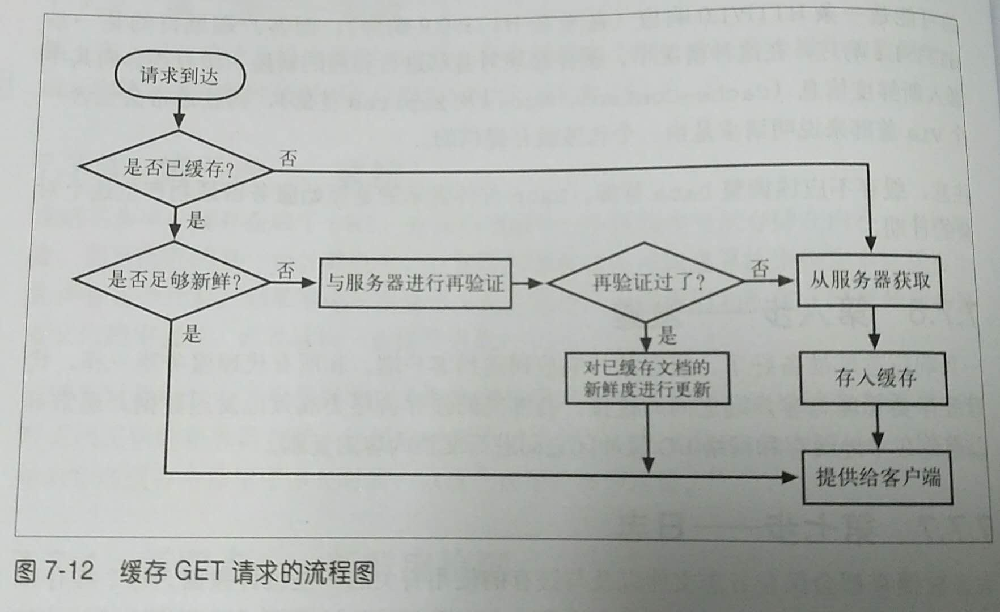
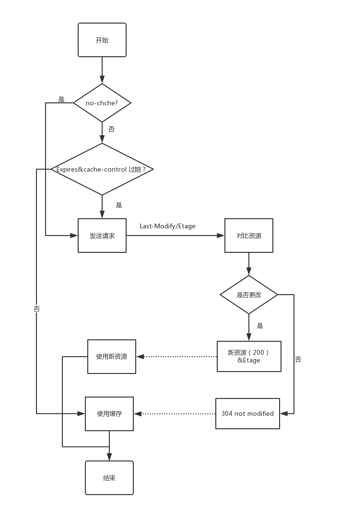

# HTTP&fetch&跨域
>[资料](https://segmentfault.com/a/1190000014134828)

## 目录
*   [HTTP WEB 的基础](#basehttp)
*   [HTTP报文](#HTTPword)
    *   [报文流](#HTTPflow)
    *   [报文组成详细解释](#HTTPcontent)
        *   [请求报文](#request)
        *   [响应报文](#response)
    *   [其他首部介绍](#otherheader)
*   [状态码](#status)
*   [缓存](#cache)
*   [浏览器的协商缓存与强缓存]()
*   [跨域及其express示例](#crossDomain)
*   三次挥手


<h2 id="basehttp">HTTP WEB 的基础</h2>

*  **MIME type**： Web 服务器会为所有HTTP 对象数据附加一个MIME 类型中间由一个斜杠来划分

* **URI**: 统一资源标识符，我们通过他访问资源
    * URL: 统一资源定位符
    * URN: 统一资源名字（不常用）

* 方法
     * GET
     * PUT
     * POST
     * DELETE
     * POST
     * HEAD
     GET和POST 的区别

* 报文
    * 报文的种类
        * request message(请求报文)
        * response meassage(相应报文)
    * 组成格式
        * 起始行
        * 首部字段
        * 主体

* TCP/IP
>>HTTP 是个应用层协议。HTTP 无需操心网络通信的具体细节；它把联网的细节都
交给了通用、可靠的因特网传输协议TCP/IP。

* **web的结构组件**
    * 代理: 位于客户端和服务器之间的HTTP中间实体
    * 缓存（web cache）或代理缓存（proxy cache）： HTTP 的仓库，使常用页面的副本可以保存在离客户端更近的地方,是一种特殊的代理
    * 网关：连接其他应用程序的特殊Web 服务器。
    * Agent： 代理发起自动HTTP 请求的半智能Web 客户端。

## URL与资源
>url的基本组成结构不做介绍

<h2 id="HTTPword">HTTP报文</h2>
<h3 id="HTTPflow">报文流</h3>

* 报文向下流动： 不管请求报文还是相应报文，所有的报文都会向下流动
* 报文的组成部分
        * **起始行**
        * **首部**: http首部字段向请求和响应报文添加了一些附加信息。由“名/值”对组成，`应用程序也可以随意发明自己的所用首部`，组成： name:（空格）key，如下图
            * 通用首部（出现在请求、响应报文）
            * 请求首部
            * 响应首部
            * 实体首部
            * 扩展首部
        * **主体**
        
     
***

<h3 id="HTTPcontent"> 报文组成详细解释</h3>
>基本报文语法 `method:` 方法 `version:` http版本  `status:` 状态码 `reason-phrase:` 原因短读 `header:` 首部

>我们知道报文的组成是由`起始行、首部字段、主体`组成的，但是报文的种类是不同的，我们依次看


<h4 id="request"> 请求报文</h4>


**1. 请求行**

**2. 请求首部** 
请求首部为请求报文添加了一些附加信息，由“名/值”对组成，每行一对，名和值之间使用冒号分隔。请求首部也有不同的含义

|        请求头    | 说明       |
| :--------------:|:---------:|
| Host            | 接受请求的服务器地址，可以是IP:端口号，也可以是域名 
| User-Agent      | 发送请求的应用程序名称 
| Connection      | 指定与连接相关的属性，如Connection:Keep-Alive  

**Accept首部：**会使链接的两段都受益，客户端和得到他们想要的东西，拂去其不会浪费资源发送没用的东西。

|        请求头    | 说明       |
| :--------------:|:---------:|
| Accept          | 接受的媒体类型 
| Accept-Charset  | 通知服务端可以发送的编码格式 
| Accept-Encoding | 通知服务端可以发送的数据压缩格式  
| Accept-Language | 通知服务端可以发送的语言 

**条件请求首部：**有时候希望客户端为请求加上某些限制，要求拂去其在对请求型芯响应之前，确保某个条件为真

|        请求头    | 说明       |
| :--------------:|:---------:|
| Expect             | 允许客户端列出请求所要求的服务器行为。
| If-Match           | 如果实体标记与文档当前的实体标记相匹配，就获取这份文档。
| If-Modified-Since  | 除非在某个指定的日期之后资源被修改过，否则就限制这个请求。
| If-None-Match      | 如果提供的实体标记与当前文档的实体标记不相符，就获取文档。
| If-Range           | 允许对文档的某个范围进行条件请求。
| If-Unmodified-Since| 除非在某个指定日期之后资源没有被修改过，否则限制这个请求。
| Range              | 如果服务器支持范围请求，就请求资源的指定范围。


**安全请求首部：** http 本身可以进行询问/响应认证。这种响应要在客户端获取特定的资源之前。

|        首部      | 描述       |
| :--------------:|:---------:|
| Authorization  | 包含了提供给服务器来对客户端进行自身认证的数据。
| Cookie         | 它并不是真正的安全首部，但却是隐含了安全功能。
| Cookie2        | 用来说明请求端支持的cookie版本。


**代理请求首部** :   


|        首部      | 描述       |
| :--------------:|:---------:|
| Max-Forward         | 在通往源端服务器的路径上，将请求转发给其他代理或网管的最大次数----与 TRACE 方法一同使用。
| Proxy-Authorization | Authorization 首部相同，但这个首部是在于代理进行认证时使用的。
| Proxy-Connection    | Connection 首部相同，但这个首部是在于代理建立连接时使用的。


**3. 主体** [见下文](#body)
<hr/>

<h4 id="response"> 响应报文</h4>


**1. 响应行**

**2. 响应首部** 

|        请求头    | 说明       |
| :--------------:|:---------:|
| Age               | 推算资源创建经过时间
| ETag              | 资源的匹配信息
| Location          | 令客户端重定向至指定URI
| Proxy-Authenticate| 代理服务器对客户端的认证信息
| Retry-After       | 对再次发起请求的时机要求
| Server HTTP       | 服务器的安装信息
| Accept-Ranges     | 是否接受字节范围请求
| Vary              | 代理服务器缓存的管理信息
| WWW-Authenticate  | 服务器对客户端的认证信息
| Server          | 服务器应用程序软件的名称和版本  


**3. 主体** [见下文](#body)    
** **

<h3 id="otherheader"> 其他首部介绍</h3>

#### *通用首部* 
通用请求比较少。一般是Date，Cache-Control或Connection。通用的缓存首部

|        请求头    | 说明       |
| :--------------:|:---------:|
| Date            | 时间       |
| Cache-Control   | 用于随报文传送缓存指示 |
| Pragma          | 另一种用于随报文传送缓存指示 |

#### *实体首部* 
 * *内容首部*

|        请求头    | 说明       |
| :--------------:|:---------:|
| Content-Encoding | 实体主体适用的编码方式
| Content-Language | 实体主体的自然语言
| Content-Length   | 实体主体的大小（单位：字节）
| Content-Location | 替代对应资源的URI
| Content-MD5      | 实体主体的报文摘要
| Content-Range    | 实体主体的位置范围
| Content-Type     | 实体主体的媒体类型

 * *实体缓存首部*

|        请求头    | 说明       |
| :--------------:|:---------:|
| ETag            | 与实体相关的实体标注
| Expires         | 实体主体过期的日期时间
| Last-Modified   | 资源的最后修改日期时间

在缓存章节我们重点介绍

#### *自定义首部*
上文提到过我们可以自定义首部，自定义首部可以让前台和后台进行特殊的通信，但是需要后台的一些配合。
我们前台定义了特殊的头部
```
//client/index.js

let myHeaders = new Headers({
    'X-Custom-Info': "isam2016" // 自定的请求头
});
```

如果没有后台的支持会报错


后台支持
```
//设置跨域访问  
app.all('*', function(req, res, next) {
  res.header("Access-Control-Allow-Headers", "X-Custom-Info");
  next();
});
```
***

<h3 id="body">主体</h3>
>位于首部行之后

实体包含了Web客户端请求的对象。当Web服务器接收到Web客户端的请求报文后，对HTTP请求报文进行解析，并将Web客户端的请求的对象取出打包，通过HTTP响应报文将数据传回给Web客户端，如果出现错误则返回包含对应错误的错误代码和错误原因的HTTP响应报文。



<h2 id="status">状态码</h2>

| 总体范围     | 已定义范围 | 类别 |
| -----------|:---------:| -----:|
| 100~199    | 100~101   |信息|
| 200~299    | 200~206   |成功|
| 300~399    | 300~305   |重定向 |
| 400~499    | 400~415   |客户端错误|
| 500~599    | 500~505   |服务器错误|
  
**我们重点关注的是3开头的状态码**

| 状态        | 原因短语   | 含　　义 |
| :----------|:-------- |:-----:|
| 300 | Multiple Choices | 多重选择。链接列表。用户可以选择某链接到达目的地。最多允许五个地址。|
| 301 | Moved Permanently  | 请求的URL已移走。响应中应该包含一个LocationURL，说明资源现在所处的位置 |
| 302 |  Found |  与状态码301 类但这里的移除是临时的。客户端应该用Location 首部给出的URL 对资源进行临时定位|
| 303 | See Other | 告诉客户端应该用另一个URL 获取资源。这个新的URL 位于响应报文的Location 首部|
| 304 | Not Modified | 客户端可以通过它们所包含的请求首部发起条件请求。这个代码说明资源未发生过变化
| 305 | Use Proxy | 必须通过代理访问资源，代理的位置是在Location首部中给出的
| 307 |Temporary Redirect | 和状态码301 类似。但客户端应该用Location 首部给出的URL 对资源进行临时定位 |

* 永久搬离的资源

    资源可能被移动到新的位置，或者被重新命名，有了一个新的URL.web服务器可以告诉客户端资源已经被重新命名了。这样客户端就可以从新的地址获取资源之前，更新数钱之类的信息了。状态码301就是这个作用

* 临时搬离资源

    如果资源被临时移走或重命名, 服务器可能希望将客户端重定向到新的位置上去。但由于重命名是临时的，所以服务器希望客户端将来还可以回去使用老的URL,不要对书签进行更新。状态码301 和 307

* URL增强

    服务器通常用重定向来重写URL，往往用于嵌入上下文。当请求到达时，服务器会生成一个新的包含了嵌入式状态信息的URL，并将用户重定向到这个新的URL上去。客户端会跟随这个重定向信息，重新发起请求，但这次的请求会包含完整的、经过状态增强的URL。这是在事务间维护状态的一种有效方式。状态码"303 See Other"和"307 Temporary Redirect"用于此类重定向。

* 负载均衡 
    
    如果一个超载的服务器收到一条请求，服务器可以将客户端重定向到一个负载不太重的服务器上去。状态码"303 See Other"和"307 Temporary Redirect"可用于此类重定向。

* 服务器关联
 
    Web服务器上可能会有某些用户的本地信息；服务器可以将客户端重定向到包含了那个客户端信息的服务器上去。状态码"303 See Other"和"307 Temporary Redirect"可用于此类重定向。

* 规范目录名称

    客户端请求的URI是一个不带尾部斜线的目录名时，大多数Web服务器都会将客户端重定向到一个加了斜线的URI上，这样相对链接就可以正常工作了。

<h2 id="cache">缓存</h2>
**缓存作用：**
    
    缓存减少了冗余数据传输，缓解了网络瓶颈问题，降低了对原始服务器的要求，降低了延时距离，如何衡量其有效性及将缓存置于何处可以发挥最大的作用。还用缓存检查新鲜度的问题

**缓存命中**
    
    可以使用已有的副本为某些达到缓存的请求提供服务，这被称为缓存命中。其他一些达到花村的请求可能会由于没有副本可用，而被转发给原始服务器。被称为缓存未命中。

**新鲜度检查**

    原始服务器的内容可能会法伤变化，缓存要对其进行检测，看看他们保存的副本是否是服务器上最新的副本。


**再验证命中或缓慢命中**
  
    缓存对缓存的副本进行再验证时候，会向服务器发送一个小的再请求验证，如果内容没有变化，服务器会以一个小的304（NOT Modified）进行响应。只要缓存知道副本任然有效，就会再次将副本标记为暂时新鲜的，并将副本提供给客户端.Http提供了几个工具，用的最多的是if-Modified-Since。在请求中添加该字段，告诉服务器只有在缓存了对象的副本之后，又对其进行的修改情况下才发送对象

**缓存的拓扑结构：**

    私有缓存：一般是我们的浏览器
    公有缓存：（代理缓存,不做讨论）

**缓存的处理步骤**
  1. 接收- 缓存从网络中读取抵达的请求报文
  
  2. 解析- 缓存对报文进行解析，提取出url和各种首部

  3. 查询- 缓存查看是否有本地副本可用，如果没有，就获取一份副本（并将其保存在本地）

  4. 新鲜度检测- 缓存查看已缓存副本是否足够新鲜，如果不是，就询问服务器是否有任何的更新

  5. 创建响应- 缓存回会用新的首部和已缓存的主体来共偶见一天响应报文

  6. 发送

  7. 日志




[浏览器的协商缓存与强缓存](http://caibaojian.com/browser-cache.html)

#### 文档过期

http可以使用文档过期

| 首部           | 描述      |
| -----------   |:---------:| 
| cache-control:max-age |  值定义了文档的最大使用周期-从第一次生成文档到文档不再新鲜、无法使用为止，最大的合法生存时间（以秒为单位 Cache-Control: max-age=49489   |
| Expires       |指定一个绝对过期日期，如果过期日期已经过期了，说明文档不再更新 |

**服务器在验证**

仅仅是已缓存文档过期了并不是意味着它和原始服务器上目前处于活跃状态的文档有实际的区别，这只是意味到了进哪个行核对的事件

* 如果在验证显示内容*发生了变化*，缓存会获取一份新的文档副本，并将其存在旧的文档位置上，然后将文档发给客户端

* 如果在验证显示内容*没有发生变化*，缓存只需要获取新的首部，包括一个新的过期日期，并对缓存中的首部进行更新行了

**用条件方法进行在验证**

对缓存在验证首部是 If-Modified-Since 和 If-None-Match

| 首部           | 描述      |
| -----------   |:---------:| 
| If-Modified-Since | 如果从指定日期之后文档被修改过了，就执行请求的方法。可以与Last-Modified 服务器响应首部配合使用，只有在内容被修改之后与已缓存版本有所不同的是由才获取内容  |
| If-None-Match     | 服务器可以为文档提供特殊的标签（ETag）,而不是将其与最近修改日期相匹配，这些标签就像序列号一样。如果已缓存标签与服务器文档中的标签有所不同，If-none-Match 首部就会执行索请求的方法  |


###缓存详细介绍
现在看来，缓存部分有些疑惑，条理不清楚，请仔细阅读HTT缓存控制小结

[通过express框架简单实践几种设置HTTP对缓存的控制](https://www.jianshu.com/p/3bc803a4313f)

[HTTP缓存控制小结](http://imweb.io/topic/5795dcb6fb312541492eda8c)

[浏览器的协商缓存与强缓存](http://caibaojian.com/browser-cache.html)



说明：
    Expiresf相比，Cache-control 更加，精准控制缓存，并且有更高的优先级

    浏览器在Cache-control 指定no-cache或者max-age和Expires均过期之后，将Etag值通过If-none-match作为请求首部发送给服务器，服务器接受到请求之后，对比所请求资源的Etag值是否改变，如果未改变则返回304 Not Modified, 并且根据既定的缓存策略分配新的Cache-control 信息； ...

    如果强制浏览器使用协商缓存策略，需要将Cache-control 首部信息设置为no-cache,这样不会判断max-age 和 Expires 过期时间，从而每次资源请求都会经过服务器对比。

** **
**补充**

web缓存的种类

* 1 数据库缓存

　　我们可能听说过memcached，它就是一种数据库层面的缓存方案。数据库缓存是指，当web应用的关系比较复杂，数据库中的表很多的时候，如果频繁进行数据库查询，很容易导致数据库不堪重荷。为了提供查询的性能，将查询后的数据放到内存中进行缓存，下次查询时，直接从内存缓存直接返回，提供响应效率。

* 2 CDN缓存

　　CDN缓存一般是由网站管理员自己部署，为了让他们的网站更容易扩展并获得更好的性能。通常情况下，浏览器先向CDN网关发起Web请求，网关服务器后面对应着一台或多台负载均衡源服务器，会根据它们的负载请求，动态将请求转发到合适的源服务器上。从浏览器角度来看，整个CDN就是一个源服务器，从这个层面来说，浏览器和服务器之间的缓存机制，在这种架构下同样适用。

* 3 代理服务器缓存

　　代理服务器是浏览器和源服务器之间的中间服务器，浏览器先向这个中间服务器发起Web请求，经过处理后（比如权限验证，缓存匹配等），再将请求转发到源服务器。代理服务器缓存的运作原理跟浏览器的运作原理差不多，只是规模更大。

* 4 浏览器缓存

　　每个浏览器都实现了 HTTP 缓存，我们通过浏览器使用HTTP协议与服务器交互的时候，浏览器就会根据一套与服务器约定的规则进行缓存工作。

* 5 应用层缓存

　　应用层缓存是指我们在代码层面上做的缓存。通过代码逻辑，把曾经请求过的数据或资源等，缓存起来，再次需要数据时通过逻辑上的处理选择可用的缓存的数据。

##  参考文章
[《图解HTTP》笔记——HTTP首部(通用请求与客户端请求)](http://blog.csdn.net/qq_34289537/article/details/52971516)

[http状态码301和302详解及区别——辛酸的探索之路](http://blog.csdn.net/grandPang/article/details/47448395)

[HTTP 首部字段详细介绍](http://www.cnblogs.com/jycboy/p/http_head.html)

***

#### 三次挥手四次握手

[通俗大白话来理解TCP协议的三次握手和四次分手 #14](https://github.com/jawil/blog/issues/14)
是验证对方能否正常通信的基本步骤。  

* client发送信息，server接受信息，确认client能发送信息. 
* server发送信息，client接受信息，确认serve能发送和接受信息，
* client发送信息，server接受，确认client 能接受信息 

简化：
1：A发，B收， B知道A能发
2：B发，A收， A知道B能发收
3：A发，B收， B知道A能收

断开一个TCP链接则需要“四次握手”

* 第一次挥手： 主动官邸对方发送的一个FIN, 用来关闭主动方到被动关闭方的数据传输，也就是主动关闭方告诉被动关闭方：我已经不会再发送数据了，但是此时主动关闭方还可以接受数据

* 第二次挥手： 被动关闭方接收到FIN 包后， 发送一个ACK给对方，确认序号为接受序号+1，

* 第三次挥手： 被动关闭方发送一个FIN,用来关闭被动关闭方的数据传输，也就是告诉制动关闭方，我的数据也发送完了，不会再给你发数据了。

* 第四次挥手： 主动关闭对方收到FIN后，发送一个ACK给被动关闭方，确认序号接收到序号+1， 

<h2 id="crossDomain">跨域</h2>
>[ajax跨域，这应该是最全的解决方案了](https://juejin.im/entry/5a379a7b5188252b145b269e)
>[详解js跨域问题](https://segmentfault.com/a/1190000000718840)
>[反向代理](https://juejin.im/post/58e8c932ac502e4957bde78b)
|        URL      |      URL     |   说明   | 是否通讯 |
| :--------------:|:------------:|---------|---------|
| http://www.a.com/a.js       |http://www.a.com/b.js     | 同一域名下      |   允许|     
| http://www.a.com/lab/a.js   |http://www.a.com/script/b.js|同一域名下不同文件夹 |允许   |  
| http://www.a.com:8000/a.js  |http://www.a.com/b.js     | 同一域名，不同端口  | 不允许 |    
| http://www.a.com/a.js       |https://www.a.com/b.js    | 同一域名，不同协议  | 不允许 |    
| http://www.a.com/a.js       |http://70.32.92.74/b.js   | 域名和域名对应ip  |   不允许 |     
| http://www.a.com/a.js       |http://script.a.com/b.js  | 主域相同，子域不同  |   不允许 |     
| http://www.a.com/a.js       |http://a.com/b.js         | 同一域名，不同二级域名| 不允许（cookie这种情况下也不允许访问）|    
| http://www.cnblogs.com/a.js |     http://www.a.com/b.js|  不同域名         |不允许 |


对于端口和协议的不同，只能通过后台来解决.前台无能为力

### 跨域资源共享（CORS）
<hr>

*CORS（Cross-Origin Resource Sharing）*跨域资源共享，定义了必须在访问跨域资源时，浏览器与服务器应该如何沟通。CORS背后的基本思想就是使用自定义的HTTP头部让浏览器与服务器进行沟通，从而决定请求或响应是应该成功还是失败。
```
//express 设置跨域访问
app.all('*', function(req, res, next) {
  res.header("Access-Control-Allow-Origin", "*");
  res.header("Access-Control-Allow-Headers", "X-Custom-Info");
  res.header("Access-Control-Allow-Methods", "PUT,POST,GET,DELETE,OPTIONS");
  res.header("X-Powered-By", ' 3.2.1');
  res.header("Content-Type", "application/json;charset=utf-8");
  next();
});

```

```
// 前台文件
var url = 'http://t.ibs-bj.com/';
var xhr = new XMLHttpRequest();
xhr.onreadystatechange = function() {
    if (xhr.readyState === 4) {
        if (xhr.status == 200) {
            document.body.innerHTML = xhr.responseText;
        }
    }
}
xhr.open('GET', url, true);
xhr.send();
```


###  通过JSONP跨域
<hr>

现在问题来了？什么是jsonp？维基百科的定义是：JSONP（JSON with Padding）是资料格式 JSON 的一种“使用模式”，可以让网页从别的网域要资料。

JSONP也叫填充式JSON，是应用JSON的一种新方法，只不过是被包含在函数调用中的JSON，例如：

```
<script type="text/javascript">
    function dosomething(jsondata){
        //处理获得的json数据
    }
</script>
<script src="http://example.com/data.php?callback=dosomething"></script>
```

具体实现
```
function addScriptTag(src) {
    var script = document.createElement('script');
    script.setAttribute("type","text/javascript");
    script.src = src;
    document.body.appendChild(script);
  }

  window.onload = function () {
    addScriptTag('http://example.com/ip?callback=foo');
  }

 
```

```
//GSONP 服务器
app.get('/gsonp', function(req, res) {
  var callback = req.query.callback; //得到回调函数名
  var data = ['a', 'b', 'c']; //要返回的数据
  res.end(callback + '(' + data + ')');
})
```
JSONP由两部分组成：回调函数和数据。回调函数是当响应到来时应该在页面中调用的函数，而数据就是传入回调函数中的JSON数据。

**JSONP的优缺点**

JSONP的优点是：它不像XMLHttpRequest对象实现的Ajax请求那样受到同源策略的限制；它的兼容性更好，在更加古老的浏览器中都可以运行，不需要XMLHttpRequest或ActiveX的支持；并且在请求完毕后可以通过调用callback的方式回传结果。

JSONP的缺点则是：它只支持GET请求而不支持POST等其它类型的HTTP请求；它只支持跨域HTTP请求这种情况，不能解决不同域的两个页面之间如何进行JavaScript调用的问题。

###CORS和JSONP对比
<hr>
CORS与JSONP相比，无疑更为先进、方便和可靠。

    1、 JSONP只能实现GET请求，而CORS支持所有类型的HTTP请求。

    2、 使用CORS，开发者可以使用普通的XMLHttpRequest发起请求和获得数据，比起JSONP有更好的错误处理。

    3、 JSONP主要被老的浏览器支持，它们往往不支持CORS，而绝大多数现代浏览器都已经支持了CORS）。


### 通过修改document.domain来跨子域
<hr>

浏览器都有一个同源策略，其限制之一就是第一种方法中我们说的不能通过ajax的方法去请求不同源中的文档。 它的第二个限制是浏览器中不同域的框架之间是不能进行js的交互操作的。
不同的框架之间是可以获取window对象的，但却无法获取相应的属性和方法。比如，有一个页面，它的地址是http://www.example.com/a.html ， 在这个页面里面有一个iframe，它的src是http://example.com/b.html, 很显然，这个页面与它里面的iframe框架是不同域的，所以我们是无法通过在页面中书写js代码来获取iframe中的东西的：
```
<script type="text/javascript">
    function test(){
        var iframe = document.getElementById('ifame');
        var win = document.contentWindow;//可以获取到iframe里的window对象，但该window对象的属性和方法几乎是不可用的
        var doc = win.document;//这里获取不到iframe里的document对象
        var name = win.name;//这里同样获取不到window对象的name属性
    }
</script>
<iframe id = "iframe" src="http://example.com/b.html" onload = "test()"></iframe>
```

这个时候，document.domain就可以派上用场了，我们只要把http://www.example.com/a.html 和 http://example.com/b.html这两个页面的document.domain都设成相同的域名就可以了。但要注意的是，document.domain的设置是有限制的，我们只能把document.domain设置成自身或更高一级的父域，且主域必须相同。

1.在页面 http://www.example.com/a.html 中设置document.domain:
```
<iframe id = "iframe" src="http://example.com/b.html" onload = "test()"></iframe>
<script type="text/javascript">
    document.domain = 'example.com';//设置成主域
    function test(){
        alert(document.getElementById('iframe').contentWindow);//contentWindow 可取得子窗口的 window 对象
    }
</script>

```

2.在页面 http://example.com/b.html 中也设置document.domain:
```
<script type="text/javascript">
    document.domain = 'example.com';//在iframe载入这个页面也设置document.domain，使之与主页面的document.domain相同
</script>
```
修改document.domain的方法只适用于不同子域的框架间的交互。

