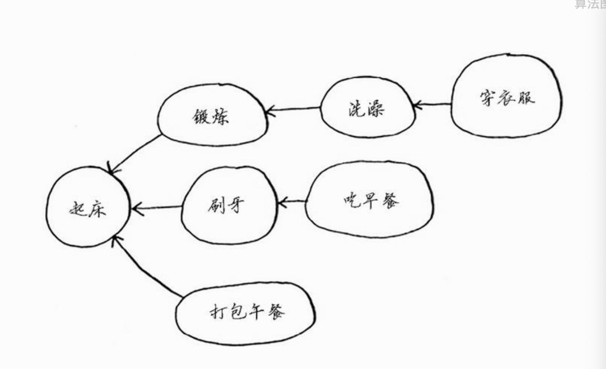

# 数据结构和算法

> 1.  边学边练，每周花 1~2 小时集中攻关三节课涉及的数据结构和算法，全部写出来

1. 数据结构是指一组数据的存储结构
2. 算法就是操作数据的方法
3. 两者相辅相成

数据结构： 数组、链表、栈、队列、散列表、二叉树、堆、跳表、图、 trie 树

算法： 递归 排序 二分法查找 搜索 哈希算法 贪心算法 分治算法 回溯算法 动态规划 字符串匹配算法

## 复杂度分析

时间、空间复杂度分析,更省空间和时间的解决问题

_复杂度分析法则_

1. 单段代码看高频：比如循环。
2. 多段代码取最大：比如一段代码中有单循环和多重循环，那么取多重循环的复杂度。
3. 嵌套代码求乘积：比如递归、多重循环等
4. 多个规模求加法：比如方法有两个参数控制两个循环的次数，那么这时就取二者复杂度相加。

### 时间复杂度

> 算法的时间是从其增速的角度度量的

所有代码的执行时间 T(n)与 每行代码的执行次数 n 成正比（O）

O:代表代码执行时间随数据规模增长的变化趋势，也叫渐进时间复杂度简称时间复杂度

1. 多项式量级

-   O（1）常量阶
-   O(logn) 对数阶
-   O（n）线性阶
-   O（n\*logn） 线性对数阶
-   O（n2） 平方阶

2. 非多项式量级

-   O(2^n) 指数阶
-   O（n!） 阶乘

### 空间复杂度分析

1. 最好
2. 最坏
3. 平均
4. 均摊
5. 时间复杂度

## 线性表

数组：基于这两点实现随机访问

-   一种线性表数据结构，
-   用一组连续的内存空间，来存储一组具有相同类型的数组

*   线性表结构：

1. 数组
2. 队列
3. 链表
4. 栈

-   连续的内存空间和相同类型的数据

**数组和链表的区别**
链表适合插入、删除，时间复杂度 O(1)

数组支持随机访问， 根据下标随机访问时间的复杂度为 O（1）

数组的 '插入'和 ‘删除’ 是比较低效

### 链表

链表的插入和删除是很快的

缓存淘汰策略：

-   先进先出 (FIFO: fist in fist out)
-   最少使用策略(LFU: Leaset Frequently Used)
-   最近最少使用策略（LRU: Leaset Recently Used）

链表

-   单链表
-   双向链表
-   循环链表

1. 单链表

内存块： 链表节点

头结点：第一节节点， 记录链表的地址

尾节点 ：最后一个节点 空地址 null


2. 循环链表

是一种特殊的单链表

3. 双向链表


## 栈

用数组实现的栈叫 顺序栈

用链表实现的栈 叫 链式栈

# 2 选择排序

基本的数据结构

-   链表
-   数组

*   计算机内存犹如一大堆的内存
*   需要存储多个元素的时候，可以使用数据或链表
*   数组的元素在一起
*   数组的读取速度很快
*   链表的插入和删除速度很快


# 3 递归

-   基线： 函数不在调用自己
-   递归条件： 函数调用自己

尾调：如果可以改成写尾递归呢（只用保留一个调用记录），不是所有的语言都支持尾调

## 栈

### 调用栈

（先进先出）用于存储多个变量


-   所有函数都进入调用栈
-   栈有两种操作： 压入和弹出
-   调用栈可能很长，这将占用大量的内存。

## 递归 分而治之（D&C 策略）

> 最简单的数组是不需要排序（操作）的数组

> “D&C 并非可用于解决问题的算法，而是一种解决问题的思路。我们再来看一个例子。”

分田的例子

使用 D&C 解决问题的过程包括两个步骤

-   (1) 找出基线条件，这种条件必须尽可能简单。

-   (2) 不断将问题分解（或者说缩小规模），直到符合基线条件。”

```
def sum(arr):
    total = 0
    for x in arr:
        total +=x
    return  total
print sum([1,21])
```

```
# 列表包含的元素
def count(list):
    if list ==[]:
        return 0
    return  1 + sum[list[1:]]
```

1. 找出基线，一个元素和 0 个元素
2. 每次递归调用都必须离空数组更近些

“编写涉及数组的递归函数时，基线条件通常是数组为空或只包含一个元素。陷入困境时，请检查基线条件是不是这样的”

## 快速排序


“归纳证明

刚才你大致见识了归纳证明！归纳证明是一种证明算法行之有效的方式，它分两步：基线条件和归纳条件。是不是有点似曾相识的感觉？例如，假设我要证明我能爬到梯子的最上面。递归条件是这样的：如果我站在一个横档上，就能将脚放到下一个横档上。换言之，如果我站在第二个横档上，就能爬到第三个横档。这就是归纳条件。而基线条件是这样的，即我已经站在第一个横档上。因此，通过每次爬一个横档，我就能爬到梯子最顶端。”

# 5 散列表

> 也被称为散列映射，映射 字典和关联数组 对象
> 将将输入映射到数字
> 散列表将键映射到值

-   “它必须是一致”
-   输入输入一一对应

*   散列函数总是将同样的输入映射到相同的索引
*   “散列函数将不同的输入映射到不同的索引”
*   散列函数知道数组有多大，只返回有效的索引

*   散列表（hash table）数据结构
    -   散列函数
    -   数组

数组和链表都被直接映射到内存，但是散列表更加复杂，他使用散列函数来确定元素的位置

## 5.2 散列表

模拟映射关系

防止重复

# 广度优先算法

> “广度优先搜索是一种用于图的查找算法，”
> 图的组成

1.  节点
2.  边

图能解决的问题

1. 使用图在建立问题模型
2. 使用广度优先搜索解决问题

“第一类问题：从节点 A 出发，有前往节点 B 的路径吗？（在你的人际关系网中，有芒果销售商吗？）”

“第二类问题：从节点 A 出发，前往节点 B 的哪条路径最短？（哪个芒果销售商与你的关系最近？）”

### 队列

> 栈：后进后出

先见先出

### 图的一些概念

“但没有从他们出发指向其他人的箭头。这被称为有向图 关系是单向的

“无向图 （undirected graph）没有箭头，直接相连的节点互为邻居。

### 广度优先算法的时间

“先搜索的运行时间为 O (人数 + 边数)，这通常写作 O (V + E )，其中 V 为顶点（vertice）数，E 为边数。”

### 图的特殊形式

-   `拓扑结构`

如果任务 A 依赖于任务 B,在列表中任务 A 就必须在任务 B 后面，


-   树

没有往后指的边

-   广度优先算法指出是否有 A 到 B 的路径
-   如果有广度优先搜索找出最短路径
-   面临类似寻找最短录几个的问题时，可以尝试使用图来建立模型，在使用官渡优先搜索来解决问题
-   有向图的边为箭头，箭头的方向指定了关系的方向
-   无向图中的边不带箭头，其中的关系是双向的，
-   你需要按加入顺序检查搜索列表中的人，否则找到的就不是最短路径，因此搜索列表必须是队列

*   你需要按加入顺序检查搜索列表中的人，否则找到的就不是最短路径，因此搜索列表必须是队列

# 狄克斯拉算法

