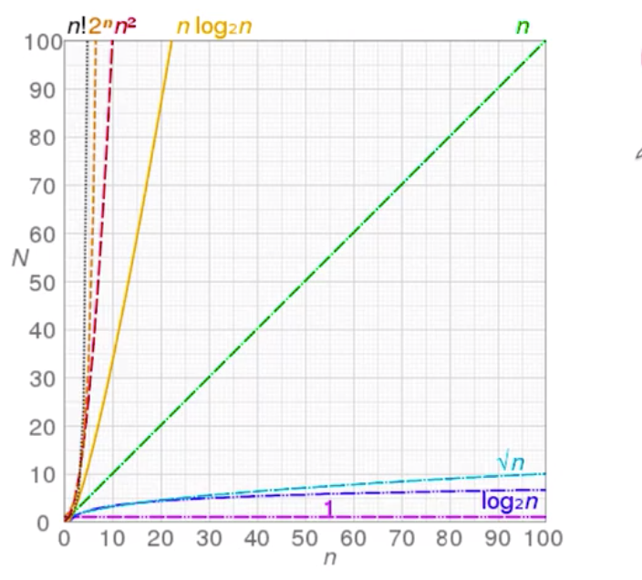
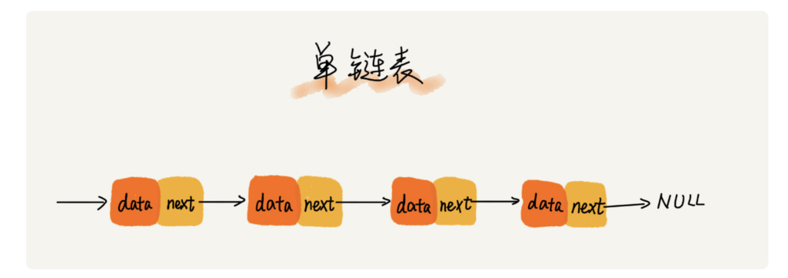
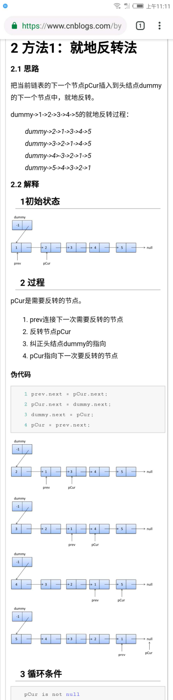
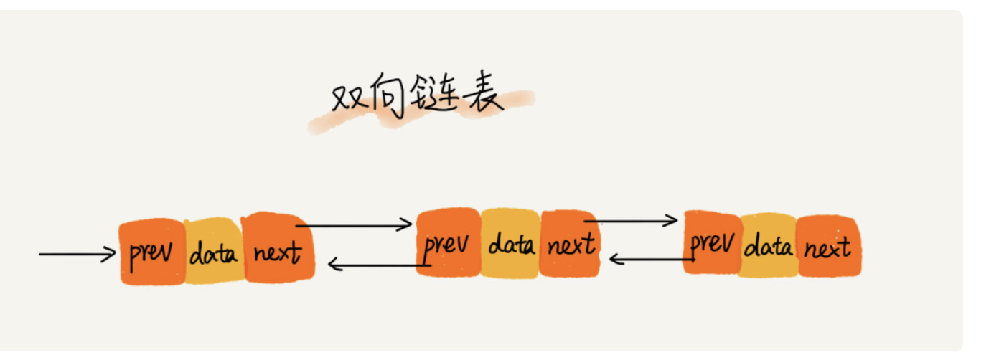
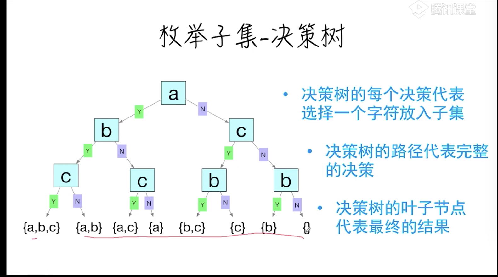
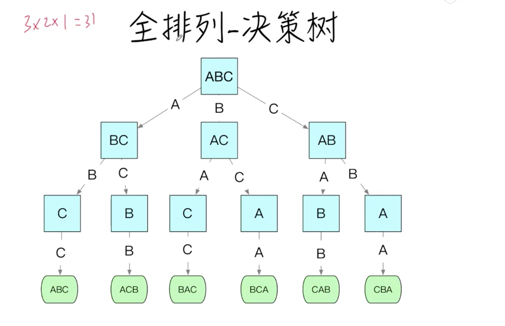
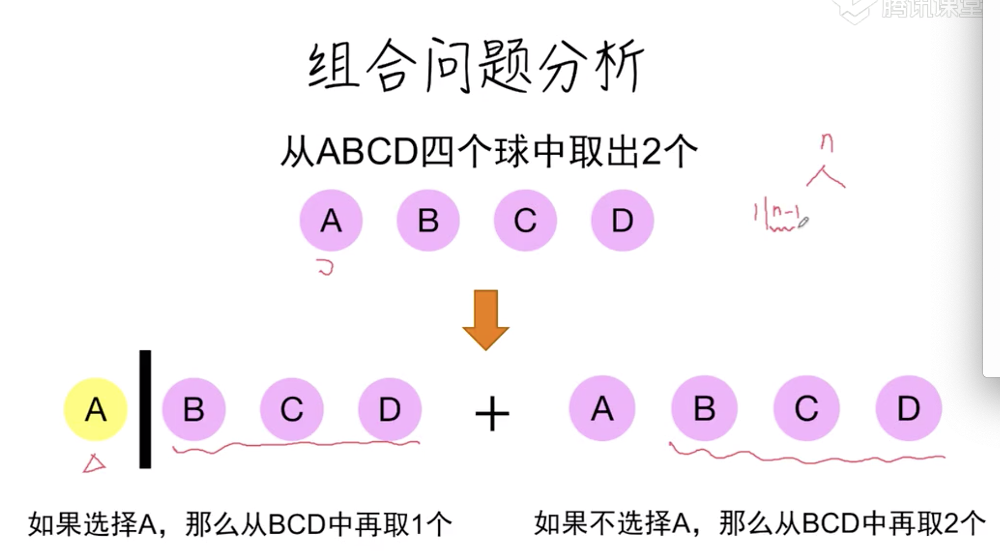
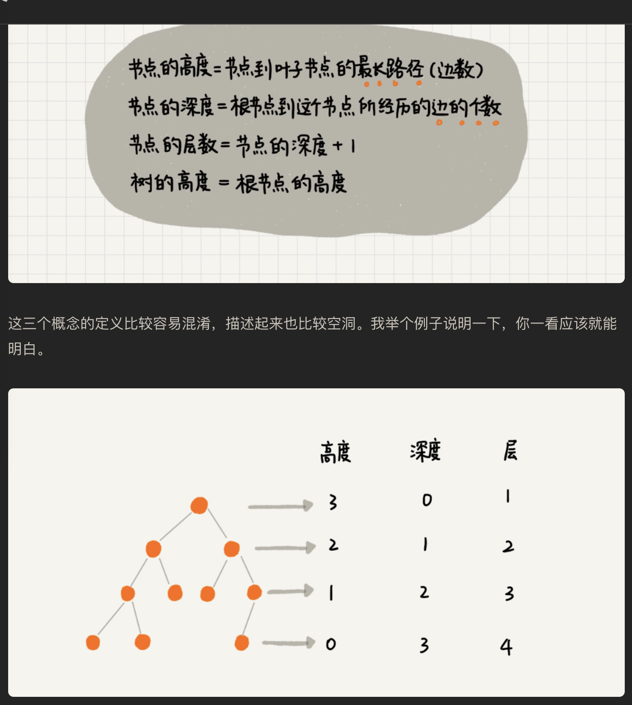
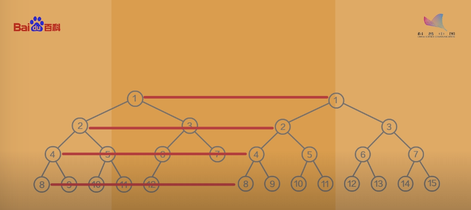

# 数据结构和算法

1. 数据结构是指一组数据的存储结构
2. 算法就是操作数据的方法
3. 两者相辅相成

-   数据结构：数组、链表、栈、队列、散列表、二叉树、堆、跳表、图、 tree 树

-   算法： 递归 排序 二分法查找 搜索 哈希算法 贪心算法 分治算法 回溯算法 动态规划 字符串匹配算法

# 1 复杂度分析

时间、空间复杂度分析,更省空间和时间的解决问题

_复杂度分析法则_

1. 单段代码看高频：比如循环。
2. 多段代码取最大：比如一段代码中有单循环和多重循环，那么取多重循环的复杂度。
3. 嵌套代码求乘积：比如递归、多重循环等
4. 多个规模求加法：比如方法有两个参数控制两个循环的次数，那么这时就取二者复杂度相加。

# 1.2 时间复杂度

> 算法的时间是从其增速的角度度量的

所有代码的执行时间 T(n)与 每行代码的执行次数 n 成正比（O）

O:代表代码执行时间随数据规模增长的变化趋势，也叫渐进时间复杂度简称时间复杂度

1. 多项式量级

-   O（1）常量阶
-   O (logn) 对数阶
-   O（n）线性阶
-   O（n\*logn） 线性对数阶
-   O（n2） 平方阶

2. 非多项式量级

-   O(2^n) 指数阶
-   O（n!） 阶乘

*   

## 1.3 空间复杂度分析

1. 最好
2. 最坏
3. 平均
4. 均摊
5. 时间复杂度

# 2 线性表

数组：基于这两点实现随机访问

-   一种线性表数据结构，
-   用一组连续的内存空间，来存储一组具有相同类型的数组

## 2.1 线性表结构

1. 数组
2. 链表
3. 栈
4. 队列

-   连续的内存空间和相同类型的数据

-   **数组和链表的区别**


## 2.2 链表

> 链表的插入和删除是很快的

-   单链表
-   双向链表
-   循环链表

缓存淘汰策略：

-   先进先出 (FIFO: fist in fist out)
-   最少使用策略(LFU: Leaset Frequently Used)
-   最近最少使用策略（LRU: Leaset Recently Used）

1. 单链表

    - 内存块： 链表节点

    - 头结点：第一节节点， 记录链表的地址

    - 尾节点 ：最后一个节点 空地址 null





2. 循环链表: 是一种特殊的单链表

3. 双向链表



## 2.3 栈

用数组实现的栈叫 顺序栈

用链表实现的栈 叫 链式栈

-   调用栈:（先进先出）用于存储多个变量

*   所有函数都进入调用栈
*   栈有两种操作： 压入和弹出
*   调用栈可能很长，这将占用大量的内存。


## 2.4 队列(queue)

1. 入队
2. 出队

# 3 排序

## 3.1 插入排序

## 3.2 冒泡排序

## 3.3 快速排序

## 3.4 合并排序

## 3.5 快速排序

# 4 分而治之（D&C 策略）

> 最简单的数组是不需要排序（操作）的数组

> “D&C 并非可用于解决问题的算法，而是一种解决问题的思路。我们再来看一个例子。”

分田的例子

使用 D&C 解决问题的过程包括两个步骤

-   (1) 找出基线条件，这种条件必须尽可能简单。

-   (2) 不断将问题分解（或者说缩小规模），直到符合基线条件。”

```python
def sum(arr):
    total = 0
    for x in arr:
        total +=x
    return  total
print sum([1,21])
```

```python
# 列表包含的元素
def count(list):
    if list ==[]:
        return 0
    return  1 + sum[list[1:]]
```

1. 找出基线，一个元素和 0 个元素
2. 每次递归调用都必须离空数组更近些

“编写涉及数组的递归函数时，基线条件通常是数组为空或只包含一个元素。陷入困境时，请检查基线条件是不是这样的”

它分两步：基线条件和归纳条件。是不是有点似曾相识的感觉？例如，假设我要证明我能爬到梯子的最上面。递归条件是这样的：如果我站在一个横档上，就能将脚放到下一个横档上。换言之，如果我站在第二个横档上，就能爬到第三个横档。这就是归纳条件。而基线条件是这样的，即我已经站在第一个横档上。因此，通过每次爬一个横档，我就能爬到梯子最顶端。”

## 4.1 递归

-   基线： 函数不在调用自己
-   递归条件： 函数调用自己

尾调：如果可以改成写尾递归呢（只用保留一个调用记录），不是所有的语言都支持尾调

### 递归和穷举

#### 枚举子集-决策时

-   求集合{a,b,c} 的所有子集？ {a,b,c} {a,b} {a,c} {b,c} {a} {b} {c} {}

1. 枚举一个集合的所有子集，可以转换成依次鞠策要不要选择集合中的某个元素的决策问题
2. 每一步骤有两个选择（是或否） 一共 n 步 因此一共有 2^n 中可能



问题抽象

```js
function find_subsets(S, decistions){
    //所有的决策树都已经完成
    if(S.length) === decistions.length{
        //返回结果
    }
    let r=[]
    r = r.concat(find_subsets(S, decistions.concat(true)))
    r = r.concat(find_subsets(S, decistions.concat(false)))
    return r;
}
```

#### 全排列-决策树

求字符串的全排列 abc



#### 排列总结

1. 枚举问题可以转化为决策问题
2. 画出问题的决策树，然后根据决策树写出递归程序

```
function exhan(){
    if(所有决策都完成){
        返回结果
    }
    根据当前状态算出所有可能的决策
    递归调用这些决策
    收集递归结果 返回
}
```

### 组合问题

1. 从集合{a,b,c,d,e,f,g} 中取 3 个元素有多少种组合
2. 从 ABCD 四个球中取出 2 个



递归条件（从结婚 s 中取 k 个）

-   初始条件
    -   k=0 或者 k===|s| 返回当前解
-   递归
    -   选择一个元素 x
    -   递归： 包含这个元素 x
    -   递归： 不包含这个元素 x
    -   收集上面两步的结果

```js
// s: 数组 需要求组合的集合
// k: 取出的元素个数
function combination(S, k) {
    if (k === 0 || S.length === k) {
        return [S.slice(0, k)];
    }
    const [first, ...others] = S;
    let r = [];
    r = r.concat(combination(others, k - 1).map((c) => [first, ...c]));
    r = r.concat(combination(others, k));
    return r;
}
const S = ['A', 'B', 'C', 'D'];
console.log(combination(S, 2));
```

### 重复子问题

使用尾递归解决

```js
const Fibonacci = (n, sum1 = 1, sum2 = 1) => {
    if (n <= 1) return sum2;
    return Fibonacci(n - 1, sum2, sum1 + sum2);
};
Fibonacci(10); // 89
Fibonacci(100); // 573147844013817200000 速度依旧很快
```

## 动态规划

动态规划处理的是一类可以被递归描述的问题

和一般递归问题不同，这类问题总往往有很多倍重复计算的子结构， 我们从底部向上构造整个解，使得所有子问题计算都只有一次

有的时候问题没有那么简单，缓存数据可能是一个二维数组或其他

1. 求解公共子序列

```
   lcs(ABCBDAB, BDCABA);
```

# 二叉树

-   兄弟节点：同属于一个父节点，它们之间互称为兄弟节点

-   根节点： 没有父节点的节点

-   叶节点： 没有子节点的节点



## 7.1 满二叉树

除了叶子节点之外，每个节点都有左右两个子节点，



## 7.2 完全二叉树

1. 第一种定义

-   深度为 k
-   n 个节点

当且仅当每个每一个节点都与深度为 k 的满二叉树中，编号从 1-n 的节点一一对应时


2. 第一种定义

-   深度为 h
-   除第 h 层外

其他各节点数都达到最大个数， 第 h 层所有节点（不是子节点）都连续集中在最左边

## 7.3 如何存储二叉树

1. 一种是基于指针或者引用的二叉链式存储法，
2. 一种是基于数组的顺序存储法

## 7.4 二叉树的遍历

1. 前序遍历
2. 中序遍历
3. 后序遍历
4. 按层访问（广度优先搜索）
5. 深度优先搜索

 给定一个数组，比如 1，3，5，6，9，10 来算算，可以构建 6！  中二叉树

前序遍历的递推公式：
preOrder(r) = print r->preOrder(r->left)->preOrder(r->right)

中序遍历的递推公式：
inOrder(r) = inOrder(r->left)->print r->inOrder(r->right)

后序遍历的递推公式：
postOrder(r) = postOrder(r->left)->postOrder(r->right)->printr

# 二叉查找树

二叉查找树最大的特点是 支持动态的数据集合的快速插入 删除 查找 操作

二叉查找树要求，在树中的任意一个节点，其左子树中的每个节点的每个节点的值，都要小于这个节点的值，而右子树节点的值都大于这个节点的值

树高
确定二叉树高度有两种思路：

第一种是深度优先思想的递归，分别求左右子树的高度。当前节点的高度就是左右子树中较大的那个+1；

第二种可以采用层次遍历的方式，每一层记录都记录下当前队列的长度，这个是队尾，每一层队头从 0 开始。然后每遍历一个元素，队头下标+1。直到队头下标等于队尾下标。这个时候表示当前层遍历完成。每一层刚开始遍历的时候，树的高度+1。最后队列为空，就能得到树的高度。

# 红黑树 的一些案例

旋转

# 图

> [基本概念](https://www.jianshu.com/p/84a59257b0b7)

1. 由边和顶点组成
2. 图有各种形状和大小。边可以有权重（weight),即每一条边会被分配一个正数或者负数值。考虑一个代表航线的图。各个城市就是顶点，航线就是边。那么边的权重可以是飞行时间，或者机票价格。
3. 广度优先算法

### 代码表示：顶点和边

有两种主要的方法：邻接列表和邻接矩阵。

邻接列表：在邻接列表实现中，每一个顶点会存储一个从它这里开始的边的列表。比如，如果顶点 A 有一条边到 B、C 和 D，那么 A 的列表中会有 3 条边
