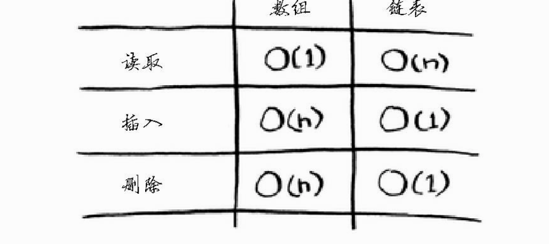
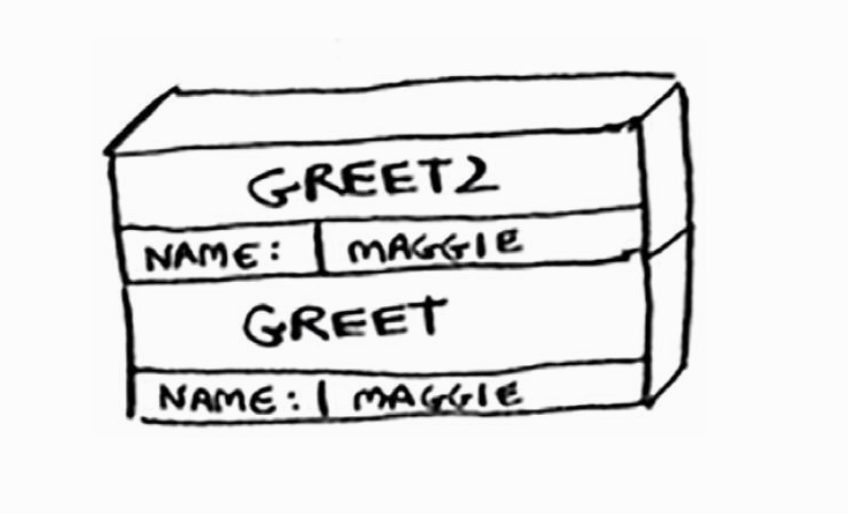
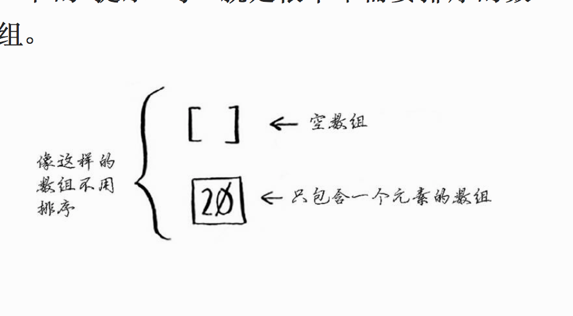

# 数据结构和算法

一般上我们把数据结构分为逻辑结构和物理结构

逻辑结构： 是指数据对象中数据元素之间的相互关系
物理结构： 是指数据是逻辑结构在计算机中的存在

## 逻辑结构

-   集合结构： 集合结构中的数据元素同属一个结合为，他们之间没有关系

*   属性结构： 树形结构中的数据元素之间存在一种一对多的层次关系
*   线性结构： 线性结构中的数据元素之间是一对一的关系
*   图形结构： 是多对多的问题

## 物理结构

数据元素的存储结构形式有两种： 顺序存储和链式存储

-   顺序存储结构：
    是把数据元素存放在地址连续的存储单元里面，数据间的逻辑关系和物理关系是一致的，例如我们编程语言的数组结构就是这样的

*   链式存储结构：是把数据元素存放在任意的存储单元里面，存储单元可以是连续的也可以是不连续的

# 1 算法时间

> 算法的时间是从其增速的角度度量的

-   O(logn) 对数时间
-   O（n）线性时间
-   O（n\*logn） 快速排序
-   O（n2） 较慢的排序
-   O（n!）非常慢

“大 O 表示法中的常量有时候事关重大，这就是快速排序比合并排序快的原因所在。

比较简单查找和二分查找时，常量几乎无关紧要，因为列表很长时，O (log n )的速度比 O (n )快得多。”

# 2 选择排序

基本的数据结构

-   链表
-   数组

*   计算机内存犹如一大堆的内存
*   需要存储多个元素的时候，可以使用数据或链表
*   数组的元素在一起
*   数组的读取速度很快
*   链表的插入和删除速度很快



# 3 递归

-   基线： 函数不在调用自己
-   递归条件： 函数调用自己

尾调：如果可以改成写尾递归呢（只用保留一个调用记录），不是所有的语言都支持尾调

## 栈

### 调用栈

（先进先出）用于存储多个变量



-   所有函数都进入调用栈
-   栈有两种操作： 压入和弹出
-   调用栈可能很长，这将占用大量的内存。

# 4 快速排序 - 分而治之（D&C 策略）

## 4.1 分而治之（D&C 策略）

> 最简单的数组是不需要排序（操作）的数组

> “D&C 并非可用于解决问题的算法，而是一种解决问题的思路。我们再来看一个例子。”

分田的例子

使用 D&C 解决问题的过程包括两个步骤

-   (1) 找出基线条件，这种条件必须尽可能简单。

-   (2) 不断将问题分解（或者说缩小规模），直到符合基线条件。”

```
def sum(arr):
    total = 0
    for x in arr:
        total +=x
    return  total
print sum([1,21])
```

```
# 列表包含的元素
def count(list):
    if list ==[]:
        return 0
    return  1 + sum[list[1:]]
```

1. 找出基线，一个元素和 0 个元素
2. 每次递归调用都必须离空数组更近些

“编写涉及数组的递归函数时，基线条件通常是数组为空或只包含一个元素。陷入困境时，请检查基线条件是不是这样的”

## 4.2 快速排序



“归纳证明

刚才你大致见识了归纳证明！归纳证明是一种证明算法行之有效的方式，它分两步：基线条件和归纳条件。是不是有点似曾相识的感觉？例如，假设我要证明我能爬到梯子的最上面。递归条件是这样的：如果我站在一个横档上，就能将脚放到下一个横档上。换言之，如果我站在第二个横档上，就能爬到第三个横档。这就是归纳条件。而基线条件是这样的，即我已经站在第一个横档上。因此，通过每次爬一个横档，我就能爬到梯子最顶端。”

# 5 散列表

> 也被称为散列映射，映射 字典和关联数组 对象
> 将将输入映射到数字
> 散列表将键映射到值

-   “它必须是一致”
-   输入输入一一对应

*   散列函数总是将同样的输入映射到相同的索引
*   “散列函数将不同的输入映射到不同的索引”
*   散列函数知道数组有多大，只返回有效的索引

*   散列表（hash table）数据结构
    -   散列函数
    -   数组

数组和链表都被直接映射到内存，但是散列表更加复杂，他使用散列函数来确定元素的位置

## 5.2 散列表

模拟映射关系

防止重复

“缓存/记住数据，以免服务器再通过处理来生成它们”

# 广度优先搜索

## 最短路径

1. 使用图在建立问题模型
2. 使用广度优先搜索解决问题

图

1.  节点
2.  边
