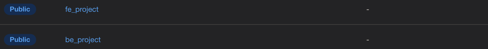
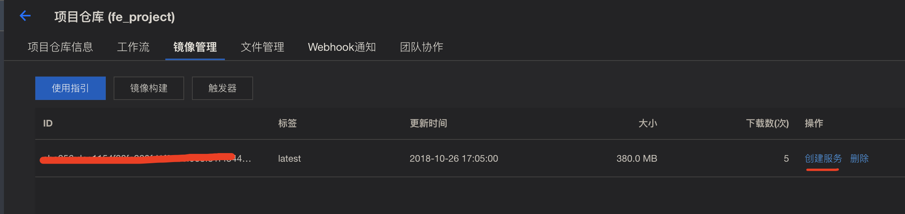
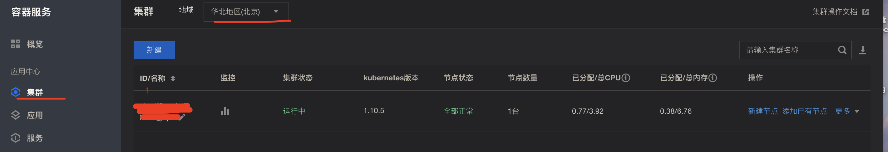
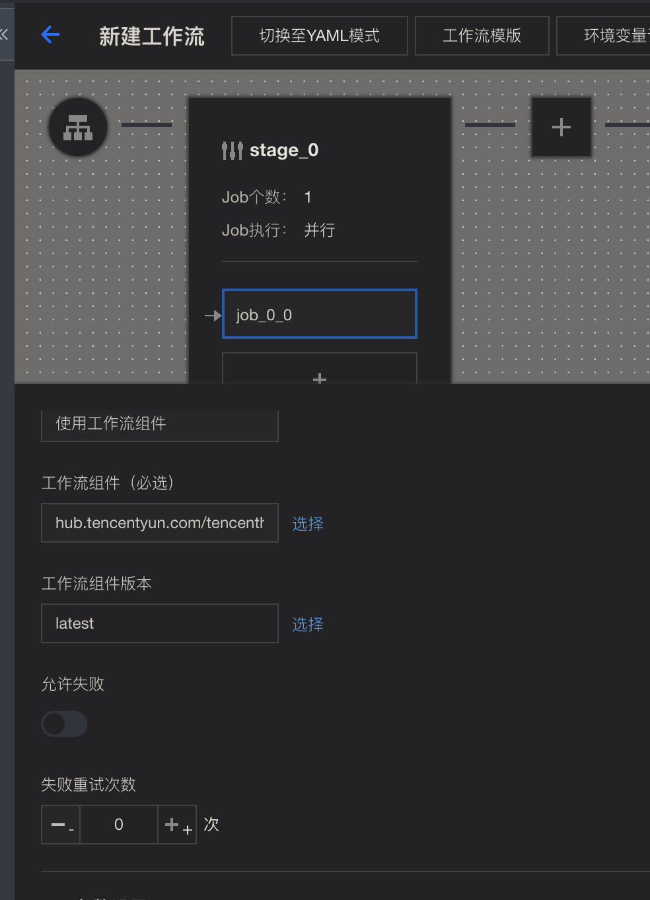
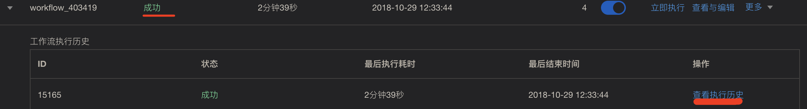
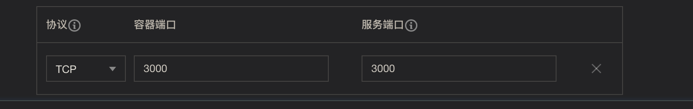
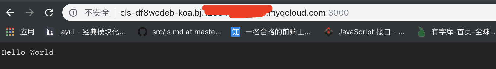
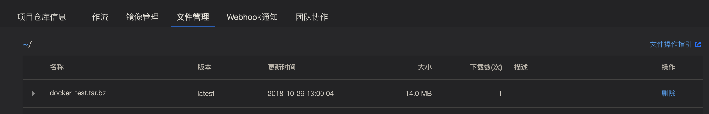
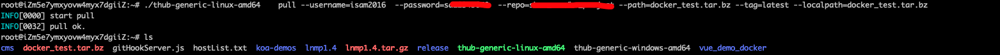

# Tencent Hub 

使用了Tencent Hub,这个东西是基于容器化的。提供一个简单的demo

* docker

     * [教程](http://www.ruanyifeng.com/blog/2018/02/docker-tutorial.html)
     * [命令行](https://gitee.com/shouzan_network/container_research/blob/master/docker.md)
    

* 前端： 
    * koa
    * pm2
    * docker-node 
    * [地址](https://gitee.com/shouzan_network/dashboard/projects/shouzan_network/koa)
    
* 后端
    * java
    * nginx    
    * docker-java
    * [地址](https://gitee.com/shouzan_network/docker_test)
    
* 服务器
    
    * ip: 	188.131.181.30
    * name:  
    * pass: sa123456
    
* Tencent Hub 
    
    * [仓库地](https://console.cloud.tencent.com/tencenthub/repo )
   * 前端是： fe_project
   * 后端是： be_project

## Tencent Hub 基本设置

先参考[基于TencentHub 的持续集成和持续部署](https://cloud.tencent.com/document/product/457/11039)


* **授权**

    先让管理员，授权你能操作这个地方，之前就被坑了，我是把所有的权限都开了，防止被坑
* 组织
    
    略
* 仓库
    
    我们是前后端分为两个仓库
    
    
        
* 发布 

  发展在镜像中创建服务
  
  
          
   当然是用服务的前提是有集群和节点
   
   请自行创建集群和节点，注意地区的选择
   
   
   
 
 
 ##  前端创建镜像和发布
 
 Dockerfile
 
 ```
FROM node:8.11.3

# copy souce
COPY . /app

WORKDIR /app

# Install pm2 
# 全局安装放在最前边
RUN npm install pm2 -g

# Install package
RUN npm install 

# 暴露端口
EXPOSE 3000

# pm2 启动服务
CMD ["pm2-runtime", "server.js"]

```
   
   
###  fe_project 中创建工作流

* 代码授权 
  
  触发方式 自行选择
   
   这里我们选 `提交代码到分支时触发` - `master`   


* 添加工作流
     
     * 打包成镜像文件 
     
    

    * 选择工作流组件 `thub_docker_builder`
  
* 测试
 
  保存之后 点击 `立即执行` 测试   
  
* 结果  

  
  
  也可以查看日志
  

### 发布

> [参考](https://cloud.tencent.com/document/product/457/7851)

  到镜像管理找到 刚才的镜像 ，点击 `创建服务`
     
     端口注意
     
   
     
     
       
找到服务对应的 域名 ，访问  

`cls-df8wcdeb-koa.bj.[example].clb.myqcloud.com：300`

 
     
     
 
 # java 项目
 
 
 
 
 
 
 [阅读](https://cloud.tencent.com/document/product/857/18776)
 
 
 
进入``be_project`` 仓库，创建工作流，并新建job ,选择 java_build_maven，组件


注意： Job参数设置 

* HUB_REPO 的填写 如下


    请务必记住这两个参数，含义为 `mynamespace/myrepo`

* _WORKFLOW_FLAG_HUB_TOKEN :true


* 其余为空 
 
 
 ### 点击立即执行
 
 
 
 如图 产生java 文件，我们的下载，请注意文件下载方法。
 
 
  
  
 ### 文件下载
 
  [请查看需要的客户端文件](https://cloud.tencent.com/document/product/857/18231)
    
   工具为命令行工具。
  
  我们使用linux版，将文件放到我们的服务器上，
  
  * 修改一下thub-generic-linux-amd64 的权限
```
chmod -R 777 thub-generic-linux-amd64
```


* 用法 ：./thub-generic-linux-amd64 pull --username=xxx --password=xxx --repo=mynamespace/myrepo --path=test.txt --tag=latest --localpath=test.txt 


所以我们执行 
```
./thub-generic-linux-amd64 pull --username=isam2016  --password=mima  --repo=刚才提到的mynamespace/myrepo --path=docker_test.tar.bz --tag=latest --localpath=docker_test.tar.bz
```



