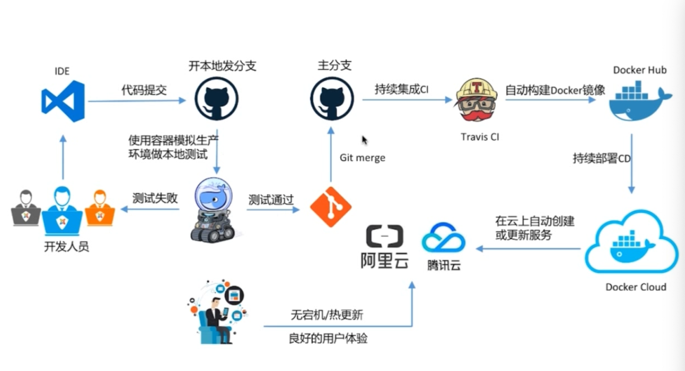

# 容器化

-   环境复杂
-   解决开发和运维之间的关系

*   对软件和其依赖的标准化打包
*   应用之间相互隔离

#docker

Docker 一直是以客户端和服务器的模式运行的.可以远程连接。以阿里云为例
[腾讯云](https://cloud.tencent.com/developer/article/1030184)

# 镜像

> 国内镜像地址 https://www.daocloud.io/mirror#accelerator-doc

独立的软件包 用来安装程序，容器是镜像运行的实例

**注意： 创建 了镜像不要在镜像中保存业务数据,应该放在宿主机上面**

## 镜像的命令

> 为了解决 docker 命令 sudo 授权问题可以把 docker 赋予权限添加到用户组

-   启动镜像 `service docker start`
-   停止镜像 `service docker stop`

*   重启镜像 `service docker restart`

-   获取镜像 `git pull NAME[:tag]`

*   查看所有镜像 `docker images`

*   用 tag 命令添加标签 `docker tag ubuntu:14.04 myubuntu:latest`

*   镜像重新起名 `docker tag OLDNAME NEWNAME`

-   查看详情镜像 `docker inspect NAME`

-   删除镜像 `docker rmi IMAG [IMAGE...](标签或ID)`

### 创建镜像

1. 基于已有的镜像进行创建
   `docker commit -m 'add a new file' -a 'kl' 4771f8bf30cc test:0.1`

    - -a 作者信息

    * -m 提交信息
    * -p 提交时暂停容器运行

2. 基于本地模板导入

3. 通过 dockerfile

### 存入和载入镜像

1. 存出镜像
2. 载入

### 上传镜像

`docker push NAME:[:TAG]`

## 数据管理

容器中的数据管理有

-   数据卷 : 容器内数据直接映射到本机环境
-   数据卷容器：使用特定容器维护数据卷

```
docker run -it -p 9000:3000 --name koatests --rm -v /Users/suhailong/su/NOTE/async:/demos --privileged koa-demo
```

# 端口映射与容器互联

## 端口映射实现访问容器

1. 从外部访问容器
   利用 `-P(大写)` 来实现，docker 会映射一个 49000~49900 范围的一个端口,

> 可以使用`docker ps` 查看端口映射

```
 docker run  -P -it koa-demo /bin/bash
```

2.  映射所有接口地址

> 可以使用多个 -p

```
   docker run  -p 8000:3000 -it koa-demo /bin/bash
```

3. 映射到指定地址的指定端口

```
   docker run  -p 127.128.9.0:8000:3000 -it koa-demo /bin/bash
```

4. 映射到指定地址的任意端口

```
   docker run  -p 127.128.9.0::3000 -it koa-demo /bin/bash
```

5. 查看映射关系

    docker port CONTAINER

## 互联机制

1. 自定义容器命名
    - `--name`

```
docker run -d -P --name=web koa-demo
```

# 容器

-   创建
    `docker run`

    -   `-it 启动一个界面（bash）`
        -   `exit 退出 bash`
    -   `-d 后台运行`
    -   `-v 数据卷`
        -   `-v 主机目录：容器目录`

    *   `--privileged 数据卷的读写最高权限`

    -   `--net 网段`

    *   `--name 容器命名`
    *   `--ip 规定的IP地址`

```
docker run -d -p 3306:3306 -e MYSQL_ROOT_PASSWORD=abc123456 -e CLUSTER_NAME=PXC -e XTRABACKUP_PASSWORD=abc123456 -v v1:/var/lib/mysql --privileged --name=node1 --net=net1 --ip 172.18.0.2 pxc
```

第一个初始化较为缓慢，必须等待第一个初始化完毕

```
docker run -d -p 3307:3306 -e MYSQL_ROOT_PASSWORD=abc123456 -e CLUSTER_NAME=PXC -e XTRABACKUP_PASSWORD=abc123456  -e CLUSTER_JOIN=node1 -v v2:/var/lib/mysql --privileged --name=node2 --net=net1 --ip 172.18.0.3 pxc
```

```
docker run -d -p 3308:3306 -e MYSQL_ROOT_PASSWORD=abc123456 -e CLUSTER_NAME=PXC -e XTRABACKUP_PASSWORD=abc123456  -e CLUSTER_JOIN=node1 -v v3:/var/lib/mysql --privileged --name=node3 --net=net1 --ip 172.18.0.4 pxc
```

```
docker run -d -p 3309:3306 -e MYSQL_ROOT_PASSWORD=abc123456 -e CLUSTER_NAME=PXC -e XTRABACKUP_PASSWORD=abc123456  -e CLUSTER_JOIN=node1 -v v4:/var/lib/mysql --privileged --name=node4 --net=net1 --ip 172.18.0.5 pxc
```

```
docker run -d -p 3310:3306 -e MYSQL_ROOT_PASSWORD=abc123456 -e CLUSTER_NAME=PXC -e XTRABACKUP_PASSWORD=abc123456  -e CLUSTER_JOIN=node1 -v v5:/var/lib/mysql --privileged --name=node5 --net=net1 --ip 172.18.0.6 pxc
```

-   查看

```
docker container ls --all 所有容器
```

# 网段设置

mysql 默认的网段是 172.17.0.X

如果创建则按顺序递增 172.17+n.0.X

```
docker network create NAME
```

```
eg: docker network create --subnet=172.18.0.0/24 net1
```

-   查看网段信息

```
docker network inspect NAME`
```

-   删除网段

```
  docker newwork rm net1
```

-   可以创建特定网段
-   `--subnet`

# Docker 数据管理

-   创建数据卷

    -   `docker volume create NAME`
        -   在创建容器的时候是 -v
        -   `--name v1`

*   查看数据卷

    -   `docker inspect NAME`

*   查看所有

    -   docker volume ls

*   删除数据卷
    -   `docker valume rm NAME`ss

# docekrfile

### RUN

执行命令并创建新的 IMage layer

### CMD

-   设置容器启动后默认执行的命令

*   如果 docker run 指定了其他的命令，CMD 将被忽略
*   如果定义了多个 CMD ，只有最后一个会执行

```
FROM centos
ENV name Docker
CMD echo "hello $name"
```

```
docker run [image] 输出 ？
# hello Docker
```

```
docker run  -t [image] /bin/bash ？
# 不在输出
```

### ENTRYPOINT

-   让容器以应用程序或者服务的形式运行

*   不会被或略
*   最佳实践： 写一个 shell 脚本为 entrypoint

```
COPY docker-entrypoint.sh /usr/local/bin/
ENTRYPOINT ["docker-entrypoint.sh"]

EXPOSE 27017
CMD ["mongod"]
```

## 书写的格式

为两种，

-   shell

```
FROM centos
ENV name Docker
CMD echo "hello $name"
```

-   exec

```
FROM centos
ENV name Docker
ENTRYPOINT ["/bin/bash","-c","echo hello $name"]
```

# 容器互联

[项目地址]（前端地址）
[参考](https://www.jianshu.com/p/21d66ca6115e)

使用--link 参数可以让容器之间进行安全的交互，docker 相当于在连个容器之间建立了一个虚拟通道，并且不用映射他们的端口到宿主机上，可以不用使用-p ，-P 标记。

1. nginx

```
# 建立nginx
# docker run --rm -it -d --name mynginx --link wordpressdb:mysql nginx
# docker run -d -p 127.0.0.2:8080:80 --rm --name mynginx nginx
# 进入nginx
# docker exec -it mynginx /bin/bash
```

2. 建立 数据库 容器

```
docker run -d --rm --name wordpressdb --env MYSQL_ROOT_PASSWORD=123456 --env MYSQL_DATABASE=wordpress mysql:5.7
```

## 源容器和接收容器之间传递数据是通过以下 2 种方式：

-   设置环境变量
-   更新/etc/hosts 文件

#### 2.1 设置环境变量

当使用--link 时，docker 会自动在接收容器内创建基于--link 参数的环境变量：
docker 会在接收容器中设置名为<alias>\_NAME 的环境变量，该环境变量的值为：
<alias>\_NAME=/接收容器名/源容器 alias

我们进入 nginx 容器，看下此环境变量：

```
docker exec -it mynginx /bin/bash
```

查看 myslq 信息

```
env | grep -i MYSQL
```


#### 2.2 更新/etc/hosts 文件

docker 会将源容器的 host 更新到目标容器的/etc/hosts 中

```
cat /etc/hosts
```

# 发布流程



### Docker Compose

新建`docker-compose.yml`

```
mysql:
  image: mysql:latest
  environment:
    - MYSQL_ROOT_PASSWORD=123456
    - MYSQL_DATABASE=wordpress
web:
  image: nginx
  links:
    - mysql
  environment:
    - WORDPRESS_DB_PASSWORD=123456
  ports:
    - "127.0.0.1:8080:80"
```

# TCP 端口打开

> [链接](https://blog.csdn.net/onlyshenmin/article/details/81069047#1%E5%BC%80%E5%90%AFtcp%E7%AE%A1%E7%90%86%E7%AB%AF%E5%8F%A3)

1. 开启 TCP 管理端口

-   1.1 创建目录/etc/systemd/system/docker.service.d

```
mkdir /etc/systemd/system/docker.service.d
```

-   1.2. 在这个目录下创建 tcp.conf 文件,增加以下内容

```
Ubuntu和CentOS7 通用版
cat > /etc/systemd/system/docker.service.d/tcp.conf <<EOF
[Service]
ExecStart=
ExecStart=/usr/bin/dockerd -H unix:///var/run/docker.sock -H tcp://0.0.0.0:2375
EOF
```

上面两个版本的区别在于用何种方式指定 Docker 守护进程本地套接字监听

```
-H fd://                                    仅Ubuntu可用
-H unix:///var/run/docker.sock              CentOS和Ubuntu通用
```

-   1.3. Daemon 重新 reload ，并重启 docker

```
systemctl daemon-reload
systemctl restart docker
```

-   1.4. 查看端口是否打开

```
ps aux |grep dockerd
或者
netstat -an | grep 2375
```

-   1.5 关闭 TCP 管理端口

```
   rm /etc/systemd/system/docker.service.d/tcp.conf -rf
   systemctl daemon-reload
   systemctl restart docker
   ps aux |grep dockerd
```
