- [0 CI/CD](#0-cicd)
  - [脚本备份](#%E8%84%9A%E6%9C%AC%E5%A4%87%E4%BB%BD)
- [1 安装 Jenkins](#1-%E5%AE%89%E8%A3%85-jenkins)
    - [1.2.0 防火墙放行](#120-%E9%98%B2%E7%81%AB%E5%A2%99%E6%94%BE%E8%A1%8C)
    - [1.2.1 在线安装](#121-%E5%9C%A8%E7%BA%BF%E5%AE%89%E8%A3%85)
    - [1.2.3 调整配置文件](#123-%E8%B0%83%E6%95%B4%E9%85%8D%E7%BD%AE%E6%96%87%E4%BB%B6)
    - [sudo vim /etc/sysconfig/iptables](#sudo-vim-etcsysconfigiptables)
    - [重启生效: sudo systemctl restart iptables](#%E9%87%8D%E5%90%AF%E7%94%9F%E6%95%88-sudo-systemctl-restart-iptables)
- [sudo systemctl stop jenkins](#sudo-systemctl-stop-jenkins)
- [sudo systemctl disable jenkins](#sudo-systemctl-disable-jenkins)
- [sudo yum -y remove jenkins](#sudo-yum--y-remove-jenkins)
- [sudo rm -rf /var/{lib,log,cache}/jenkins /usr/lib/jenkins /root/.jenkins](#sudo-rm--rf-varliblogcachejenkins-usrlibjenkins-rootjenkins)
- [sudo rm -rf `sudo find /{etc,var,run} -name "jenkins*"`](#sudo-rm--rf-sudo-find-etcvarrun--name-%22jenkins%22)
- [docker ps // domo 容器的 ID 为 345aa0753269](#docker-ps--domo-%E5%AE%B9%E5%99%A8%E7%9A%84-id-%E4%B8%BA-345aa0753269)
- [apt-get update](#apt-get-update)
- [apt-get install vim](#apt-get-install-vim)
- [mv apache-maven-3.6.0-bin.tar.gz /usr/local/](#mv-apache-maven-360-bintargz-usrlocal)
- [解压](#%E8%A7%A3%E5%8E%8B)
- [重命名](#%E9%87%8D%E5%91%BD%E5%90%8D)
- [配置环境变量，编辑/etc/profile 文件，添加如下代码](#%E9%85%8D%E7%BD%AE%E7%8E%AF%E5%A2%83%E5%8F%98%E9%87%8F%E7%BC%96%E8%BE%91etcprofile-%E6%96%87%E4%BB%B6%E6%B7%BB%E5%8A%A0%E5%A6%82%E4%B8%8B%E4%BB%A3%E7%A0%81)
- [保存文件，并运行如下命令使环境变量生效](#%E4%BF%9D%E5%AD%98%E6%96%87%E4%BB%B6%E5%B9%B6%E8%BF%90%E8%A1%8C%E5%A6%82%E4%B8%8B%E5%91%BD%E4%BB%A4%E4%BD%BF%E7%8E%AF%E5%A2%83%E5%8F%98%E9%87%8F%E7%94%9F%E6%95%88)
- [在控制台输入如下命令，如果能看到 Maven 相关版本信息，则说明 Maven 已经安装成功](#%E5%9C%A8%E6%8E%A7%E5%88%B6%E5%8F%B0%E8%BE%93%E5%85%A5%E5%A6%82%E4%B8%8B%E5%91%BD%E4%BB%A4%E5%A6%82%E6%9E%9C%E8%83%BD%E7%9C%8B%E5%88%B0-maven-%E7%9B%B8%E5%85%B3%E7%89%88%E6%9C%AC%E4%BF%A1%E6%81%AF%E5%88%99%E8%AF%B4%E6%98%8E-maven-%E5%B7%B2%E7%BB%8F%E5%AE%89%E8%A3%85%E6%88%90%E5%8A%9F)
  - [1.4 node 环境 安装 node](#14-node-%E7%8E%AF%E5%A2%83-%E5%AE%89%E8%A3%85-node)
  - [1.5 cnetos 安装 git](#15-cnetos-%E5%AE%89%E8%A3%85-git)
  - [1.6 docker](#16-docker)
- [2 基本配置](#2-%E5%9F%BA%E6%9C%AC%E9%85%8D%E7%BD%AE)
  - [2.1 登录](#21-%E7%99%BB%E5%BD%95)
  - [2.2 安全设置](#22-%E5%AE%89%E5%85%A8%E8%AE%BE%E7%BD%AE)
  - [2.3 插件安装方法](#23-%E6%8F%92%E4%BB%B6%E5%AE%89%E8%A3%85%E6%96%B9%E6%B3%95)
    - [2.3.1 离线安装](#231-%E7%A6%BB%E7%BA%BF%E5%AE%89%E8%A3%85)
    - [2.3.2 在线安装](#232-%E5%9C%A8%E7%BA%BF%E5%AE%89%E8%A3%85)
  - [2.4 工具设置](#24-%E5%B7%A5%E5%85%B7%E8%AE%BE%E7%BD%AE)
- [3 项目接入-私有 Git 仓库帐号配置（通用版）](#3-%E9%A1%B9%E7%9B%AE%E6%8E%A5%E5%85%A5-%E7%A7%81%E6%9C%89-git-%E4%BB%93%E5%BA%93%E5%B8%90%E5%8F%B7%E9%85%8D%E7%BD%AE%E9%80%9A%E7%94%A8%E7%89%88)
  - [3.1 配置 SSH Key 登录配置](#31-%E9%85%8D%E7%BD%AE-ssh-key-%E7%99%BB%E5%BD%95%E9%85%8D%E7%BD%AE)
  - [3.2 在 Jenkins 配置 git ssh](#32-%E5%9C%A8-jenkins-%E9%85%8D%E7%BD%AE-git-ssh)
  - [3.2 插件安装](#32-%E6%8F%92%E4%BB%B6%E5%AE%89%E8%A3%85)
  - [3.3 新建构建项目](#33-%E6%96%B0%E5%BB%BA%E6%9E%84%E5%BB%BA%E9%A1%B9%E7%9B%AE)
    - [3.3.1 开始创建](#331-%E5%BC%80%E5%A7%8B%E5%88%9B%E5%BB%BA)
    - [3.3.2 源码管理](#332-%E6%BA%90%E7%A0%81%E7%AE%A1%E7%90%86)
    - [3.3.4 版本提交触发构建](#334-%E7%89%88%E6%9C%AC%E6%8F%90%E4%BA%A4%E8%A7%A6%E5%8F%91%E6%9E%84%E5%BB%BA)
    - [3.3.5 构建](#335-%E6%9E%84%E5%BB%BA)
  - [3.4 手工触发构建](#34-%E6%89%8B%E5%B7%A5%E8%A7%A6%E5%8F%91%E6%9E%84%E5%BB%BA)
- [4 部署](#4-%E9%83%A8%E7%BD%B2)
  - [4.1 Publish Over SSH](#41-publish-over-ssh)
  - [4.2 工程配置服务器](#42-%E5%B7%A5%E7%A8%8B%E9%85%8D%E7%BD%AE%E6%9C%8D%E5%8A%A1%E5%99%A8)
- [5 开启 开启邮件报告](#5-%E5%BC%80%E5%90%AF-%E5%BC%80%E5%90%AF%E9%82%AE%E4%BB%B6%E6%8A%A5%E5%91%8A)
  - [5.1 安装相关插件](#51-%E5%AE%89%E8%A3%85%E7%9B%B8%E5%85%B3%E6%8F%92%E4%BB%B6)
  - [5.2 全局统一设置](#52-%E5%85%A8%E5%B1%80%E7%BB%9F%E4%B8%80%E8%AE%BE%E7%BD%AE)
    - [5.2.1 设置管理员邮箱](#521-%E8%AE%BE%E7%BD%AE%E7%AE%A1%E7%90%86%E5%91%98%E9%82%AE%E7%AE%B1)
    - [5.2.2 设置发件人帐号](#522-%E8%AE%BE%E7%BD%AE%E5%8F%91%E4%BB%B6%E4%BA%BA%E5%B8%90%E5%8F%B7)
    - [5.2.4 设置邮件触发时机](#524-%E8%AE%BE%E7%BD%AE%E9%82%AE%E4%BB%B6%E8%A7%A6%E5%8F%91%E6%97%B6%E6%9C%BA)
    - [5.2.5 邮件可用变量](#525-%E9%82%AE%E4%BB%B6%E5%8F%AF%E7%94%A8%E5%8F%98%E9%87%8F)
    - [5.2.6 邮件未发送问题排查](#526-%E9%82%AE%E4%BB%B6%E6%9C%AA%E5%8F%91%E9%80%81%E9%97%AE%E9%A2%98%E6%8E%92%E6%9F%A5)
  - [5.3 项目设置中启用邮件](#53-%E9%A1%B9%E7%9B%AE%E8%AE%BE%E7%BD%AE%E4%B8%AD%E5%90%AF%E7%94%A8%E9%82%AE%E4%BB%B6)
  - [5.4 验证构建报告邮件](#54-%E9%AA%8C%E8%AF%81%E6%9E%84%E5%BB%BA%E6%8A%A5%E5%91%8A%E9%82%AE%E4%BB%B6)
- [6 开启 钉钉通知 （不全）](#6-%E5%BC%80%E5%90%AF-%E9%92%89%E9%92%89%E9%80%9A%E7%9F%A5-%E4%B8%8D%E5%85%A8)
  - [6.1 创建机器人](#61-%E5%88%9B%E5%BB%BA%E6%9C%BA%E5%99%A8%E4%BA%BA)
  - [6.1 工程添加机器人](#61-%E5%B7%A5%E7%A8%8B%E6%B7%BB%E5%8A%A0%E6%9C%BA%E5%99%A8%E4%BA%BA)
- [7 开启 Java 代码静态检查 （不全）](#7-%E5%BC%80%E5%90%AF-java-%E4%BB%A3%E7%A0%81%E9%9D%99%E6%80%81%E6%A3%80%E6%9F%A5-%E4%B8%8D%E5%85%A8)
- [8 Java/JUnit 单元测试（不全）](#8-javajunit-%E5%8D%95%E5%85%83%E6%B5%8B%E8%AF%95%E4%B8%8D%E5%85%A8)
- [9 单元测试覆盖率报告](#9-%E5%8D%95%E5%85%83%E6%B5%8B%E8%AF%95%E8%A6%86%E7%9B%96%E7%8E%87%E6%8A%A5%E5%91%8A)
  - [9.1 安装插件](#91-%E5%AE%89%E8%A3%85%E6%8F%92%E4%BB%B6)
  - [9.2 调整工程 pom.xml](#92-%E8%B0%83%E6%95%B4%E5%B7%A5%E7%A8%8B-pomxml)
  - [9.3 调整项目的构建设置](#93-%E8%B0%83%E6%95%B4%E9%A1%B9%E7%9B%AE%E7%9A%84%E6%9E%84%E5%BB%BA%E8%AE%BE%E7%BD%AE)
  - [9.4 构建并查看报告](#94-%E6%9E%84%E5%BB%BA%E5%B9%B6%E6%9F%A5%E7%9C%8B%E6%8A%A5%E5%91%8A)
- [10 添加节点](#10-%E6%B7%BB%E5%8A%A0%E8%8A%82%E7%82%B9)

Jenkins 是一款流行的开源持续集成（Continuous Integration）工具，广泛用于项目开发，具有自动化构建、测试和部署等功能。本文以 jenkins 镜像（docker）为例，总结了 Jenkins 的安装与配置、邮件功能使用，docker 镜像制作。以此演示 Java 项目（gitee+Maven）等常用插件的使用、单元测试及其覆盖率报告等，力求实战性强。

# 0 CI/CD

什么是 CI：Continuous Integration，也就是持续集成

什么是 CD：Continuous Delivery 和 Continuous Deployment，也就是持续交付、持续部署

持续集成：就是开发提交了新代码之后，立刻进行构建、（单元）测试。根据测试结果，测试过程可以确定新代码和原有代码能否正确地集成在一起，如果测试过程有问题，那么将返回代码给开发部门

持续交付：在持续集成的基础上，将集成后的代码部署到更贴近于真实的生产环境中。在贴近真实的生成环境中，可以提高数据支撑，且进一步做测试，如果进一步测试没有问题，那么可以部署到线上的生成环境中

持续部署：是在持续交付的基础上，把部署到生产环境的过程自动化，实现部署无需人工参与，如何在部署的过程中出现问题，将立即回滚代码

参考文章

[Jenkins 打造强大的前端自动化工作流](https://juejin.im/post/5ad1980e6fb9a028c42ea1be)

[使用 Generic Webhook Trigger 插件实现 Jenkins+WebHooks（码云）持续集成--指定具体项目和分支进行集成](https://blog.csdn.net/xlgen157387/article/details/76216351)

[Jenkins 自动构建教程二 ---私有 Git 仓库帐号配置](https://www.jianshu.com/p/22cc65462e8b)

版本回滚

[使用 jenkins 进行项目的自动构建部署](https://www.jianshu.com/p/dceaa1c7bb49)

[Jenkins 版本回滚](https://www.longs.cc/743.html)

## 脚本备份

```
case $deploy_env in
    deploy)
        echo "deploy:$deploy_env"
        npm config set registry http://registry.npm.taobao.org/
        cd dist
        pwd && ls
        tar -zcvf dist.tar.gz *
        ;;
    rollback)
        echo "rollback:$deploy_env"
        echo "version:$version"
        cd dist
        pwd && ls
        rm -rf *
        cp -R ${JENKINS_HOME}/jobs/testTask/builds/${version}/archive/dist/* .
        pwd && ls
        ;;
     *)
     exit
        ;;
esac
cd /home/wwwroot/test.isam2016.top
tar -zxvf dist.tar.gz
rm -rf dist.tar.gz

java -jar agent.jar -jnlpUrl http://build.ibs-bj.com.cn/computer/isam2016_server_node/slave-agent.jnlp -secret bcb046e5efe8b237d53619dc4d0b5817a0eac29ab009955b13af2a68149c3828 -workDir "/home/wwwroot/test.isam2016.top"
```

# 1 安装 Jenkins

> cenntos 系统
> 官网: https://jenkins.io/

### 1.2.0 防火墙放行

```
	### sudo vim /etc/sysconfig/iptables
	-A INPUT -m state --state NEW -m tcp -p tcp --dport 8088 -j ACCEPT
	### 重启生效: sudo systemctl restart iptables
```

### 1.2.1 在线安装

```
配件

sudo yum update
sudo yum -y install git yum-utils device-mapper-persistent-data lvm2 expect
```

```
# sudo wget -O /etc/yum.repos.d/jenkins.repo https://pkg.jenkins.io/redhat/jenkins.repo
# sudo rpm --import https://pkg.jenkins.io/redhat/jenkins.io.key
# sudo yum -y install jenkins
```

### 1.2.3 调整配置文件

```

1. ## sudo vim /etc/sysconfig/jenkins
2. JENKINS_USER="jenkins" ## 原值 "jenkins" 千万不要修改
3. JENKINS_PORT="8080" ## 原值 "8080" 可以不修改
4. ## 还有开启 HTTPS 相关参数，此处不打算开启，故不作说明
5. 配置 java

# sudo vim  /etc/init.d/jenkins

candidates="
/usr/lib/jdk1.8.0_201/bin/java #此处为加入的java路径
/etc/alternatives/java
/usr/lib/jvm/java-1.8.0/bin/java
/usr/lib/jvm/jre-1.8.0/bin/java
/usr/lib/jvm/java-1.7.0/bin/java
/usr/lib/jvm/jre-1.7.0/bin/java
/usr/bin/java


安装目录: /usr/lib/jenkins

工作目录: /var/lib/jenkins(对应于环境变量 JENKINS_HOME)

### 1.2.4 启动

```

sudo systemctl enable jenkins
sudo systemctl restart jenkins

```

查看日志文件: `sudo tail -f /var/log/jenkins/jenkins.log`启动后会生成文件 hudson.model.UpdateCenter.xml，需要修改它，否则浏览器首次进入时会卡在“Jenkins 正在启动，请稍后…”

```

1. ## 原值: http://updates.jenkins-ci.org/update-center.json
2. ## 新值: http://mirror.xmission.com/jenkins/updates/update-center.json
3. ## 或者: http://mirror.xmission.com/jenkins/updates/current/update-center.json

4) sudo cat /var/lib/jenkins/hudson.model.UpdateCenter.xml
5) sudo sed -i 's/updates.jenkins-ci.org/mirror.xmission.com\/jenkins\/updates/g' /var/lib/jenkins/hudson.model.UpdateCenter.xml
6) sudo cat /var/lib/jenkins/hudson.model.UpdateCenter.xml
7) sudo systemctl restart jenkins

```

### 1.2.5 防火墙放行

```

### sudo vim /etc/sysconfig/iptables

-A INPUT -m state --state NEW -m tcp -p tcp --dport 8080 -j ACCEPT

### 重启生效: sudo systemctl restart iptables

```

### 1.2.6 卸载

如果要重装，或者本机不需要 Jenkins，可卸载：

```

# sudo systemctl stop jenkins

# sudo systemctl disable jenkins

# sudo yum -y remove jenkins

# sudo rm -rf /var/{lib,log,cache}/jenkins /usr/lib/jenkins /root/.jenkins

# sudo rm -rf `sudo find /{etc,var,run} -name "jenkins*"`

```

## 1.3 安装必要环境 Maven

> 如果 docker 容器安装 jenkins,则需要到 docker 容器中安装 maven

本文集成的项目基于 Maven 构架，所以 Maven 也必须安装；

这里介绍在 docker 环境下安装 maven

### 1.3.1 进入数据卷

-   查看运行容器的 ID

```

# docker ps // domo 容器的 ID 为 345aa0753269

```

-   进入容器

```

docker exec -it --user root 345aa0753269 /bin/bash

```

-   安装 vim

```

# apt-get update

# apt-get install vim

```

### 1.3.3 安装 maven

1. 下载

```

wget -o- http://mirrors.hust.edu.cn/apache/maven/maven-3/3.6.0/binaries/apache-maven-3.6.0-bin.tar.gz

```

2. 配置

```

#移动文件到 /usr/local/

# mv apache-maven-3.6.0-bin.tar.gz /usr/local/

# 解压

tar -zxvf apache-maven-3.6.0-bin.tar.gz

# 重命名

mv apache-maven-3.6.0 maven

# 配置环境变量，编辑/etc/profile 文件，添加如下代码

MAVEN_HOME=/usr/local/maven
export MAVEN_HOME
export PATH=${PATH}:${MAVEN_HOME}/bin

# 保存文件，并运行如下命令使环境变量生效

source /etc/profile

# 在控制台输入如下命令，如果能看到 Maven 相关版本信息，则说明 Maven 已经安装成功

mvn -v

## 1.4 node 环境 安装 node

安装 Nodejs 插件，然后在构建项目的时候选择不同的 NodeJS 版本。

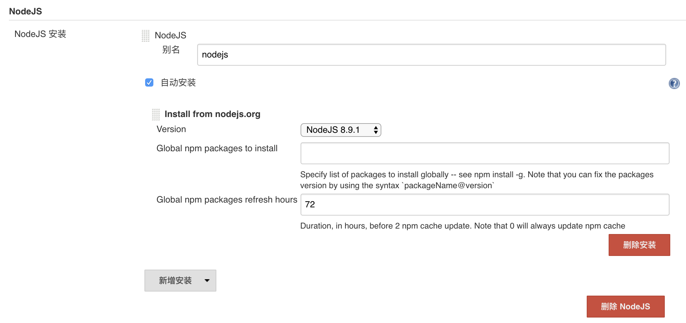

-   构建环境

注意这里需要选择“Provide Node & npm bin/ folder to PATH”，并在下面选择上面步骤安装的 NodeJS 对应版本。否则会由于找不到 npm 命令的错误而构建失败。

## 1.5 cnetos 安装 git

请自行解决

## 1.6 docker

```
/var/lib/docker
```

# 2 基本配置

## 2.1 登录

浏览器进入 http://IP:8088/

首次进入需要输入初始密码来解锁，

-   docker 下安装，密码存储在数据卷中，

```

# 查看 Mountpoint /var/lib/docker/volumes/jenkins_home/\_data

# docker inspect jenkins_home

# 进入 Mountpoint 目录

# cd /var/lib/docker/volumes/jenkins_home/\_data

# 查看密码

# sudo cat secrets/initialAdminPassword

```

-   centos

初始密码查看方法: `sudo cat /var/lib/jenkins/secrets/initialAdminPassword`

进入 Jenkins 定制界面, 点击 Install suggested plugins

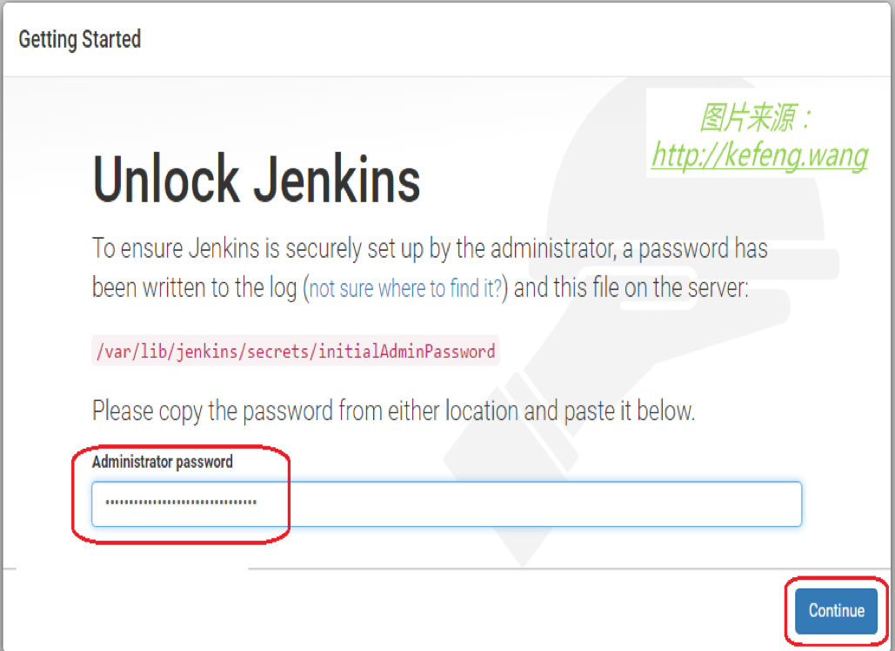

**注意**

如果遇到，如图问题，请多次重试点击 `使用admin账户继续`, 并进入 `系统管理/全局安全配置` 中，把`CSRF Protection` 选项关掉,如果关不掉，请勾选`允许用户注册`，然后点击`应用按钮`,`保存按钮`交叉点击，`应用按钮` 多点击。直到成功

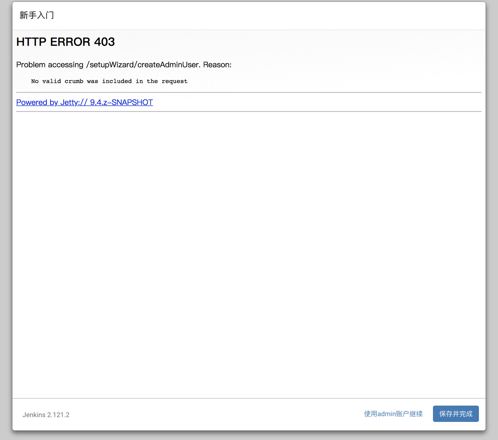

## 2.2 安全设置

默认情况下，任何用户都可以使用 Jenkins 进行发布。
可以进入相关设置：`系统管理/Configure Global Security`,
选择 Jenkins 专有用户数据库，不要选中 允许用户注册；
选择 登录用户可以做任何事，选中 Allow anonymous read access

## 2.3 插件安装方法

如果安装插件失败率很高，可设置翻墙，请参考文章：[翻墙代理 Shadowsocks 使用详解](https://go.no123.info/123/tutorial/mac?nsukey=dmyAWkGzLrctYny1gyTgu3q1IP0sgxqvJBa1SDDVBW43qn1HA43n198Sd5nabHcS%2FLvzyfi8Neb%2FuUmNwboX51yuJ18NlWhjecQZi44DsXWoIPcbCHPgVnEMB5dQfcuC6v9eiq5fhhCxCMzFDPN7K3vlsDk3vCCUj6QmP5aXOXJBWYARS99jE7tm8VSUXUr%2FU9DGAEGzBLSImaOtWDCdbw%3D%3D)

### 2.3.1 离线安装

手工下载(\*.hpi): http://updates.jenkins-ci.org/download/plugins/
进入：`系统管理 / 管理插件 / 高级`，然后上传插件进行安装。
无需重启 Jenkins 插件即生效。

### 2.3.2 在线安装

进入：`系统管理 / 管理插件 / 可选插件`
查找并勾选所需插件，点击“直接安装”；
无需重启 Jenkins 插件即生效。如遇失败可重试或离线安装。

## 2.4 工具设置

进入：`系统管理 / Global Tool Configuration`

JDK 下不勾选“自动安装”，指定别名=JDK-1.8, JAVA_HOME=/docker-java-home

Maven 下不勾选“自动安装”，指定别名=Maven, MAVEN_HOME=/usr/local/maven

点击 Save 按钮。

# 3 项目接入-私有 Git 仓库帐号配置（通用版）

## 3.1 配置 SSH Key 登录配置

1. 生成 SSH 密钥打开终端命令工具，输入命令：

```

ssh-keygen -t rsa -C "码云邮箱“

```

公钥内容在 ~/.ssh/id_rsa.pub

私有内容在 ~/.ssh/id_rsa

2.  把公钥的内容加入 码云 的 SSH 密钥中

将公钥贴在 用户设置的 SSH 公钥贴入这个

**注意一个用户可以用多个 SSH 公钥**

## 3.2 在 Jenkins 配置 git ssh

在 Jenkins ->Credentials->System--> Add credentials

新增登录方式

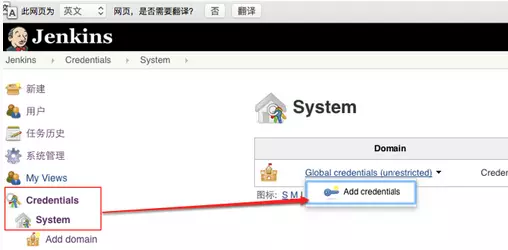

选择 SSH Username with private key. 使用私钥

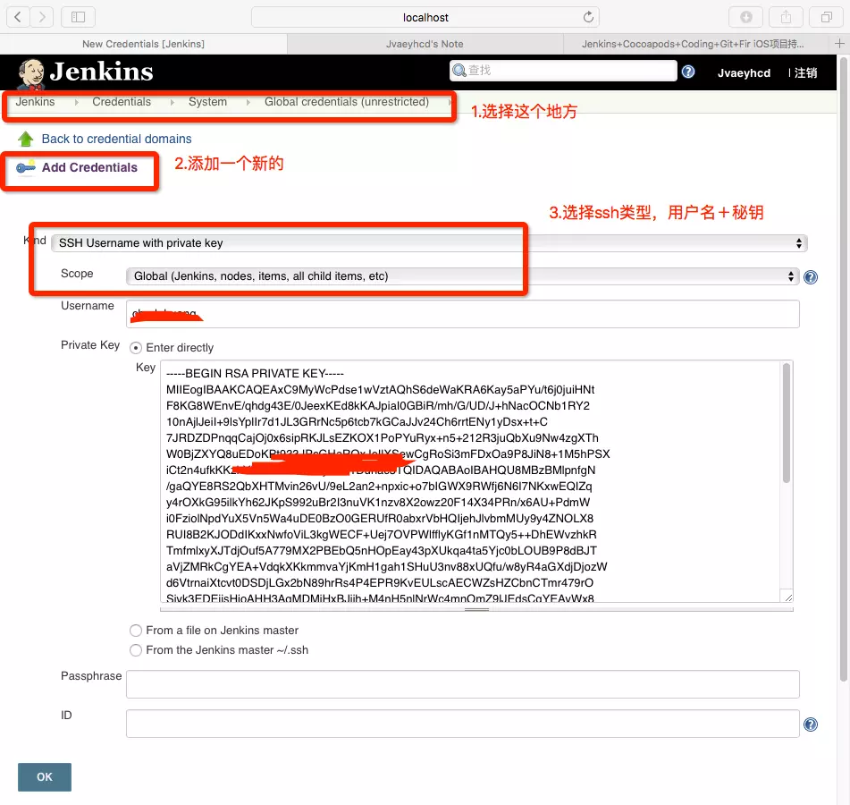

## 3.2 插件安装

[gitee jenkins](https://gitee.com/oschina/Gitee-Jenkins-Plugin#%E6%8F%92%E4%BB%B6%E5%AE%89%E8%A3%85)

## 3.3 新建构建项目

### 3.3.1 开始创建

主页：点击“新建”；

项目类型：输入项目名称 testTask，类型选择“构建一个自由软件风格项目”

### 3.3.2 源码管理

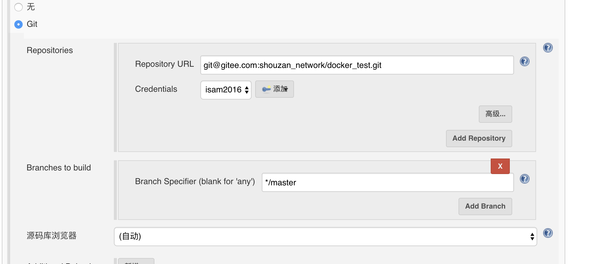

### 3.3.4 版本提交触发构建

当项目提交，触发代码构建。


在源码项目中，添加 webHooks.


URL 已经提示，为 `http://101.200.123.5:8080/poject/testTask`

密码是 `Gitee WebHook 密码` 生成配置的密码，(必填)

触发行为，选择 push

保存之后，可以点击测试按钮，进行测试

### 3.3.5 构建

我们的项目是是使用 maven 的 ，在`构建` 中我们选择`调用顶层maven 目标`

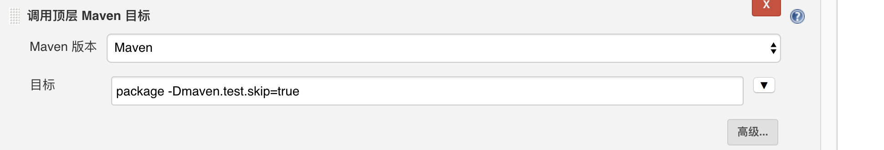

选择我们之前配置的 maven 插件

## 3.4 手工触发构建

进入 My Views, 右侧看到各个项目；
点击进入关注的项目，点击左侧的“立即构建”；

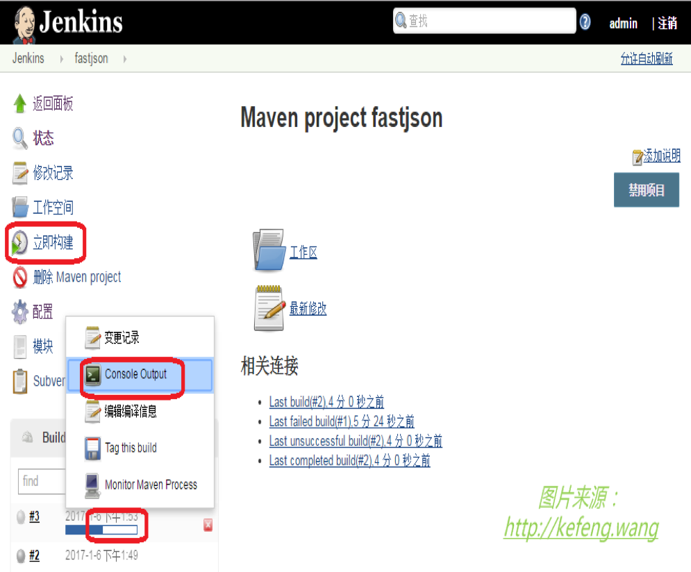

开始构建或构建完毕后，左下方列出每次构建的链接，点击进入某次构建；
点击左侧的“Console Output”，可查看构建日志，如有报错可以看到；

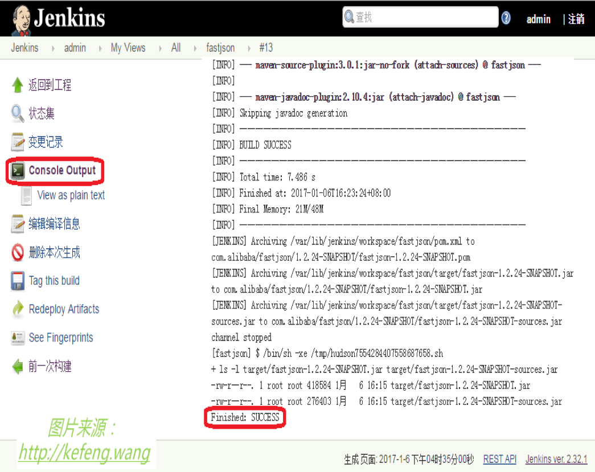

纠正错误后，返回到工程，再次点击“立即构建”，直至构建成功；
如有网络相关报错，重试几次也会成功。
package -Dmaven.test.skip=true

# 4 部署

## 4.1 Publish Over SSH

利用 Publish Over SSH 插件把我们的代码推送 到服务器

进入`系统管理/系统设置/SSH Servers`

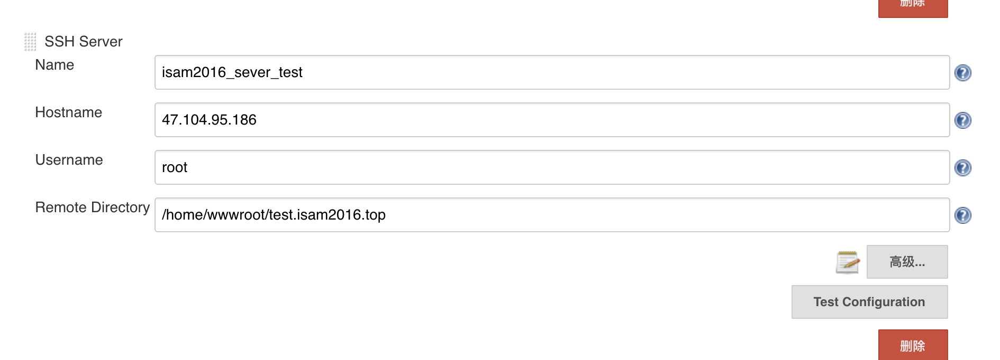

-   name 随意
-   hostname ip 地址
-   username 用户名字
-   Remote Directory 服务器路径，尽量在全局配置路径，比较稳定

点击 高级按钮， 单选 Use password authentication, or use a different key

    Passphrase / Password 为服务器密码

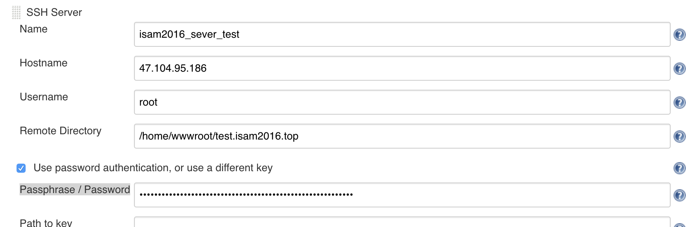

点击 test configuraton 进行服务器测试

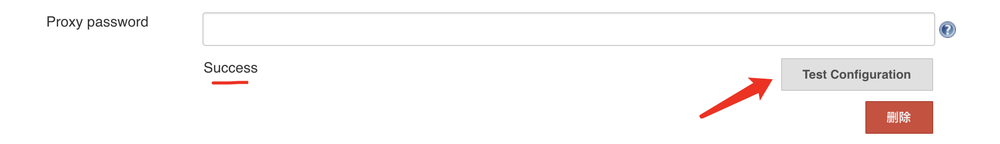

## 4.2 工程配置服务器

在构建中选择 `Send files or execute commands over SSH`,

填写服务器配置

name: 选择我们配置的服务器

Source files：（相对路径，相对代码工作目录） 要传送的代码

Remove prefix： 去除前缀

Remote directory：（相对路径，相对代码工作目录）： 目标服务器路径（绝对路径）

Exec command：代码传送玩执行脚本（绝对路径），例如

```

java -jar example.jar

```


# 5 开启 开启邮件报告

Jenkins 的邮件发送，原理与邮件客户端一样：把发件人的邮箱帐号、密码、SMTP 服务器告诉 Jenkins，Jenkins 需要时使用该帐号向指定的收件人发送邮件报告。

## 5.1 安装相关插件

Jenkins 自带邮件插件(Mailer Plugin)的功能很弱且无法自定制，需要安装扩展邮件插件: Email Extension Plugin

## 5.2 全局统一设置

以 admin@company.com 为例，如下图设置：

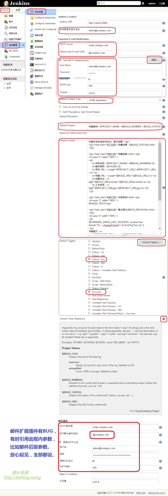

### 5.2.1 设置管理员邮箱

进入：`系统管理 / 系统设置 / Jenkins Location`

系统管理员邮件地址 设为 admin@company.com

### 5.2.2 设置发件人帐号

进入：`系统管理 / 系统设置 / Extended E-mail Notification`

```

“SMTP server” 设为 smtp.company.com
“Default user E-mail suffix” 设为 @company.com
“Use SMTP Authentication” 选中
“User Name” = admin@company.com(必须与管理员邮箱相同)
“Password” = \*\*
“Use SSL” = on
“SMTP port” = 465
“Charset” = UTF-8
“Default Content Type” = HTML (text/html)
5.2.3 设置邮箱模板
Default Subject: 构建通知：BUILD_NUMBER - \$BUILD_STATUS
Default Content: 为以下

```

```

本邮件由系统自动发出，请勿回复！<br/>

<h2><font color="#CC0000">构建结果 - ${BUILD_STATUS}</font></h2>
<h4><font color="#0B610B">构建信息</font></h4>
<hr size="2" width="100%" />
<ul>
    <li>项目名称：${PROJECT_NAME} - #${BUILD_NUMBER}</li>
    <li>触发原因：${CAUSE}</li>
    <li>项目 URL：<a href="${PROJECT_URL}">${PROJECT_URL}</a></li>
    <li>构建 URL：<a href="${BUILD_URL}">${BUILD_URL}</a></li>
    <li>构建日志：<a href="${BUILD_URL}console">${BUILD_URL}console</a></li>
    <li>工作目录：<a href="${PROJECT_URL}ws">${PROJECT_URL}ws</a></li>
 </ul>

 <h4><font color="#0B610B">失败用例</font></h4>
 <hr size="2" width="100%" />

\$FAILED_TESTS<br/>

 <h4><font color="#0B610B">最近提交(#$SVN_REVISION)</font></h4>
 <hr size="2" width="100%" />
 <ul>
 ${CHANGES_SINCE_LAST_SUCCESS, reverse=true, format="%c", changesFormat="<li>%d [%a] %m</li>"}
 </ul>

详细提交: <a href="${PROJECT_URL}changes">\${PROJECT_URL}changes</a><br/>

 <h4><font color="#0B610B">代码检查</font></h4>

 <hr size="2" width="100%" />
 FindBugs：<a href="${BUILD_URL}findbugsResult">\${BUILD_URL}findbugsResult</a><br/>
 CheckStyle：<a href="${BUILD_URL}checkstyleResult">\${BUILD_URL}checkstyleResult</a><br/>
 PMD：<a href="${BUILD_URL}pmdResult">${BUILD_URL}pmdResult</a><br/>
```

也可以自定义 Jelly 模板，并在 Default Content 中引用\${JELLY_SCRIPT, template="html_gmail"}：

```
 sudo mkdir -p /var/lib/jenkins/email-templates
 sudo cd /var/lib/jenkins/email-templates
 sudo wget https://gith
 com/jenkinsci/email-ext-plugin/raw/master/src/main/resources/hudson/plugins/emailext/templates/html_gmajelly
# 更多模板列表: https://github.com/jenkinsci/email-ext-plugin/tree/master/src/main/resources/hudson/plugins/emailext/templates
```

### 5.2.4 设置邮件触发时机

    点击 Default Triggers，比较好的方案是选中两项：

-   Failure - Any ## 可定义“编译失败时”才向哪些人员发邮件(比如最近代码提交者)
-   Success ## 可定义“构建成功时”才向哪些人员发邮件(比如所有产品关注者)

### 5.2.5 邮件可用变量

点击 Content Token Reference 右侧的问号图标，可以看到各邮件模板中可引用变量的含义。

### 5.2.6 邮件未发送问题排查

构建设置里指定的收件人只是 kevin，没有后续，希望采用插件 Email Extension Plugin 中的邮箱后缀，
却发现构建日志中报错: Failed to send e-mail to kevin because no e-mail address is known, and no default e-mail domain is configured
原来，扩展邮件插件有 BUG，使用的是自带邮件插件的后缀设置，而后者之前没有设置。
点击 保存，保存邮件全局设置。

## 5.3 项目设置中启用邮件

构建后操作步骤: 增加 Editable Email Notification(来自插件 Email Extension Plugin)。下图设置的效果是：

-   构建失败时，向上次成功构建之后导致构建失败的 SVN 提交的人员发送邮件；
-   构建成功时，向上次成功构建之后有 SVN 提交的人员、还有“Project Recipient List”中的人员发送邮件；

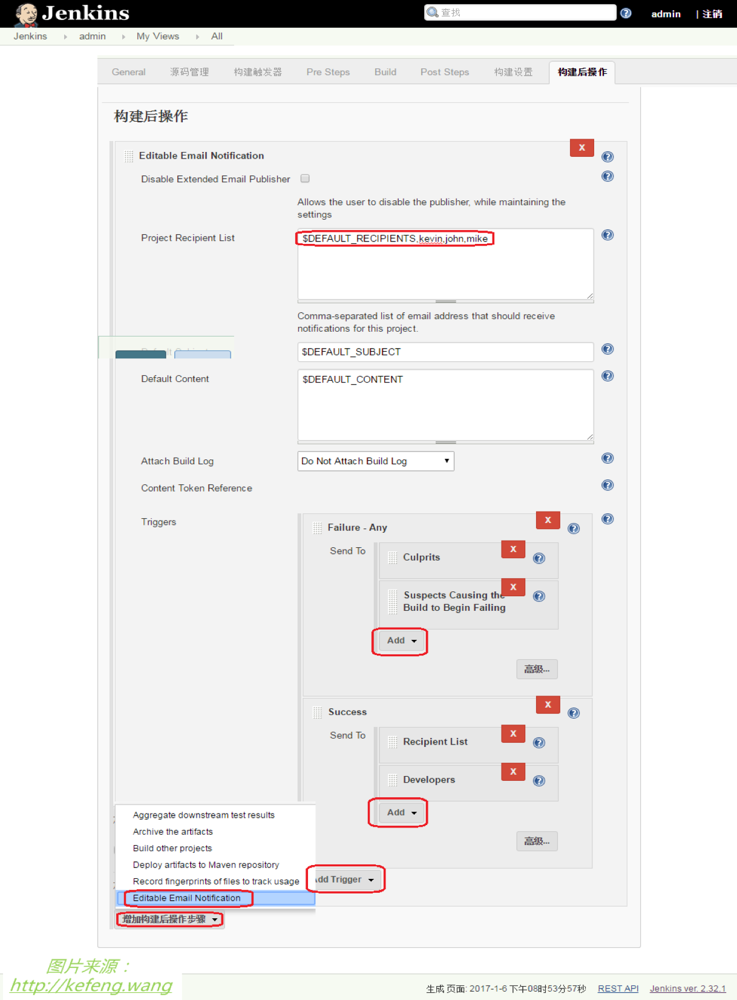

## 5.4 验证构建报告邮件

分别按以下三种情形触发构建，都能看到构建报告邮件：

-   手工触发：进入工程后，点击“立即构建”；
-   定时触发构建：“构建触发器”只选中 Build periodically；
-   版本提交触发构建：“构建触发器”只选中 Poll SCM。

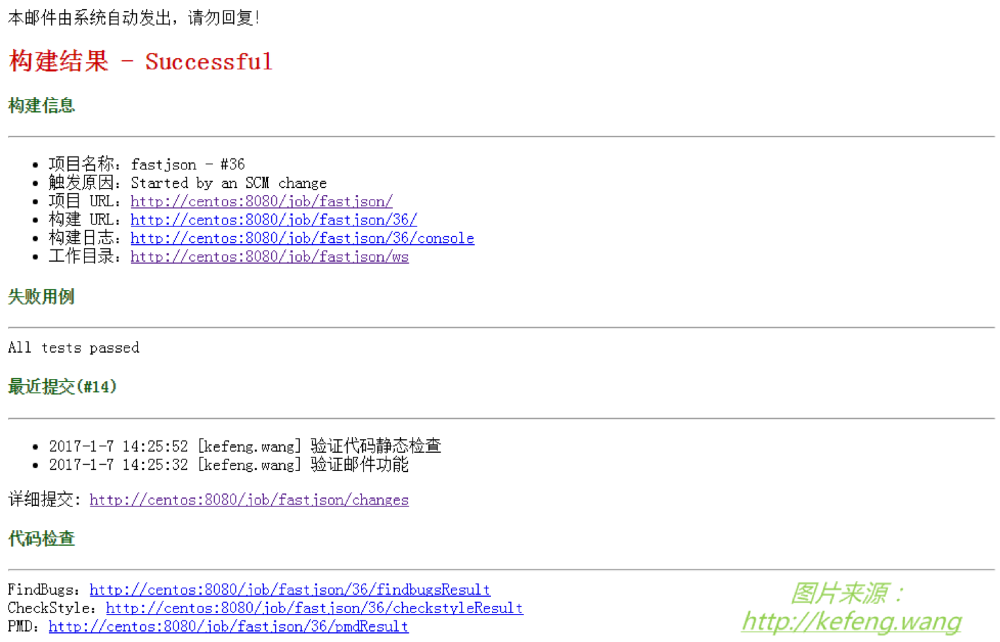

# 6 开启 钉钉通知 （不全）

安装钉钉插件(自行安装)

## 6.1 创建机器人

在钉钉群中添加，码云机器人，获取 webhooks

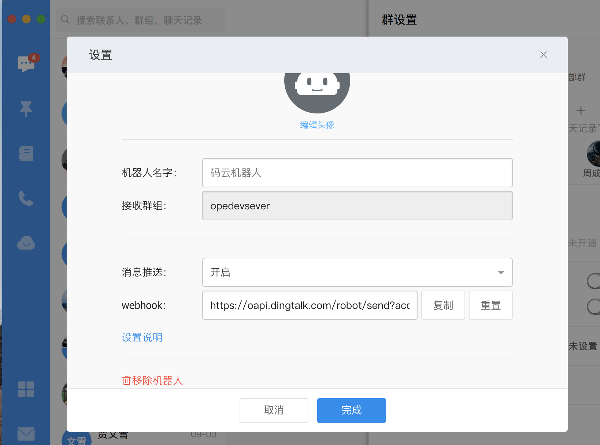

`https://oapi.dingtalk.com/robot/send?access_token=6636c769a61e7abe169053d05f3c6f69ea270e3539389b8d77ec7f96a1a764dc`

提取 access_token 的值

## 6.1 工程添加机器人

在构建后操作中选择钉钉
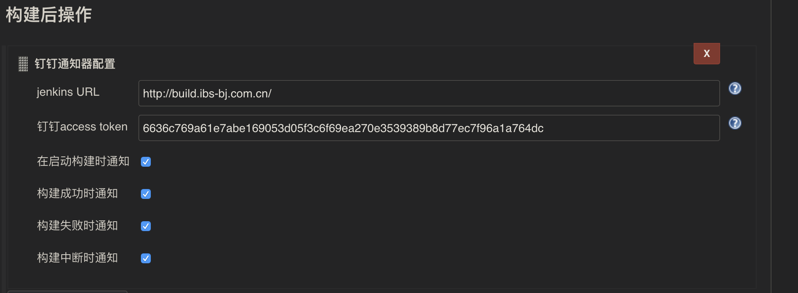

# 7 开启 Java 代码静态检查 （不全）

# 8 Java/JUnit 单元测试（不全）

# 9 单元测试覆盖率报告

## 9.1 安装插件

JaCoCo plugin：与插件 Cobertura 一样，用于生成覆盖率报告，但比 Cobertura 更易用。

## 9.2 调整工程 pom.xml

```
<build>
    <plugins>
        <plugin>
            <groupId>org.jacoco</groupId>
            <artifactId>jacoco-maven-plugin</artifactId>
            <version>0.7.8</version>
            <executions>
                <execution>
                    <id>prepare</id>
                    <goals>
                        <goal>prepare-agent</goal>
                    </goals>
                </execution>
                <execution>
                    <id>report</id>
                    <phase>package</phase>
                <goals>
                    <goal>report</goal>
                </goals>
                </execution>
            </executions>
        </plugin>
    </plugins>
</build>
```

## 9.3 调整项目的构建设置

项目的构建设置 Post Build Action 中，增加 “Record JaCoCo coverage report”，并设置期望的覆盖率阈值。
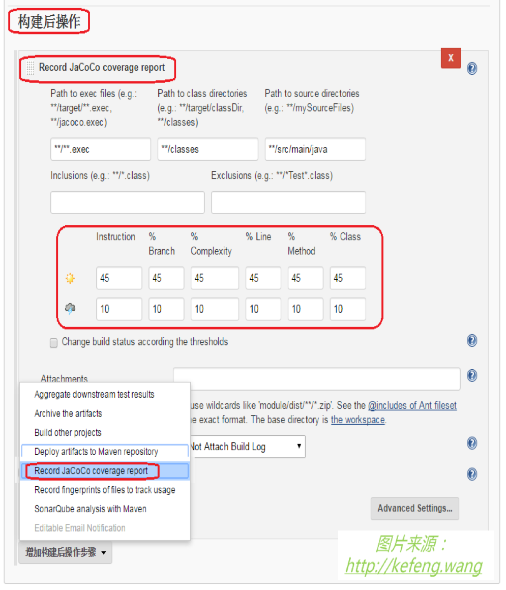

## 9.4 构建并查看报告

构建完成后，点击本次构建页的“Coverage Report”查看报告：

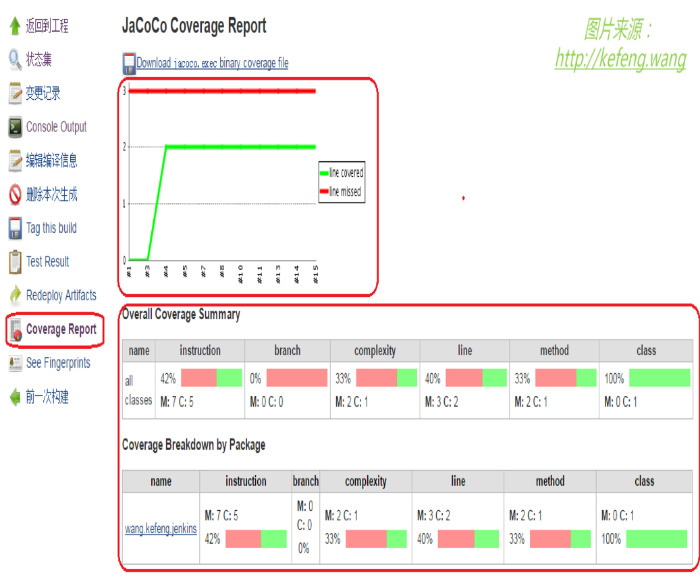

# 10 添加节点


将 agent 传到节点 服务器

执行

```
nohup  java -jar agent.jar -jnlpUrl http://101.200.123.5:8080/computer/node%E7%8E%AFcurl -o- https://raw.githubusercontent.com/creationix/nvm/v0.33.8/install.sh | bash
%E5%A2%83/slave-agent.jnlp -secret 6b503173f6ba7e6542a9519659c2584affabc59ec0e230114e3f8d23672c9b92 -workDir "/root/home" &
```

JAVA_HOME=/usr/jdk1.8.0_201
JRE_HOME=/usr/jdk1.8.0_201/jre
PATH=$PATH:$JAVA_HOME/bin:$JRE_HOME/bin
CLASSPATH=.:$JAVA_HOME/lib/dt.jar:$JAVA_HOME/lib/tools.jar:$JRE_HOME/lib
export JAVA_HOME JRE_HOME PATH CLASSPATH
