# 计算机网络-谢希仁

# 网络基础概念

ISP: 电信运营商
广域网： 一般和带宽有关系

计算机一般有连个地址：

1. 网卡 mac 地址：固定
2. IP 地址
3. 数据包 数据帧

   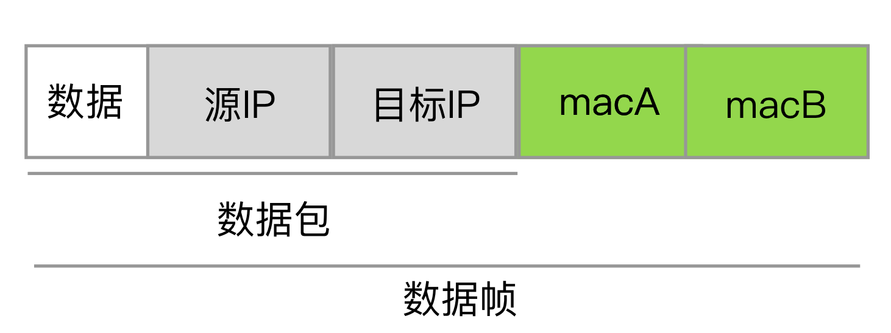

- IP 地址 决定了数据包到哪里
- mac 地址决定了数据传输的路径（跳到那一站）

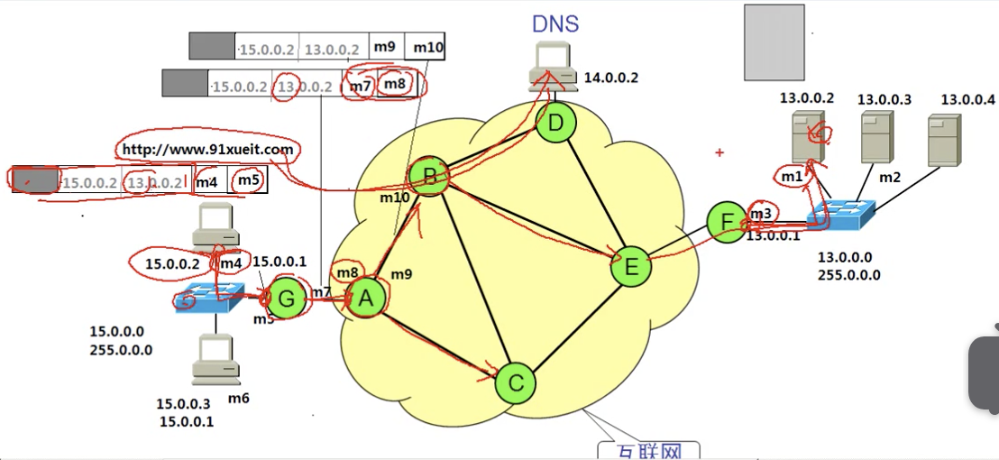

注意：

- 交换机只看 mac 地址，不会看路由地址
- 路由器会看 IP 地址，从新规划数据包

# osi 模型

1. 应用层

所有能产生网络流量的程序，

2. 表示层

在传输之前是否进行压缩 或 加密, 编码，出现乱码一般是表示层

3. 会话层

- netstat -a 查看计算机正在连接的会话
- netstat -n
- netstat -tunlp 用于显示 tcp，udp 的端口和进程等相关情况，如下图：

4. 传输层

- 可靠传输 一般是分包查询
- 流量控制
- 不可靠传输

5. 网络层

- 选择最佳路径
- 动态规划 IP

6. 数据链路层

   - 帧的开始可结束
   - 透明传输

   * 交换机
   * 差错校验

   1. 就像火车头一样，火车的头尾是开始、结束标注。中间是数据。
      例如： `0116666666011`

   2. 如果开始结尾的数据和内容重复，可以插入一些标识，然后在拿出，实现透明传输

   3. 进行数据的校验，数据包丢失，就丢掉数据。但他不进行数据错误处理

7. 物理层

## 理解 OSI 模型

是从上到下的包容关系，可以用分层的概念思考问题,每一层的工作都是为上层能工作做准备

osi 网络模型对应网络错误排查指导，我们可以从下到上排查每个层级的问题。

1. 物理故障

2. 数据链路层故障

   - mac 地址冲突
   - adls 欠费
   - 网速协商

3. 网络层故障
   配置了错误的子网掩码、 网关

4. 可以给电脑增加多个 IP 地址

## TCP/IP 协议和 OSI 参考模型

OSI 是标准模型，但是实际应用的是 TCP/IP 模型

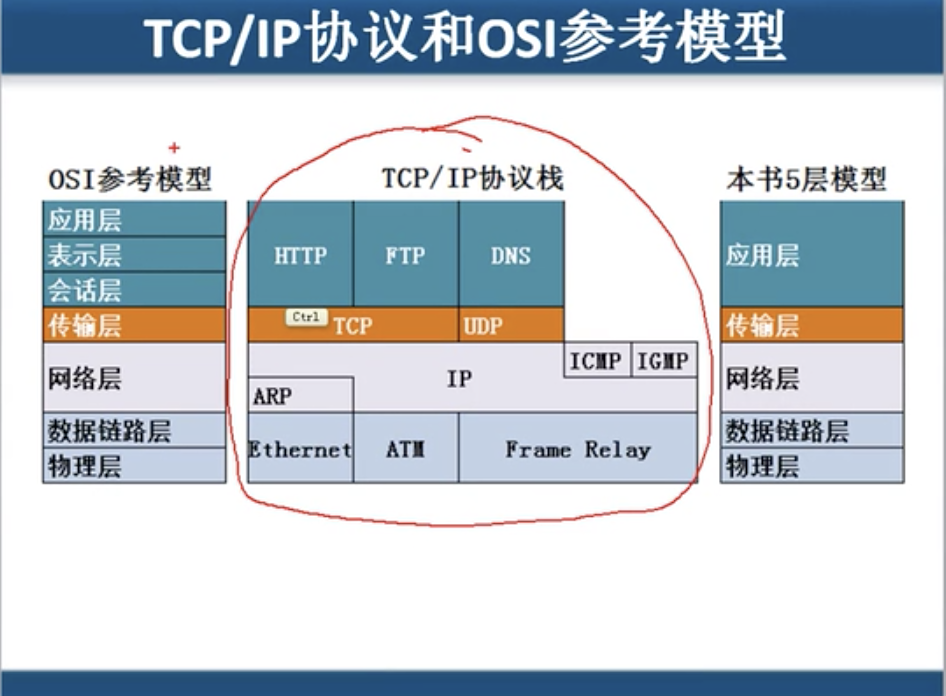

### 封装-解封

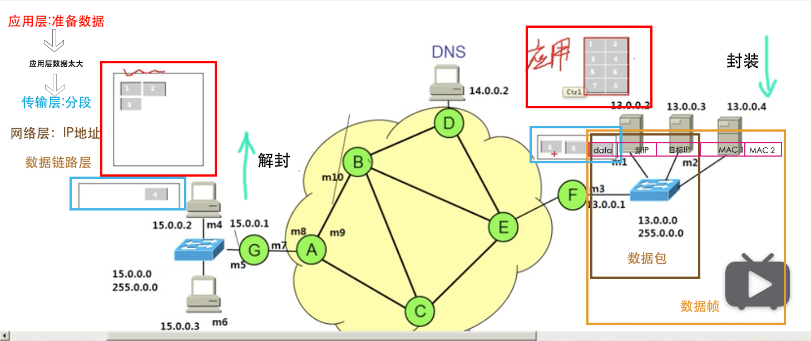

详细版

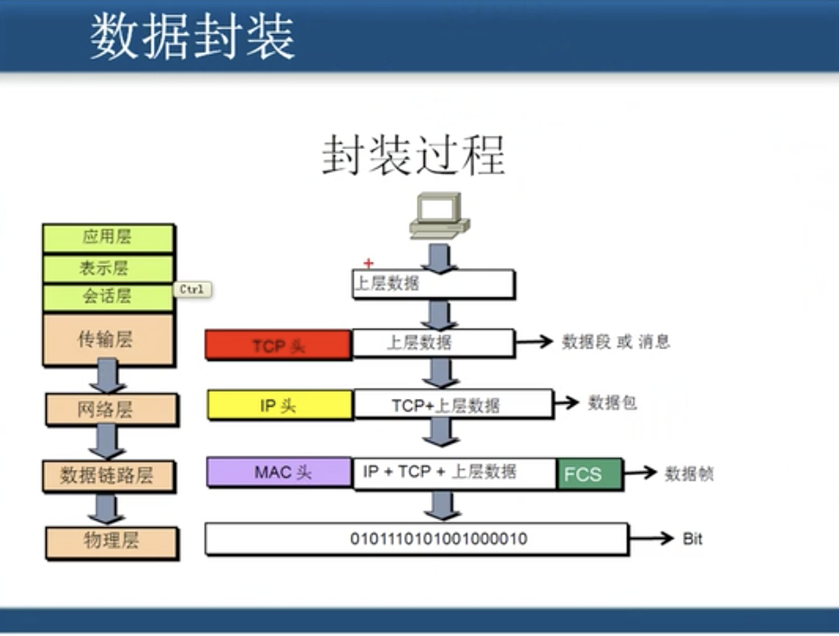

## 计算机网络性能

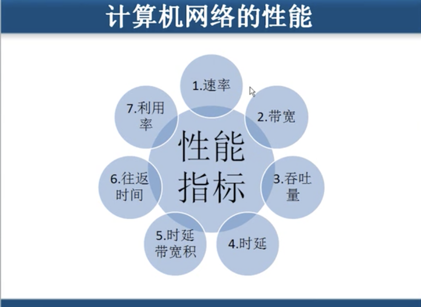

1. 速率

   连接在计算机网络上的主机在数字`信道`上传送数据位数的速率，也成为 data rete 或 bit rate。单位是 b/s,kb/s,Mb/s,Gb/s

   - 速率 ：指两端的传递数据的快慢。

   * 信道： 例如没到服务器都可以连接多台的机器，这样他们之间可以形成信道，且每条信道的速率是相同的，`不能说速率是一个总单位`。

2. 带宽

数字通信领域中，数字`信道`所能传送的最高数据率。单位是 b/s,kb/s,Mb/s,Gb/s

3. 吞吐量

单位时间内通过某个网络的数据量


4. 时延

介质的传输速度是固定的。铜的传播速度比光纤快。但是光纤的带宽高。典型的时间换空间的例子。

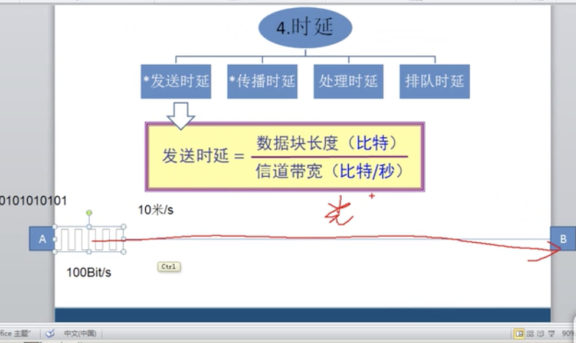

6. 往返时间（RTT：round-trip time）

7. 利用率

   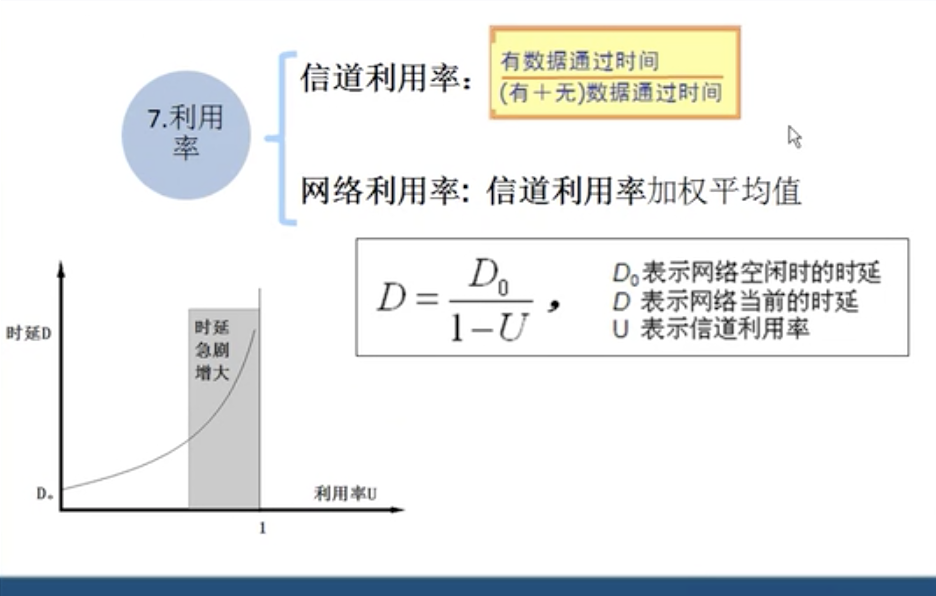

# 网络层-详细

> 网络层是负责不同网络之间转发数据包，基于数据包的 IP 地址转发并不负责按顺序传输，不负责丢包重传（传输层负责）
> 路由器的工作效率比较高，相当于驿站
> 网路层关心是否是路径最优，

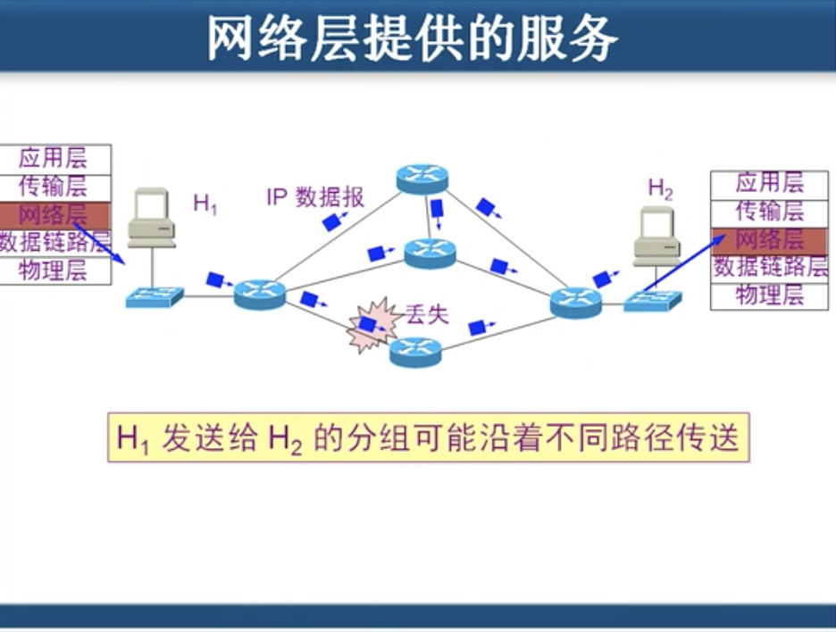

网络的复杂性，体现在物理层，数据连路层。不同的传输阶段有不同的规则。相对固定，网络错误，一般不会出现在这两层

路由器工作在第三层。

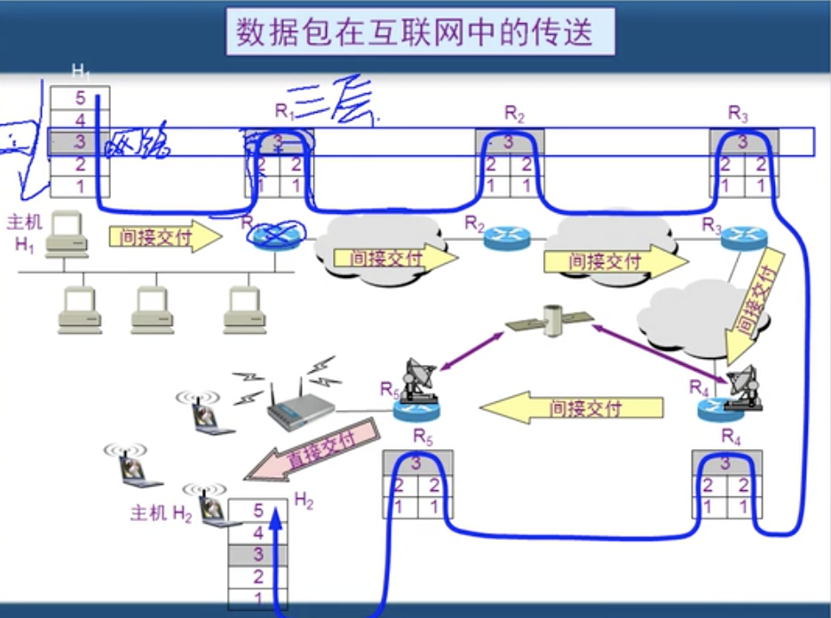

### 网络设备和 OSI 参考模型关系

> 跨网段

发送端

1. 应用程序准备要传送的文件
2. 传输层将文件分段并编码
3. 网路层添加目标 IP 地址源 IP 地址
4. 数据链路层两种情况

   - 使用自己的子掩网吗 判断自己在哪个网段

   * 用自己的子网掩码 判断目标在哪个网段
   * 如果在同一个网段 arp 协议广播解析目标 IP 地址的 MAC
   * 如果不是一个网段 先找网关的 mac（路由）地址， 在通过路由器转发

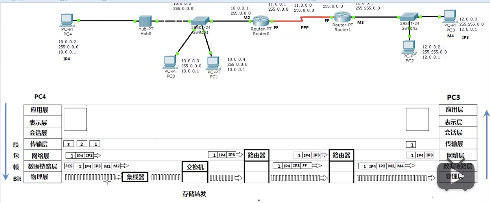

    * 路由器是三层设备，他接收的的数据是没有mac 地址的

### 网络层-ARP 协议

> 网路层协议

- arp -a 查看发送广播的设备

### 网路层——ICMP 协议

> 检测网络故障的

- ping
  - time 延迟
  - TTL 数据包的生存时间，防止数据包的死循环（每过一个路由器则会减一）
    - linux 64
    - windows 127
    - unix 255

* ping address -l 200 制定数据包的大小
* pathping 计算 IP 经过所有的路由

#### ping 和 telnet

ping: 检查 IP 的可达性
telnet 检查服务的可用性

```
telnet 10.75.44.10 80
```

```
ping www.imooc.com 不允许ping
telnet www.imooc.com
```

useradd 添加用户
passwd 添加密码
w 查看用户登录的信息

### 网络层-IGMP 协议

播放模式

1. 点到点
   每个点形成一个
2. 广播
   - 可以在本网段进行播放（不能跨过路由器），也叫做全网广播
   * 一份视频投影到各处
3. 组播=多播

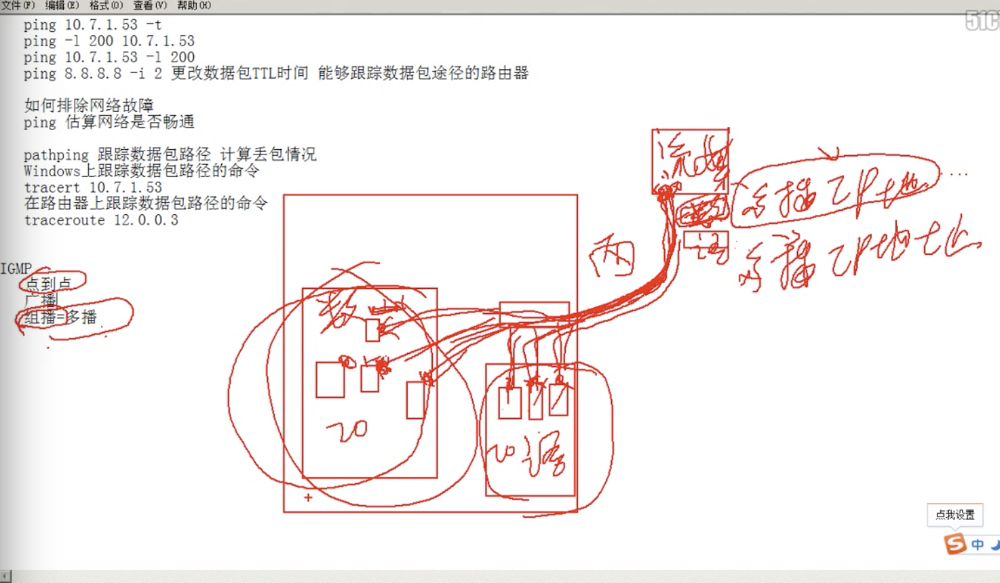

- 比如有的学生看数学，有的看语文，能提供返回看视频的能力.类似频道的概念

### IP 数据包

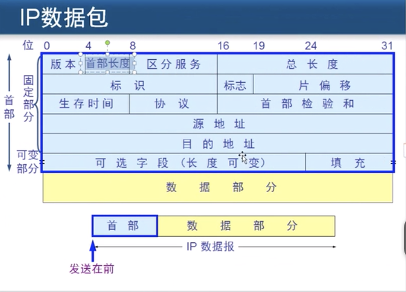

- 区分服务： 相当于火车售卖火车票，有特属窗口。数据包也有特别着急传输的，比如语音

- 分片： 数据链路层和网路层传输的数据容量不一致，网路层的容量偏大，数据包需要切分

  - 网路层： 数据包最大 655535 字节

  * 数据连路层 数据包最大 1500 字节

  利用 ping 发大数据包，ping -l size

* 标识： 当数据包分割之后，需要按顺序重组，利用标识序号进行重新组合怕列

* 标志： 为了 区分 数据包分片和较小的完整数据包, 使用标志进行区分。

  - 如果有标志： 分片

    - MF=1 表示还有分片
    - MF = 0 表示最后一个分片

  - 没有： 数据包

  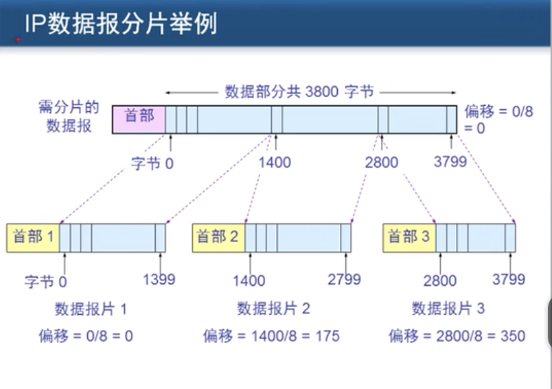

* 生存时间是 ttl
* ICMP 协议号是 1

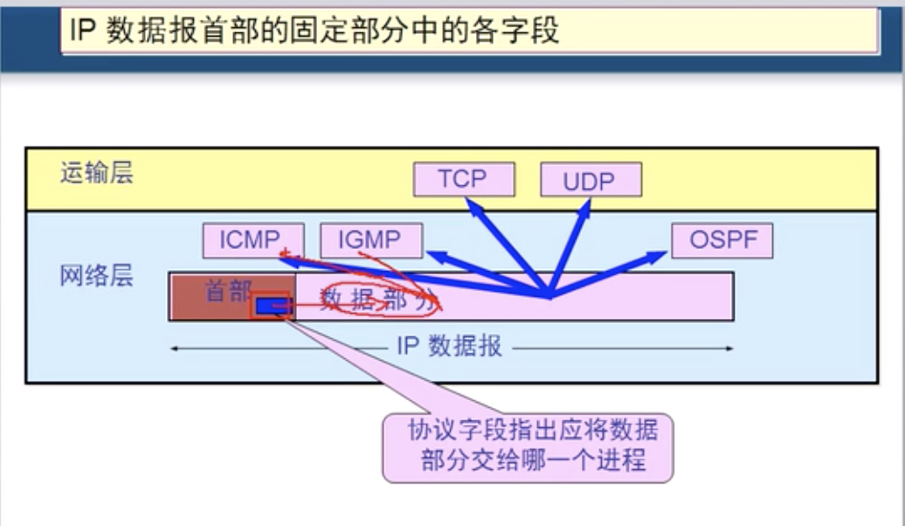

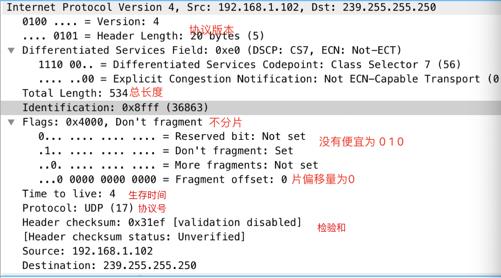

# 公有 IP 和私有 IP

- Public IP
- Private IP 不可在互联网使用，仅供机器内部使

A 类 10.0.0.0 -10.255.255.255
B 类 172.16.0.0 -172.31.255.255
