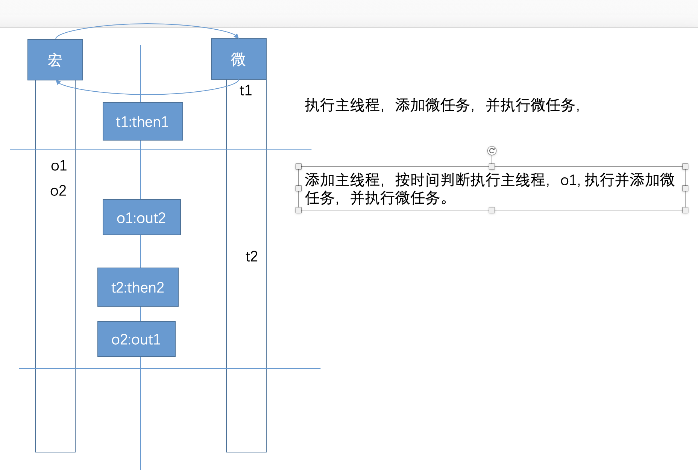

# node

- 进程的概念

计算机执行的最小单位，比如 qq 运行就是一个进程。当然进程会有很多

- 线程的概念

线程包含在进程里面，线程也有很多。

```
// then 方法的优先级会比 promis 的高
// 宏任务 比微任务 要慢

setTimeout(()=>{
console.log(2);
},0)

Promise.resolve().then(()=>{
    console.log('1')
})

```

- 是微任务
  - then
  * prcess.next
  * MutationObserve 微任务

* 是宏任务
  - setTimeout
  * setImmediate MessageChannel

默认先调用主栈，主栈调用完后 清空微任务 在取出宏任务队列中的第一个执行，并且执行完之后在清空微任务，在取第二个环

```
setTimeout(()=>{
    console.log('out2');
    Promise.resolve().then(()=>{
        console.log('then2')
    })
},0);

Promise.resolve().then(()=>{
    console.log('then1');
    setTimeout(()=>{
        console.log('out1')
    },0)
})
```



```
console.log(1)
for(var i=0; i<100; i++){
  if(i>98){
      console.log(i)
  }
}

setTimeout(()=>{
    console.log('out1');
    Promise.resolve().then(()=>{
        console.log('then1');
        Promise.resolve().then(()=>{
            console.log('then2');
        })
    })
    setTimeout(()=>{
        console.log('out2');
    },0)
},10);

Promise.resolve().then(()=>{
    console.log('then3');
    setTimeout(()=>{
        console.log('out3');
        Promise.resolve().then(()=>{
            console.log('then4')
            setTimeout(()=>{
                console.log('out4');
            },0)
        })
    },0)
})
console.log(2)
```

- MessageChannel

### node

node 是单线程，可以利用事件环处理. 当然也存在多线程，比如开启一个 setTimeout. 但是不适合 cpu 密集操作，大量计算。node 适合异步 io 操作。

1. 在浏览器中默认 this 指向 window
2. 在浏览器中 window 代理了 global
3. 在文件中默认这个 this 不是 global,在 node 环境中 this 是 global
4.  在文件中 this 指向是被更改的指向 module.exports

- process
  process.cwd();// 进程当前工作的目录。

## webworker 工作线程

### 中间层

### js 解析器和 UI 线程是共同一个线程

## node 能解决什么问题

- ndoe 的首要目标是提供一种简单的，用于创建高性能服务器的开发方式工具
- web 服务器的瓶颈在于并发的用户量

### node 是什么

### buffer 是什么

- 缓冲区 buffer 是暂时存放输入输出数据的一段内存
- js 语言没有二进制数据类型，而在处理 TCP 和文件流的时候，必须处理二进制数据
- NodeJS 提供了一个 Buffer 对象来提供对二进制数据的操作
- 是一个表示固定内存分配的全局对象，也就是说要放到缓存区中的字节数需要提前确定
- Buffer 好比由一个 8 位字节元素组成的数组，可以有效的在 JavasScript 中表示二进制数据

### 定义 buffer 的三种方式

1. 通过长度定义 buffer

### 微任务 宏任务

### mysql 的缺点、 mongoos 的 缺钱
