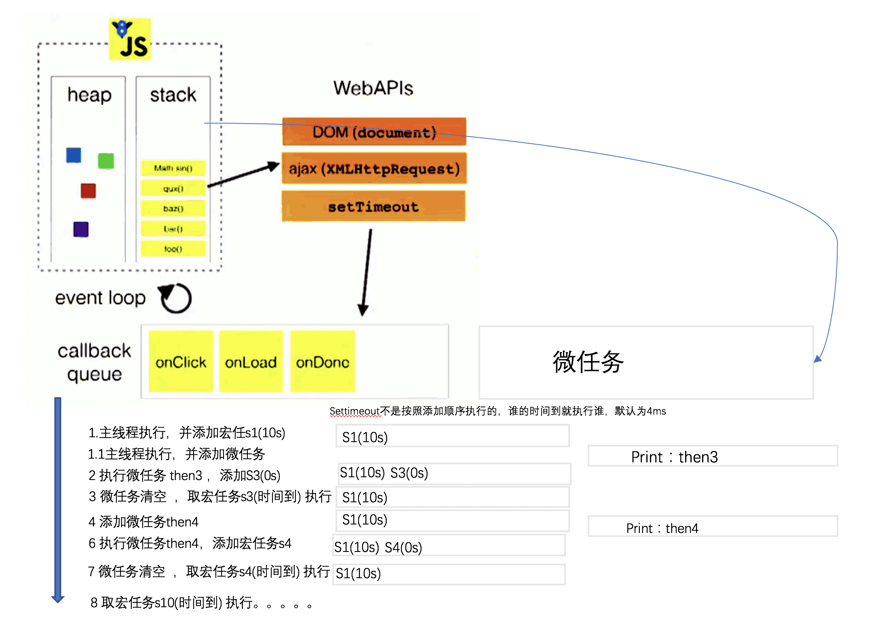

- [前言](#%E5%89%8D%E8%A8%80)
- [1. noode 常见的概念](#1-noode-%E5%B8%B8%E8%A7%81%E7%9A%84%E6%A6%82%E5%BF%B5)
- [2. Node 是什么?](#2-node-%E6%98%AF%E4%BB%80%E4%B9%88)
- [3. Node 特点](#3-node-%E7%89%B9%E7%82%B9)
    - [3.1 为什么 JavaScript 是单线程？](#31-%E4%B8%BA%E4%BB%80%E4%B9%88-javascript-%E6%98%AF%E5%8D%95%E7%BA%BF%E7%A8%8B)
    - [3.2 浏览器模型](#32-%E6%B5%8F%E8%A7%88%E5%99%A8%E6%A8%A1%E5%9E%8B)
    - [3.3 除 JS 线程和 UI 线程之外的其它线程](#33-%E9%99%A4-js-%E7%BA%BF%E7%A8%8B%E5%92%8C-ui-%E7%BA%BF%E7%A8%8B%E4%B9%8B%E5%A4%96%E7%9A%84%E5%85%B6%E5%AE%83%E7%BA%BF%E7%A8%8B)
    - [3.4 任务队列](#34-%E4%BB%BB%E5%8A%A1%E9%98%9F%E5%88%97)
    - [3.5. Event Loop](#35-event-loop)
    - [3.6. Node.js 的 Event Loop node 有自己的事件环](#36-nodejs-%E7%9A%84-event-loop-node-%E6%9C%89%E8%87%AA%E5%B7%B1%E7%9A%84%E4%BA%8B%E4%BB%B6%E7%8E%AF)
    - [3.7. 同步与异步](#37-%E5%90%8C%E6%AD%A5%E4%B8%8E%E5%BC%82%E6%AD%A5)
    - [3.8. 阻塞与非阻塞](#38-%E9%98%BB%E5%A1%9E%E4%B8%8E%E9%9D%9E%E9%98%BB%E5%A1%9E)
    - [3.9. 组合](#39-%E7%BB%84%E5%90%88)
- [4.什么场合下应该考虑使用 Node 框架](#4%E4%BB%80%E4%B9%88%E5%9C%BA%E5%90%88%E4%B8%8B%E5%BA%94%E8%AF%A5%E8%80%83%E8%99%91%E4%BD%BF%E7%94%A8-node-%E6%A1%86%E6%9E%B6)
- [6 buffer 是什么](#6-buffer-%E6%98%AF%E4%BB%80%E4%B9%88)

# 前言

# 1. noode 常见的概念

- 进程包含线程
- 一个进程只有一个主线程
- node 可以开子进程 (child_process)

Node 的首要目标是提供一种简单的，用于创建高性能服务器的开发工具 Web 服务器的瓶颈在于并发的用户量，对比 Java 和 Php 的实现方式

# 2. Node 是什么?

Node.js 是一个基于 Chrome V8 引擎的 JavaScript 运行环境,让 JavaScript 的执行效率与低端的 C 语言的相近的执行效率。

Node.js 使用了一个事件驱动、非阻塞式 I/O 的模型，使其轻量又高效。

Node.js 的包管理器 npm，是全球最大的开源库生态系统。

# 3. Node 特点

## 3.1 为什么 JavaScript 是单线程？

这是由 Javascript 这门脚本语言的用途决定的。

Web Worker 并没有改变 JavaScript 单线程的本质。

## 3.2 浏览器模型

用户界面-包括地址栏、前进/后退按钮、书签菜单等

浏览器引擎-在用户界面和呈现引擎之间传送指令

呈现引擎-又称渲染引擎，也被称为浏览器内核，在线程方面又称为 UI 线程

网络-用于网络调用，比如 HTTP 请求

用户界面后端-用于绘制基本的窗口小部件,UI 线程和 JS 共用一个线程

JavaScript 解释器-用于解析和执行 JavaScript 代码

数据存储-这是持久层。浏览器需要在硬盘上保存各种数据，例如 Cookie


## 3.3 除 JS 线程和 UI 线程之外的其它线程

浏览器事件触发线程

定时触发器线程

异步 HTTP 请求线程

## 3.4 任务队列

所有同步任务都在主线程上执行，形成一个执行栈

主线程之外，还存在一个任务队列。只要**异步任务有了运行结果**å，就在任务队列之中放置一个事件。

一旦执行栈中的所有同步任务执行完毕，系统就会读取任务队列，看看里面有哪些事件。那些对应的异步任务，于是结束等待状态，进入执行栈，开始执行。

主线程不断重复上面的第三步。

## 3.5. Event Loop

主线程从任务队列中读取事件，这个过程是循环不断的，所以整个的这种运行机制又称为 Event Loop(事件循环)

```
// then 方法的优先级会比 promis 的高
// 宏任务 比微任务 要慢

setTimeout(()=>{
console.log(2);
},0)

Promise.resolve().then(()=>{
    console.log('1')
})

```

- 是微任务
  - then
  * prcess.next
  * MutationObserve 微任务

nextTick(优先级) > then

- 是宏任务
  - setTimeout
  * setImmediate MessageChannel

默认先调用主栈，主栈调用完后 清空微任务 在取出宏任务队列中的第一个执行，并且执行完之后在清空微任务，在取第二个环

```
setTimeout(()=>{
    console.log('out2');
    Promise.resolve().then(()=>{
        console.log('then2')
    })
},0);

Promise.resolve().then(()=>{
    console.log('then1');
    setTimeout(()=>{
        console.log('out1')
    },0)
})
```



```
console.log(1)
for(var i=0; i<100; i++){
  if(i>98){
      console.log(i)
  }
}

setTimeout(()=>{
    console.log('out1');
    Promise.resolve().then(()=>{
        console.log('then1');
        Promise.resolve().then(()=>{
            console.log('then2');
        })
    })
    setTimeout(()=>{
        console.log('out2');
    },0)
},10);

Promise.resolve().then(()=>{
    console.log('then3');
    setTimeout(()=>{
        console.log('out3');
        Promise.resolve().then(()=>{
            console.log('then4')
            setTimeout(()=>{
                console.log('out4');
            },0)
        })
    },0)
})
console.log(2)

```

```
setTimeout(function(){
    console.log('setTimeout1')
    Promise.resolve().then(()=>{
        console.log('then1')
    })
},0)
Promise.resolve().then(()=>{
    console.log('then2')
    Promise.resolve().then(()=>{
        console.log('then3')
    })
    setTimeout(function(){
        console.log("setTImeout2")
    },0)
})
then2
promise.then / mutationObserver
```

## 3.6. Node.js 的 Event Loop node 有自己的事件环

node 是单线程，可以利用事件环处理. 当然也存在多线程，比如开启一个 setTimeout. 但是不适合 cpu 密集操作，大量计算。node 适合异步 io 操作。

- V8 引擎解析 JavaScript 脚本。
- 解析后的代码，调用 Node API。
- libuv 库负责 Node API 的执行。它将不同的任务分配给不同的线程，形成一个 Event Loop（事件循环），以异步的方式将任务的执行结果返回给 V8 引擎。
- V8 引擎再将结果返回给用户。

## 3.7. 同步与异步

同步和异步关注的是消息通知机制

同步就是发出调用后，没有得到结果之前，该调用不返回，一旦调用返回，就得到返回值了。 简而言之就是调用者主动等待这个调用的结果

而异步则相反，调用者在发出调用后这个调用就直接返回了，所以没有返回结果。换句话说当一个异步过程调用发出后，调用者不会立刻得到结果，而是调用发出后，被调用者通过状态、通知或回调函数处理这个调用。

## 3.8. 阻塞与非阻塞

阻塞和非阻塞关注的是程序在等待调用结果（消息，返回值）时的状态.

阻塞调用是指调用结果返回之前，当前线程会被挂起。调用线程只有在得到结果之后才会返回。
非阻塞调用指在不能立刻得到结果之前，该调用不会阻塞当前线程。

## 3.9. 组合

同步异步取决于被调用者，阻塞非阻塞取决于调用者

- 同步阻塞
- 异步阻塞
- 同步非阻塞
- 异步非阻塞

# 4.什么场合下应该考虑使用 Node 框架

当应用程序需要处理大量并发的输入输出，而在向客户端响应之前，应用程序并不需要进行非常复杂的处理。

- 聊天服务器
- 电子商务网站

# 6 buffer 是什么

- 缓冲区 buffer 是暂时存放输入输出数据的一段内存
- js 语言没有二进制数据类型，而在处理 TCP 和文件流的时候，必须处理二进制数据
- NodeJS 提供了一个 Buffer 对象来提供对二进制数据的操作
- 是一个表示固定内存分配的全局对象，也就是说要放到缓存区中的字节数需要提前确定
- Buffer 好比由一个 8 位字节元素组成的数组，可以有效的在 JavasScript 中表示二进制数据
