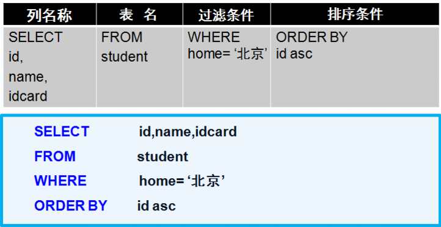

_和 mongdb 比较 有啥优缺点_

# 1. 数据库能够做什么

存储大量数据，方便检索和访问
保持数据信息的一致、完整
共享和安全
通过组合分析，产生新的有用信息

# 2. 数据库的基本概念

## 2.1 实体

只要是在客观世界存在的、可以被描述出来的都是实体

## 2.2 数据库(DB)

数据库就是数据的仓库，可以存放结构化的数据

## 2.3 数据库管理系统(DBMS)

是一种系统软件，提供操作数据库的环境，可以通过数据库管理系统对数据进行插入、修改、删除和查询等操作。

## 2.4 SQL

结构化查询语言 专门用来和数据库进行交流的语言,几乎所有的 DBMS 都支持 SQL

## InnoDB 和 MyISAM

> 我们基本不会使用约束
> MySQL 有两种常用的引擎类型：MyISAM 和 InnoDB。目前只有 InnoDB 引擎类型支持外键约束和事务。InnoDB 中外键约束定义的语法如下

CASCADE
在父表上 update/delete 记录时，同步 update/delete 掉子表的匹配记录

SET NULL
在父表上 update/delete 记录时，将子表上匹配记录的列设为 null (要注意子表的外键列不能为 not null)

NO ACTION
如果子表中有匹配的记录,则不允许对父表对应候选键进行 update/delete 操作

RESTRICT
同 no action, 都是立即检查外键约束

SET NULL
父表有变更时,子表将外键列设置成一个默认的值 但 Innodb 不能识别

## 安装


## 2.5 SQL 规范

- SQL 语句不区分大小写，建议 SQL 关键字大写，表名和列表小写
- 命令用分号结尾
- 命令可以缩进和换行，一种类型的关键字放在一行
- 可以写单行和多行注释 , #和--是单行注释，/\*/多行注释

# 4.MYSQL 简介

## 4.1 MYSQL 特点

- 开源免费
- 性能高
- 安装使用都简单

## 4.2 MYSQL 安装

mysql 下载
安装 MYSQL

## 4.3 MYSQL 配置

`mysql.server start`

```
C:\Program Files\MySQL\MySQL Server 5.5\my.ini

port 端口号
basedir 安装目录
datadir 数据存放访目录
charcter-set-server 字符集
default-storage-engine 存储引擎
sql-mode 语法模式
max-connections 最大连接数
```

## 4.4 MYSQL 启动和停止

```
net start MySQL
net stop MySQL
```

## 4.5 通过命令行连接 MYSQL

> mysql -h 127.0.0.1 -P 3306 -u root -p

```
mysql -h 127.0.0.1 -P 3306 -uroot -p123456
exit
```

`mysql -uroot -p`

| name     | mean             |
| -------- | ---------------- |
| host     | 主机名或 IP 地址 |
| username | MySQL 用户名     |
| password | MySQL 密码       |
| dbname   | 数据库           |
| port     | 端口号           |

### 6. 数据完整性

为了实现数据完整性，需要检验数据库表中的每行和每列数据是否符合要求
在创建表的时候，应该保证以后的数据输入是正确的，错误的数据不允许输入

#### 6.1 域完整性

不同的字段需要设置为各种合适的类型，比如年龄就是整数类型


#### 6.2 默认值

默认值是指如果用户没有指定值的情况下会记录的此字段指定一个提供一个预先设定的值

> 可以把居住地默认值设置为北京

#### 6.3 非空约束

我们可以指定某个字段不能不输入，必须提供一个非空的值

> 姓名字段不能为空

## 7.实体完整性

### 7.1 主键约束

#### 7.1.1 主键

表中一列或者几列组合的值能用来唯一标识表中的每一行，这样的列或者列组合称为表的主键，主键表的数据不同重复。

> 如果两列或者多列组合起来唯一标识表中的每一行，则该主键又称为"组合键"

主键的选择标准

最少性 尽量选择单个键作为主键
稳定性 ，由于主键是用来在两个表间建立联接的，所以不能经常更新，最好就不更新

#### 7.1.2 外键

成绩表中的学生 ID 应该在学生表中是存在的 我们应该让成绩表中的 ID 只能引用学生表中的 ID，它们的值应该是一一对应的，也就是说成绩表中的 ID 是成绩表中的外键，对应学生表的主键 ，这样就可以保证数据的引用完整性

命名的时候可以 `fk_表名_字段名` eg: `fk_score_student_id`

#### 7.1.3 唯一约束

唯一约束是指某个字段值是唯一的，在所有的记录中不能有重复的值.

学生的身份证号可以设置为唯一约束

#### 7.1.4 标识列

- 当表中没有合适的列作为主键时可以考虑增加标识列，标识列是一个无实际业务含义的列，仅仅用来区分每条记录。

- 标识列的值是自动生成的，不能在该列上输入数据

  > 思考: 如果标识列 id 的初始值为 1，增长量为 3，则输入 3 行数据以后，再删除 1 行，下次再输入数据行的时候，标识值自动插入的值是多少?

#### 7.1.5 外键约束

一个表的外键必须引用另一个表的主键,比如成绩表中的学生 ID 会引用学生表的主键，课程 ID 会引用成绩表的主键

- 主表没有记录，子表中不能添加相应的记录
- 修改和删除主表记录不能让子表记录孤立，必须相应修改和删除

- 数据操作

#### 8.0 基本命令

- 8.0.1 显示数据库: show databases;

- 8.0.2 选择数据库: use dbname;

- 8.0.3 创建数据库: create database dbname charset utf8;

- 8.0.3 删除数据库: drop database dbname;

- 8.0.4 查看表: showt tables;

- 8.0.5 选择表: select \* from stu;

- 8.0.6 表插入数据: insert into stu

- 8.0.7 查看表的结构: desc tableName;

- 8.0.8 查看表的创建过程:show create table tableName;

- 清空数据 truncate stu; 清空表

#### 8.1 创建学生表

```
CREATE TABLE `student` (
`id`  int(11) NOT NULL PRIMARY KEY AUTO_INCREMENT   ,
`name`  varchar(50) NOT NULL ,
`age`  int(11) NULL DEFAULT NULL ,
`city`  varchar(50) DEFAULT '北京' ,
)
```

### 8.2 增加身份证号字段

> 增加列

```
ALTER TABLE `student` ADD COLUMN `idcard`  varchar(15) NULL AFTER `city`; --增加身份证字段
ALTER TABLE `student` MODIFY COLUMN `idcard`  varchar(18) DEFAULT NULL AFTER `name`; --修改身份证字段
ALTER TABLE `student`DROP COLUMN `idcard`; --删除身份证字段
```

### 8.3 添加约束

```
-- 主键约束
ALTER TABLE `student` ADD PRIMARY KEY (`id`);
-- 唯一约束
ALTER TABLE `student` ADD UNIQUE INDEX `uq_idcard` (`idcard`) ;
-- 默认约束
ALTER TABLE `student` MODIFY COLUMN `city` varchar(50) DEFAULT '北京' AFTER `age`;
-- 外键约束
ALTER TABLE `score` ADD CONSTRAINT `fk_stuid` FOREIGN KEY (`student_id`) REFERENCES `student` (`id`);
-- 删除约束
ALTER TABLE `score` DROP FOREIGN KEY `fk_stuid`;
```

#### 8.4

```
CREATE TABLE `student` (
  `id` int(11) NOT NULL AUTO_INCREMENT,
  `name` varchar(50) NOT NULL,
  `idcard` varchar(18) DEFAULT NULL,
  `age` int(11) DEFAULT NULL,
  `city` varchar(50) DEFAULT '',
  PRIMARY KEY (`id`)
);

CREATE TABLE `course` (
  `id` int(11) NOT NULL AUTO_INCREMENT,
  `name` varchar(50) DEFAULT NULL,
  PRIMARY KEY (`id`)
);

CREATE TABLE `score` (
  `student_id` int(11) NOT NULL DEFAULT '0',
  `course_id` int(11) NOT NULL DEFAULT '0',
  `grade` float DEFAULT NULL,
  PRIMARY KEY (`student_id`,`course_id`),
  KEY `fk_courseid` (`course_id`),
  CONSTRAINT `fk_courseid` FOREIGN KEY (`course_id`) REFERENCES `course` (`id`),
  CONSTRAINT `fk_stuid` FOREIGN KEY (`student_id`) REFERENCES `student` (`id`)
) ENGINE=InnoDB DEFAULT CHARSET=utf8;
```

#### 8.4.1 列类型讲解

列类型:

整型:

- tinyint (0~255/-128~127)
- smallint (0~65535/-32768~32767)
- mediumint
- int
- bigint (参考手册 11.2)

参数解释:

unsigned 无符号(不能为负) zerofill 0 填充 M 填充后的宽度
举例:tinyint unsigned;

tinyint(6) zerofill;
数值型

浮点型:float double

格式:float(M,D) unsigned\zerofill;

字符型
char(m) 定长
varchar(m)变长
text

列 实存字符 i 实占空间 利用率

char(M) 0<=i<=M M i/m<=100%

varchar(M) 0<=i<=M i+1,2 i/i+1/2<100%

           year       YYYY  范围:1901~2155. 可输入值2位和4位(如98,2012)

日期时间类型 date YYYY-MM-DD 如:2010-03-14
time HH:MM:SS 如:19:26:32
datetime YYYY-MM-DD HH:MM:SS 如:2010-03-14 19:26:32
timestamp YYYY-MM-DD HH:MM:SS 特性:不用赋值,该列会为自己赋当前的具体时间

#### 8.5 常规操作

- 删除列

  `Alter table [kuname] drop [tablename]`

* 修改列类型

`Alter table [表名] modify [列名][新类型] [新参数]`

`alter table class modify names char(4) not null default 0;`

- 修改列名和列类型

  `Alter table [表名] change [旧列名][新列名][新类型][新参数]`

  `alter table class change names nam char(9) not null default '';`

* 重命名

```
create table stu(
sname varchar(10)
)engine myisam charset utf8;
```

#### 1. 创建表

```
create table tbName (
列名称 1 　列类型　[列参数][not null default ],
....列 2...
....
列名称 N 　列类型　[列参数][not null default ]
)engine myisam/innodb charset utf8/gbk
```

eg:

```
create table user (
id int auto_increment,
name varchar(20) not null default '',
age tinyint unsigned not null default 0,
index id (id)
)engine=innodb charset=utf8;
注:innodb 是表引擎,也可以是 myisam 或其他,但最常用的是 myisam 和 innodb,
charset 常用的有 utf8,gbk;
```

#### 2. 修改表

#### 2.1 修改表之增加列

```
alter table tbName
add 列名称１　列类型　[列参数][not null default ]　#(add 之后的旧列名之后的语法和创建表时的列声明一样)
```

#### 2.2 修改表之修改列

```
alter table tbName
change 旧列名 新列名 列类型　[列参数][not null default ]
(注:旧列名之后的语法和创建表时的列声明一样)
```

#### 2.3 修改表之减少列:

```
alter table tbName
drop 列名称;
```

#### 2.4 修改表之增加主键

```
alter table tbName add primary key(主键所在列名);
例:alter table goods add primary key(id)
该例是把主键建立在 id 列上
```

#### 2.5 修改表之删除主键

`alter table tbName drop primary key;`

#### 2.6 修改表之增加索引

`alter table tbName add [unique|fulltext] index 索引名(列名);`

#### 2.7 修改表之删除索引

`alter table tbName drop index 索引名;`

#### 2.8 清空表的数据

`truncate tableName;`

#### 3 增删改查基本操作

#### 3.1 插入数据

```
insert into 表名(col1,col2,……) values(val1,val2……); -- 插入指定列
insert into 表名 values (,,,,); -- 插入所有列
insert into 表名 values -- 一次插入多行
(val1,val2……),
(val1,val2……),
(val1,val2……);
```

#### 3.3 修改数据

```
update tablename
set
col1=newval1,
col2=newval2,
...
...
colN=newvalN
where 条件;
```

#### 3.4，删除数据

`delete from tablenaeme where 条件;`

### 9. SQL

#### 9.1 SQL 是什么

Structured Query Language：结构化查询语言

#### 9.2 为什么要用 SQL

使用界面操作数据库不方便
我们需要通过应用程序去操作数据库

#### 9.3 SQL 组成

##### 9.3.1 DDL（data definition language）是数据定义语言

主要的命令有 CREATE(创建表))、ALTER（增加列）、DROP（删除列） 等，DDL 主要是用在定义或改变表（TABLE）的结构，数据类型，表之间的链接和约束等初始化工作上，他们大多在建立表时使用

#### 9.3.2 DML（data manipulation language）是数据操纵语言

它们是 SELECT、UPDATE、INSERT、DELETE`，就象它的名字一样，这 4 条命令是用来对数据库里的数据进行操作的语言

#### 9.3.3 DCL（DataControlLanguage）是数据库控制语言

是用来设置或更改数据库用户或角色权限的语句，包括（grant,revoke 等）语句

### 9.4 SQL 运算符

是一种符号，它是用来进行列间或者变量之间的比较和数学运算的

#### 9.4.1 算术运算符

| 运算符 | 说明                                                   |
| ------ | ------------------------------------------------------ |
| +      | 加运算，求两个数或表达式相加的和，如 1+1               |
| -      | 减少减运算，求两个数或表达式相减的差，如 4-1           |
| \*     | 乘运算，求两个数或表达式相乘的积，如 2\*2              |
| /      | 除运算，求两个数或表达式相除的商，如 6/4 的值为 1      |
| %      | 取模运算，求两个数或表达式相除的余数，如：6%4 的值为 2 |

- 查询姓名全称

#### 9.4.2 逻辑运算符

| 运算符 | 说明                                          |
| ------ | --------------------------------------------- |
| AND    | 当且仅当两个布尔表达式都为 true 时，返回 TRUE |
| OR     | 当且仅当两个布尔表达式都为 false，返回 FALSE  |
| NOT    | 布尔表达式的值取反                            |

#### 9.4.3 比较运算符

| 运算符 | 说明     |
| ------ | -------- |
| =      | 等于     |
| >      | 大于     |
| <      | 小于     |
| <>     | 不等于   |
| >=     | 大于等于 |
| <=     | 小于等于 |
| !=     | 不等于   |

### 9.6 数据操作语言

#### 9.6.1 插入数据行

##### 9.6.1.1 语法

`INSERT [INTO] 表名 [(列名)] VALUES (值列表)`

##### 9.6.1.2 向学生表插入一条记录, 姓名张三,身份证号 123456,年龄 30,城市北京

```
INSERT INTO [school].[student](name,idcard,age,city)
VALUES
('张三','123456',30,'北京')
```

##### 9.6.1.3 注意事项

- 每次插入一行数据，不能只插入一部分数据，插入的数据是否有效将按照整行的完整性要求来检验
- 每个数据值的数据类型、精度、位数必须与要应的列名精确匹配
- 不能为标识符指定值
- 如果某字段设置为不能为空，则必须插入数据
- 插入数据时还要符合检查性约束的要求
- 有缺省值的列，可以使用 DEFAULT 关键字来代替插入实际的值

#### 9.6.2 更新数据行

##### 9.6.2.1 语法

`UPDATE 表名 SET 列名 = 更新值 [WHERE 更新条件]`

#### 9.6.2.2 更新 ID 等于 7 的学生年龄改为 40，城市改为上海

```
UPDATE [school].[student]
SET age = 40,city = '上海'
WHERE id=7
```

#### 9.6.2.3 注意

- 多列时用逗号隔开，一定要加更新条件以免错误更新
- 多个联合条件使用 AND id=7 and idcard='410787'
- 判断某字段是否为空 email is null or email = ''

#### 9.6.3 删除数据

##### 9.6.2.1 语法

`DELETE [FROM] 表名 [WHERE <删除条件>]`

##### 9.6.2.2 删除 ID=7 的学生记录

`DELETE FROM [school].[student] WHERE id=7`

##### 9.6.2.3 注意

Delete 语句是对整行进行操作，因此不需要提供列名
如果要删除主表数据，则要先删除子表记录

#### 9.6.4 TRUNCATE 截断表

截断整个表中的数据

##### 9.6.4.1 语法

`TRUNCATE TABLE 表名`

##### 9.6.4.2 截断学生表

`TRUNCATE TABLE student`

> 数据全部清空,但表结构、列、约束等不被改动 不能用于有外键约束引用的表 标识列重新开始编号 因为要删除的数据不会写入日志，数据也不能恢复，所以工作中请尽量不要使用此命令

### 9.7 数据查询

- 查询就是从客户端 发出查询请求数据库服务器，并从数据库返回查询结果的过程
- 每次执行查询只是从数据表中提取数据，并按表的方式呈现出来
- 查询产生的是虚拟表,并不会保存起来

#### 9.7.1 查询

##### 9.7.1.1 语法

```
SELECT <列名>
FROM <表名>
[WHERE <查询条件表达式>]ORDER BY <排序的列名>[ASC 或 DESC]]
```

##### 9.7.1.2 查询北京的学生信息，并按 ID 正序排列

```
SELECT id,name,idcard,age,city
FROM student
WHERE home= ‘北京’
ORDER BY id asc
selectquery
```



##### 9.7.1.3 别名

```
SELECT id,name,idcard,age,city AS home
FROM student
WHERE city= '山东'
ORDER BY id asc
```

##### 9.7.1.4 查询空行

```
SELECT id,name,age,city
FROM student
WHERE city is null or city =''
```

##### 9.7.1.5 常量列

```
SELECT id,name,age,city,'中国' as country
FROM student
```

##### 9.7.1.6 限制返回的行数

SELECT id,name,age,city,'中国' as country
FROM student limit 2

##### 9.7.1.7 查询同学们一共来自哪些不同的城市

```
SELECT id,name,age,DISTINCT city,'中国' as country
FROM student
```

#### 9.7.1.8 在 MYSQL 中+号只能用作运算符

```
SELECT 1+1
SELECT 1+'1'
SELECT 1+'zfpx'
 SELECT 1+null
SELECT CONCAT(last_name,first_name) FROM user;
```

#### 9.7.1.7 练习

###### 9.7.1.7.1 准备数据

```
ALTER TABLE `student`
ADD COLUMN `province` varchar(50) NULL AFTER `city`,
ADD COLUMN `birthday` date NULL AFTER `province`,
ADD COLUMN `gender` int(11) NULL AFTER `birthday`,
ADD COLUMN `email` varchar(50) NULL AFTER `gender`;
studenttable coursetable scoretable

INSERT INTO `student` VALUES ('1', '郭靖', '1', '1', '济南', '山东省', '1982-09-03', 1, '1@qq.com');
INSERT `student` VALUES ('2', '黄蓉', '2', '2', '济南', '山东省', '1982-09-03', 0, '2@qq.com');
INSERT INTO `student` VALUES ('3', '杨过', '3', '3', '终南山', '陕西省', '1979-09-03', 1, '3@qq.com');
INSERT INTO `student` VALUES ('4', '小龙女', '4', '4', '终南山', '陕西省', '1970-09-03', 0, '4@qq.com');
INSERT INTO `student` VALUES ('5', '欧阳锋', '5', '5', '白驼山', '新疆', '1989-09-09', 1, '5@qq.com');

INSERT INTO `course` VALUES ('1', '语文');
INSERT INTO `course` VALUES ('2', '数学');
INSERT INTO `course` VALUES ('3', '英语');

INSERT INTO `score` VALUES ('1', '1', '100');
INSERT INTO `score` VALUES ('1', '2', '90');
INSERT INTO `score` VALUES ('1', '3', '70');
INSERT INTO `score` VALUES ('2', '1', '100');
INSERT INTO `score` VALUES ('2', '2', '90');
INSERT INTO `score` VALUES ('2', '3', '80');
INSERT INTO `score` VALUES ('3', '1', '100');
INSERT INTO `score` VALUES ('3', '2', '90');
INSERT INTO `score` VALUES ('3', '3', '80');
```

### 9.8 函数

#### 9.8.1 字符函数

| 函数名称  | 描述                               |
| --------- | ---------------------------------- |
| CONCAT    | 字符串连接                         |
| CONCAT_WS | 使用指定的分隔符进行字符连接       |
| FORMAT    | 数字格式化                         |
| LOWER     | 转小写字母                         |
| UPPER     | 转大写字母                         |
| LEFT      | 返回字符串 s 开始的最左边 n 个字符 |
| RIGHT     | 返回字符串 s 开始的最左边 n 个字符 |

##### 9.8.1.1 LENGTH

```
SELECT LENGTH('zfpx');
SELECT LENGTH('珠峰培训');
SHOW VARIABLES like '%char%';
```

##### 9.8.1.2 拼接字符串 [CONCAT]

`SELECT CONCAT(last_name,'*',first*name) FROM employees;`

##### 9.8.1.3 拼接字符串 [UPPER]

`SELECT UPPER('zfpx') FROM employees;`

##### 9.8.1.4 拼接字符串 [LOWER]

`SELECT LOWER('ZFPX') FROM employees;`

##### 9.8.1.5 截取字符串 [SUBSTR]

```
SELECT SUBSTR('zfpx',2);-- 截取从指定索引处开始的所有的字符
SELECT SUBSTR('zfpx',2,3);--截取从指定索引处开始的指定数量的字符
```

##### 9.8.1.6 姓名的首字符大写，其它字符小写然后用\*拼接

```
SELECT CONCAT(UPPER(SUBSTR(last\*name,1,1)),'\*',LOWER(SUBSTR(last_name,2)));
```

##### 9.8.1.7 返回子串在原始字符串的起始索引

`SELECT INSTR('zfpx','f');`

##### 9.8.1.8 去掉左右空格[TRIM]

```
SELECT TRIM(' zfpx ');
SELECT LTRIM(' zfpx ');
SELECT RTRIM(' zfpx ');
SELECT TRIM('x' FROM 'xxzfpxxx');
```

##### 9.8.1.9 用空格补齐[LPAD]

```
SELECT LPAD('zfpx',10,'@');
SELECT LPAD('1',8,'0');
SELECT RPAD('1',8,'0');
```

##### 9.8.1.10 替换

```
SELECT REPLACE('zfpx','f','q')
```

##### 9.8.1.11 FORMAT

```
SELECT FORMAT(100000,2); 100,000.00
select format(100.31111,2) 100.31
select format(100.31111,0); 100
SELECT FORMAT(423423234.65534453,2); 423,423,234.66
```

##### 9.8.1.12 LEFT RIGHT

```
select left('abcde12345',5); //abcde
select left('abcde12345',5); //12345
```

#### 9.8.2 数学函数

| 函数名称 | 描述       |
| -------- | ---------- |
| CEIL     | 向上取整   |
| FLOOR    | 向下取整数 |
| DIV      | 整数取     |
| MOD      | 取余(取模) |
| POWER    | 幂运算     |
| ROUND    | 四舍五入   |
| TRUNCATE | 数字截取   |

###### 9.8.2.1 四舍五入

```
SELECT ROUND(2.5);
SELECT ROUND(2.555,2);
```

##### 9.8.2.2 向上取整

`SELECT CEIL(1.00);`

##### 9.8.2.3 向下取整

`SELECT FLOOR(1.00);`

##### 9.8.2.4 截断

`SELECT TRUNCATE(1.66,1);`

##### 9.8.2.5 取余

`SELECT mod(10,3);`

#### 9.8.3 日期函数

| 函数名称    | 描述           |
| ----------- | -------------- |
| NOW         | 当前日期和时间 |
| CURDATE     | 当前日期       |
| CURTIME     | 当前时间       |
| DATE_ADD    | 日期变化       |
| DATEDIFF    | 计算日期差     |
| DATE_FORMAT | 日期格式化     |

##### 9.8.3.1 返回日期时间

`SELECT NOW():`

##### 9.8.3.2 返回日期

`SELECT CURDATE():`

##### 9.8.3.3 返回日期

`SELECT CURTIME():`

##### 9.8.3.4 返回日期中指定的部分

年 月 日 小时 分钟 秒

```
SELECT YEAR(NOW());
SELECT MONTH(NOW());
SELECT MONTHNAME(NOW());
SELECT DAY(NOW());
SELECT HOUR(NOW());
SELECT MINUTE(NOW());
SELECT SECOND(NOW());
```

##### 9.8.3.5 str_to_date

将日期格式的字符串转成指定格式的日期

`SELECT STR_TO_DATE('2018-09-09','%Y-%m-%d')`

| 序号 | 格式符 | 功能            |
| ---- | ------ | --------------- |
| 1    | %Y     | 4 位的年份      |
| 2    | %y     | 2 位的年份      |
| 3    | %m     | 月份(01,02)     |
| 4    | %c     | 月份(1,2)       |
| 5    | %d     | 日(01,02)       |
| 6    | %H     | 小时(24 小时制) |
| 7    | %h     | 小时(12 小时制) |
| 8    | %i     | 分钟(00,01)     |
| 9    | %s     | 秒(00,01)       |

##### 9.8.3.6

查询入职日期为 1984-8-4 的员工信息

`SELECT \* FROM employees WHERE hiredate = STR_TO_DATE('12-30 1984','%m-%d %Y');`

##### 9.8.3.7 DATE_FORMAT

将日期转换成指定字符串

`SELECT DATE_FORMAT(NOW(),'%Y 年%m 月%d 日')`

##### 9.8.3.8 DATE_ADD

```
SELECT DATE_ADD(NOW(),INTERVAL 365 DAY);
SELECT DATE_ADD(NOW(),INTERVAL 1 MONTH);
SELECT DATE_ADD(NOW(),INTERVAL 1 YEAR);
```

##### 9.8.3.9 DATEDIFF

`SELECT DATEDIFF('2019-1-1',NOW());`

#### 9.8.4 其它函数

```
SELECT CONNECTION_ID();
SELECT DATABASE();
SELECT VERSION();
select LAST_INSERT_ID();
SELECT USER();

SELECT MD5('123456');//摘要算法
SELECT PASSWORD('123456');//修改当前用户的密码
SELECT User,Password from mysql.user;
```

### 9.9 流程控制函数

#### 9.9.1 IF

`SELECT IF(1>0,'A','B');`

#### 9.9.2 CASE 函数

```
CASE 要判断的字段和表达式
WHEN 常量 1 then 要显示的值或语句 1
WHEN 常量 2 then 要显示的值或语句 2
ELSE 要显示的值
END
```

```
SELECT
CASE
WHEN grade<60 then '不及格'
WHEN grade>=60 then '及格'
ELSE '未知'
END
FROM score;
```

```
SELECT
CASE level
WHEN 'A' then '优秀'
WHEN 'B' then '良好'
ELSE '未知'
END
FROM score;
```

### 9.10 练习

#### 9.10.1. 把学生表中的邮箱地址全部由小写改为大写

`update student set email = UPPER(email)`

#### 9.10.2. 字段 level 中的数据是 1-1、1-2、2-3 之类的，现在要求先按前半部分升序排列，再按后半部分降序排列

```
select SUBSTR(level,1,1),SUBSTR(level,3,1) from user
order by
CONVERT(SUBSTR(level,1,1),SIGNED) asc,
CONVERT(SUBSTR(level,3,1),SIGNED) desc

SELECT CAST('123' AS SIGNED);
SELECT CONVERT('123',SIGNED);
```

#### 9.10.3. 查询年龄超过 18 岁的男学生

```
select \_ from student
where YEAR(NOW()) - YEAR(birthday)>=39
```

#### 9.10.4. 查询出生月份是 9 月的山东省同学

```
select \_ from student
where MONTH(birthday)>=9
```

#### 9.10.5. 查询生日是今天的学生姓名

```
select \* from student
where DAY(NOW()) = DAY(birthday)
```

#### 9.10.6. 查询 ID 为 3 的同学邮箱域名

```
select SUBSTR(email FROM INSTR(email,'@')+1) from student
WHERE ID = 3;
```

### 9.11 自定义函数

- 自定义函数是对 MySQL 的扩展，使用方式和内置函数相同
- 函数必须要有参数和返回值
- 函 数可以接收任意类型的值，也可以接收这些类型的参数
- 函数体由合法的 SQL 语句组成
- 函数体可以是简单的 SELECT 语句或 INSERT 语句，如果是复合结构要用 BEGIN...END
- 函数体也可以包含声明，循环和流程控制
- 返回值只能有一个

#### 9.11.1 语法

`CREATE FUNCTION func_name RETURNS {String|Integer} body`

#### 9.11.2 实例

```
CREATE FUNCTION znow() RETURNS VARCHAR(30)
RETURN DATE_FORMAT(NOW(),'%Y 年%m 月%d 日 %H 点:%i 分:s 秒');
```

```
CREATE FUNCTION zadd(num1 INT,num2 INT) RETURNS INT
RETURN num1+num2;
```

```
CREATE TABLE stu(id int PRIMARY KEY AUTO_INCREMENT,name VARCHAR(50));
CREATE FUNCTION addUser(name VARCHAR(50)) RETURNS INT
BEGIN
INSERT INTO stu(name) VALUES(name);
RETURN LAST_INSERT_ID();
END

SELECT addUser('zfpx');
DROP FUNCTION addUser
```

### 9.12 模糊查询

就是查询的条件是模糊的，不是特别明确的

#### 9.12.1 通配符

代替一个或多个真正的字符，与 LIKE 关键字一起使用


- 查询姓名里包含 a 的 %
- 查看姓名是以 a 开头的 %
- 查看姓名第三个字符是 a 的 \_

#### 9.12.2 BETWEEN AND

查询某一列在指定的规范内的记录，包括两个边界

`select \* from score where grade between 80 and 100`

#### 9.12.3 IN

查询某一列中的值在列出的内容列表中

`select \* from student where city in ('北京','上海','广东')`

#### 9.12.4 IS NUL

- 查询没有邮箱的 IS NUL
- 查询有邮箱的 IS NOT NULL
