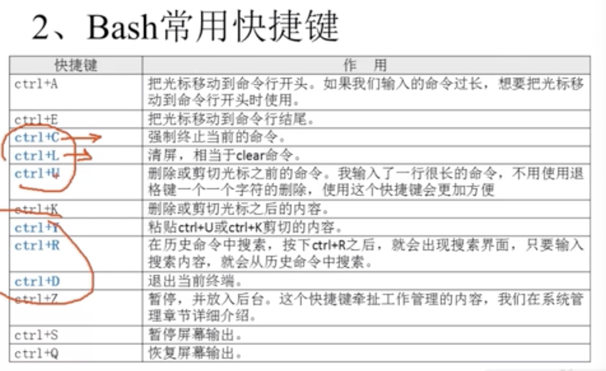

# linux

## 常用命令行

### ls

- ls -l

  文件一般有一些标头

| 标志 | 含义   |
| :--: | :----- |
|  -   | 文件   |
|  d   | 目录   |
|  l   | 软连接 |

- -ld 查看目录本身而不是子目录

### mkdir

- -p 递归创建目录

### cp

可以同时复制多个文件

```
cp a b .
```

- -r 重命名

```
cp -r /tem/a /tem/b
```

### mv (重命名)

### more/cat/tail/hand

tail -f 动态加载文件日志

### 文件搜索

- find [搜索范围][匹配条件]

```
find . -name init
find .  -name "*omm*" 模糊搜索
find .  -name "co*"  co 开头
find .  -name "*co"  co 结尾
find .  -name "co???"  匹配三个字符
```

- -inamej 不区分大小写

* size: 根据文件大小
* -a 两个条件同时满足
* -o 两个条件满一个
* -type 文件类型

### 压缩方式

#### .gz

只能压缩文件
压缩： gzip
解压： gzip -d

### tar

### netstat

- -t TCP 协议
- -u: udp 协议
- -l 监听
- -r 路由
- -n 显示 ip 地址和端口号

# shell

## 执行脚本

1.  赋予权限

- chmod 777 -R hellow
- ./hello.sh

2. 通过 bash

Bash hello.sh

## 基本命令

- echo

* history

  - -c 清空历史明亮
    

### 输入输出重定向

1. 标准输入和输出

|  设备  | 设备文件名  | 文件描述符 |     类型     |
| :----: | :---------- | :--------- | :----------: |
|  键盘  | /dev/stdin  | 0          |   标准输入   |
| 显示器 | /dev/sdtout | 1          |   标准输出   |
| 显示器 | /dev/sdterr | 2          | 标准错误输出 |

2. 输出重定向

|            类型            | 符号                      | 作用                                                   |
| :------------------------: | :------------------------ | :----------------------------------------------------- |
|       标准输出重定向       | 命令 > 文件               | 以覆盖的方式，把命令的正确输出输出到指定的文件或设备中 |
|                            | 命令 >> 文件              | 以追加的方式，把命令的正确输出输出到指定的文件或设备中 |
|     标准错误输出重定向     | 命令 2> 文件              | 以覆盖的方式，把命令的正确输出输出到指定的文件或设备中 |
|                            | 命令 2 >> 文件            | 以追加的方式，把命令的正确输出输出到指定的文件或设备中 |
| 正确输出和错误输入同时保存 | 命令 > 文件 2> &1         | 以覆盖的方式，把正确输出和错误输出保存到指定的文件     |
|                            | 命令 >> 文件 2> &1        | 以追加的方式，把正确输出和错误输出保存到指定的文件     |
|                            | 命令 &> 文件              | 以覆盖的方式，把正确输出和错误输出保存到指定的文件     |
|                            | 命令 &>> 文件             | 以追加的方式，把正确输出和错误输出保存到指定的文件     |
|                            | 命令 >> 文件 1 2>> 文件 2 | 把正确输出追加到文件 1 中， 把错误输出指定的文件 2     |

3. 多命令书序执行

| 多命令执行 | 格式               | 作用                                                                 |
| :--------: | :----------------- | :------------------------------------------------------------------- |
|     ;      | 命令 1 ; 命令 2    | 多个明亮顺序执行，命令之间没有任何的联系                             |
|     &&     | 命令 1 && 命令 2   | 命令 1 执行正确，命令 2 才会执行, 当 1 不执行，2 不会执行            |
|    \|\|    | 命令 1 \|\| 命令 2 | 命令 1 执行正确，命令 2 不会执行, 命令 1 执行不正确，命令 2 才会执行 |

```
ls ; date; cd /home; pwd
```

4. 管道符

命令 1 | 命令 2
`#命令1 的正确输出作为命令2操作对象`

注意是操作主体

```
# 错误，后者并没找到主体 颠倒了 思路也不对
 tar -zxcf | find . -name "*gz"
```

```
tar命令批量解压方法总结
ls *.tar.gz | xargs -n1 tar xzvf
```

```
ll -a /etc | more （主体）
```

5. 内容上搜索

`grep 内容 目标文件`

```
netstat -anp  | grep ESTABLISHED (主体)
netstat -a 查看计算机正在连接的会话
netstat -n
netstat -tunlp 用于显示 tcp，udp 的端口和进程等相关情况，如下图：
```

6. 通配符

| 通配符 | 作用                                                                     |
| :----: | :----------------------------------------------------------------------- |
|   ？   | 匹配任意一个字符                                                         |
|   \*   |                                                                          |
|   []   | 匹配中括号任意一个字符,[abc] 代表一定匹配一个字符 ，或者 a,或者 b,或者 c |
|  [-]   | 匹配中括号任意一个字符,- 代表一个范围 ，[a-z] 代表匹配一个小写字母       |
|  [^]   | 表示匹配不是中括号内任意一个字符,[^0-9] 代表匹配一个不是数字的字符       |

```
 1957  touch abc
 1958  touch abcd
 1959  touch 012
 1960  touch 0abc
 1961  ls ?abc
 1963  ls [0-9]a
 1964  ls [0-9]abc
 1965  ls [^0-9]*
```

7. Bash 中其他特殊符号

| 符号 | 作用                                                                       |
| :--: | :------------------------------------------------------------------------- |
|  ‘’  | 所用特殊字符都没有含义                                                     |
|  ""  | 所用特殊字符都没有含义。但是‘\$’（调用变量值）. '`'（引用命令） ‘\’ 除外， |
| \$() | 引用系统命令                                                               |
|  \$  | 用于调用变量的值                                                           |

```
name=sc // 不要有空格
echo '$name'
echo "$name"
echo '$(date)'
echo "$(date)"

“$PWD”
echo $(ls)
```

## 变量

1. 变量设置规则

- 在 bash 中，变量的默认类型都是字符串型，如果要进行数值运算，则必须是制定变量类型为数值型
- 变量用等号连接值，等号左右两侧不能有空格
- 如果把命令的结果作为变量值赋予变量，则需要使用反引号或\$()包含命令

```
name=$(date)
echo $name;
```

- 变量分类

  - 用户自定义变量

  * 环境变量
  * 位置参数变量
  * 预定义变量

#### 用户自定义变量

- 允许用户自定义变量

```
aa=123
aa=${aa}789
```

- 查看变量

`set`

- 删除变量

`unset $name;`

#### 环境变量

- 全局变量

* 局部变量

用户自定义变量只在当前的 shell 有效，而环境变量会在当前 shell 和这个 shell 的所写的子 shell 当中有效

- 申明变量-设置全局变量

`export 变量名=变量值`

- 查询变量

`env`

- 删除变量

`unset 变领名`

要显示个别的环境变量的值，可以使用 printenv 命令,如果要取值需要使用\$,

#### 位置参数变量

| 位置参数变量 | 作用                                                                                       |
| :----------: | :----------------------------------------------------------------------------------------- |
|     \$n      | n 为数字，$0 代表命令本身，$1-$9 代表第一到九个参数，十以上的参数需要用大哭哦靠包含如${10} |
|     \$\*     | 这个变量代表命令行中所有的参数，\$\* 把所有的参数看做一个整体                              |
|     \$@      | 这个变量代表命令行中所有的参数，把所有的参数 区分对待                                      |
|     \$#      | 这个变量代表命令行中所有的参数个数                                                         |

```
#！/bin/bash

num1=$1;
num2=$2;

sum=$(($num1 + $num2));
echo $sum;

# $@ $*
x=1;
for param in $@
    do
        echo "this $x param is $param"
        x=$(($x+1))
     done
```

```
# ./hello.sh 1 3
# 4
```

#### 预定义变量

| 位置参数变量 | 作用                                                                                                                      |
| :----------: | :------------------------------------------------------------------------------------------------------------------------ |
|     \$？     | 最后一次执行的命令的返回状态，如果这个变量的值为 0，证明上一个命令执行正确： 如果这个变量的值为非 0，则上次执行的命令不对 |
|     \$\$     | 当前进程的 PID 号码                                                                                                       |
|     \$！     | 后台运行的最后一个进程的进程号 PID                                                                                        |

### 数值运算

`$(()) 或 $[运输式]`

```
#！/bin/bash

num1=$1;
num2=$2;

declare -i sum=$num1 + $num2;
echo $sum;
```

## 替换命令

命令输出给变量：

1. 反引号符号（`）
2. \$()

# 网络

- netstat -a 查看计算机正在连接的会话
- netstat -n
- netstat -tunlp 用于显示 tcp，udp 的端口和进程等相关情况，如下图：
- telnet 链接自己启动的本地服务(类似 dssh)
  - brew install telnet
  - telnet localhost 3000

* curl -v --header "Range:bytes=3-6" www.baidu.com
  - curl -v --header 'a:1' http://localhost:3000(get)
  - curl -X POST -v --header "a:isam2016" --data 'a=1' http://localhost:3000(post)

# 监控信息

- 监控当前的进程信息 ps

- top 是实时监控进程信息

# 使用结构化命令

```
if commend(退出状态值为0则继续执行，commands)
then
    commands
fi
```

```
if command
then
    commands
else
    commands
fi
```
